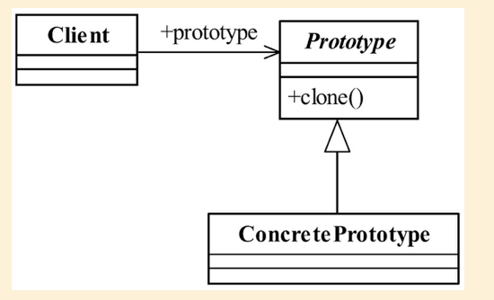

## 原型模式

## 1定义

Specify the kinds of objects to create using a prototypical instance,and create new objects by copying this prototype.（用原型实例指定创建对象的种类， 并且通过拷贝这些原型创建新的对象。 ）

#### 1.1通用类图



#### 1.2通用代码

```java
public class PrototypeClass implements Cloneable{
//覆写父类Object方法
@Override
public PrototypeClass clone(){
PrototypeClass prototypeClass = null;
try {
prototypeClass = (PrototypeClass)super.clone();
} catch (CloneNotSupportedException e) {
//异常处理
}
  return prototypeClass;
}
}
```

## 2.优缺点

#### 2.1优点

1. 性能优良
2. 逃避构造函数的约束

## 3.使用场景

1. 资源优化场景
   1. 资源优化场景
2. 性能和安全要求的场景
3. 一个对象多个修改者的场景

## 6.  扩展

 在kubernetes中所有api对象都实现了deepcopy，就是实现了原型模式