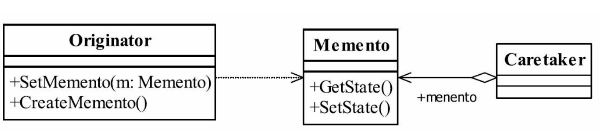

## 备忘录模式

## 1定义

Without violating encapsulation,capture and externalize an object's internal state so that theobject can be restored to this state later.（在不破坏封装性的前提下， 捕获一个对象的内部状态， 并在该对象之外保存这个状态。 这样以后就可将该对象恢复到原先保存的状态。 ）

#### 1.1通用类图



#### 1.2通用代码

```java
public class Originator {
//内部状态
private String state = "";
public String getState() {
return state;
}p
ublic void setState(String state) {
this.state = state;
}/
/创建一个备忘录
public Memento createMemento(){
return new Memento(this.state);
}/
/恢复一个备忘录
public void restoreMemento(Memento _memento){
this.setState(_memento.getState());
}
}
```

```java
public class Memento {
//发起人的内部状态
private String state = "";
//构造函数传递参数
public Memento(String _state){
this.state = _state;
}
  public String getState() {
return state;
}
  public void setState(String state) {
this.state = state;
}
}
```

```java
public class Caretaker {
//备忘录对象
private Memento memento;
public Memento getMemento() {
return memento;
}
public void setMemento(Memento memento) {
this.memento = memento;
}
}
```

```java
public class Client {
public static void main(String[] args) {
//定义出发起人
Originator originator = new Originator();
//定义出备忘录管理员
Caretaker caretaker = new Caretaker();
//创建一个备忘录
caretaker.setMemento(originator.createMemento());
//恢复一个备忘录
originator.restoreMemento(caretaker.getMemento());
}
}
```

## 2.优缺点

#### 2.1优点

1. 被存储的状态放在外面，不要和关键对象混在一起，这可以帮助维护内聚。
2. 保持了关键对象的数据封装
3. 提供了容易实现的恢复能力

#### 2.2缺点

1. 存储和恢复耗时
2. 在java总可以考虑使用序列化


## 3.使用场景

1. 需要存储状态的情况下

## 4.注意事项

## 5.设计原则

## 6.  扩展

#####  