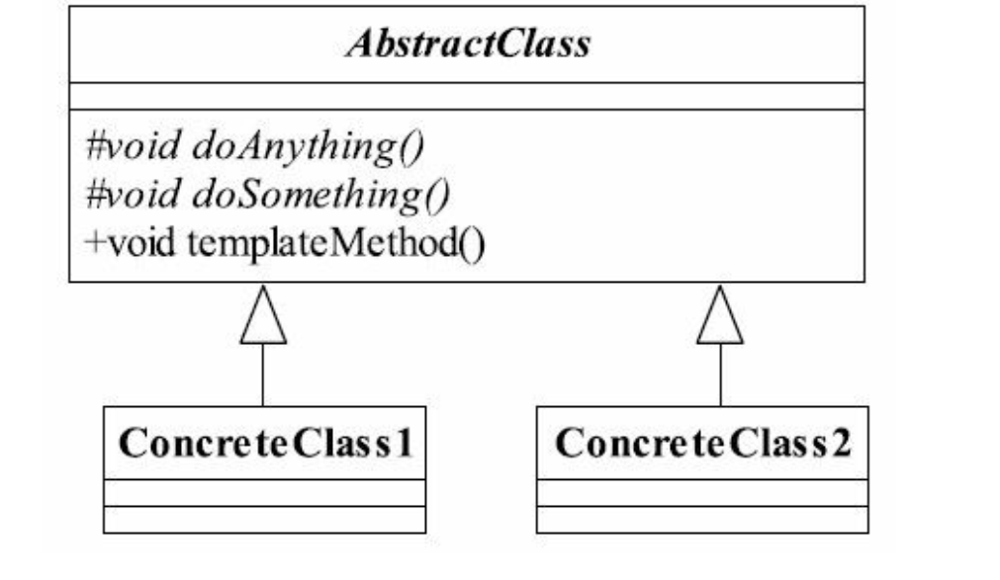

## 模板方法模式

## 1定义

Define the skeleton of an algorithm in an operation,deferring some steps to subclasses.Template
Method lets subclasses redefine certain steps of an algorithm without changing the algorithm's
structure.（在一个方法中定义一个算法的骨架， 而将一些步骤延迟到子类中。 使得子类可以不改
变一个算法的结构的情况下，重新定义算法中的某些步骤。 ）

#### 1.1通用类图



#### 1.2通用代码

```java
public abstract class AbstractClass {
    abstract void doAnyThing();

    abstract void doSomeThing();

    public void templateMethod() {
        doAnyThing();
        doSomeThing();
    }
}

```

```java
public class ConcreteClass1 extends AbstractClass {
    @Override
    void doAnyThing() {
        System.out.println("class1");
    }

    @Override
    void doSomeThing() {
        System.out.println("class2");
    }
}
```

```java
public class ConcreteClass2 extends AbstractClass {
    @Override
    void doAnyThing() {
        System.out.println("class2");
    }

    @Override
    void doSomeThing() {
        System.out.println("class2");
    }
}
```

## 2.优缺点

#### 2.1优点

1. 封装不变部分， 扩展可变部分
2. 提取公共部分代码， 便于维护
3. 行为由父类控制， 子类实现

##### 

## 3.使用场景

1. 多个子类有公有的方法， 并且逻辑基本相同时
2. 重要、 复杂的算法， 可以把核心算法设计为模板方法， 周边的相关细节功能则由各个子类实现。
3. 重构时， 模板方法模式是一个经常使用的模式， 把相同的代码抽取到父类中， 然后通过钩子函数（见“模板方法模式的扩展”） 约束其行为。

## 5.设计原则

好莱坞原则：别调用我们， 我们会调用你

## 6.  扩展

#####  