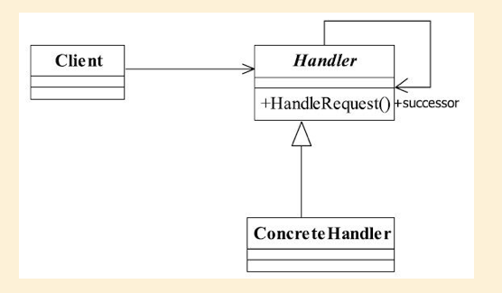

## 责任链模式

## 1定义

Avoid coupling the sender of a request to its receiver by giving more than one object a chance to
handle the request.Chain the receiving objects and pass the request along the chain until an object
handles it.（使多个对象都有机会处理请求， 从而避免了请求的发送者和接受者之间的耦合关
系。 将这些对象连成一条链， 并沿着这条链传递该请求， 直到有对象处理它为止。 ）

#### 1.1通用类图



#### 1.2通用代码

```java
public abstract class Handler {
private Handler nextHandler;
//每个处理者都必须对请求做出处理public final Response handleMessage(Request request){
Response response = null;
//判断是否是自己的处理级别
if(this.getHandlerLevel().equals(request.getRequestLevel())){
response = this.echo(request);
}else{ //不属于自己的处理级别
//判断是否有下一个处理者
if(this.nextHandler != null){
response = this.nextHandler.handleMessage(request);
}else{
//没有适当的处理者， 业务自行处理
}
}r
eturn response;
}/
/设置下一个处理者是谁
public void setNext(Handler _handler){
this.nextHandler = _handler;
}/
/每个处理者都有一个处理级别
protected abstract Level getHandlerLevel();
//每个处理者都必须实现处理任务
protected abstract Response echo(Request request);
}
```

```java
public class ConcreteHandler1 extends Handler {
//定义自己的处理逻辑
protected Response echo(Request request) {
//完成处理逻辑
return null;}/
/设置自己的处理级别
protected Level getHandlerLevel() {
//设置自己的处理级别
return null;
}
}
public class ConcreteHandler2 extends Handler {
//定义自己的处理逻辑
protected Response echo(Request request) {
//完成处理逻辑
return null;
}/
/设置自己的处理级别
protected Level getHandlerLevel() {
//设置自己的处理级别
return null;
}
}
public class ConcreteHandler3 extends Handler {
//定义自己的处理逻辑
protected Response echo(Request request) {
//完成处理逻辑
return null;
}/
/设置自己的处理级别
protected Level getHandlerLevel() {
//设置自己的处理级别
return null;
}
}
```

```java

```

```java

```

```java

```

```java

```

```java

```

```java

```

## 2.优缺点

#### 2.1优点

责任链模式非常显著的优点是将请求和处理分开。 请求者可以不用知道是谁处理的， 处
理者可以不用知道请求的全貌


#### 2.2缺点

一是性能问题， 每个请求都是从链头遍历到链尾， 特别是在链比较长的时候， 性能是一个非常大的问题。 二是调试不很方便， 特别是链条比较长

## 3.使用场景

## 

#####  