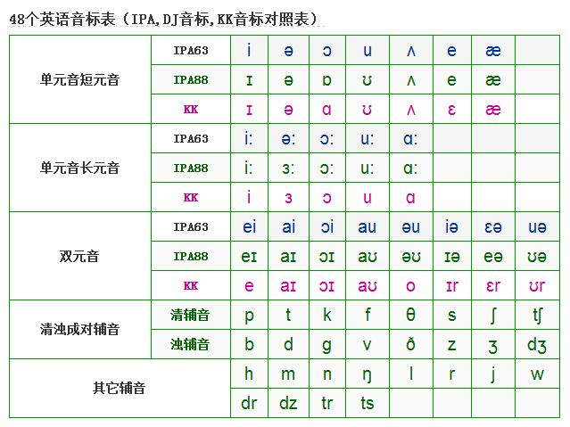

赖世雄美语音标复习表
20181009开始

|  |1-4页  |5-8页|9-10页|10-18页|19-26|
|--------|--------|--|--|--|-|
|24小时|10.10 6:00 完成| 10.11 6：00 完成|10.12 6.00|10。15 完成|10.17|
|3天|10.12完成| 10.13完成|10.14完成|10.17|
|7天|10.16|10.17|10.18|10.21|
|15天|10.24|10.25|10.26|10.30|
|30天|11/08|11.9|11.10|11.15||

可以找到4个没有的。是：ar ɔr ɪə iə.

