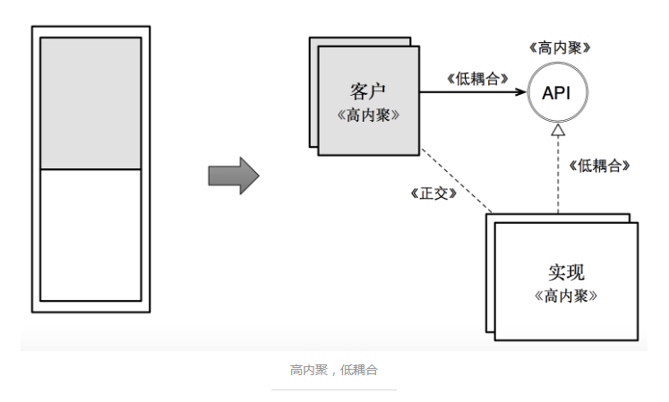
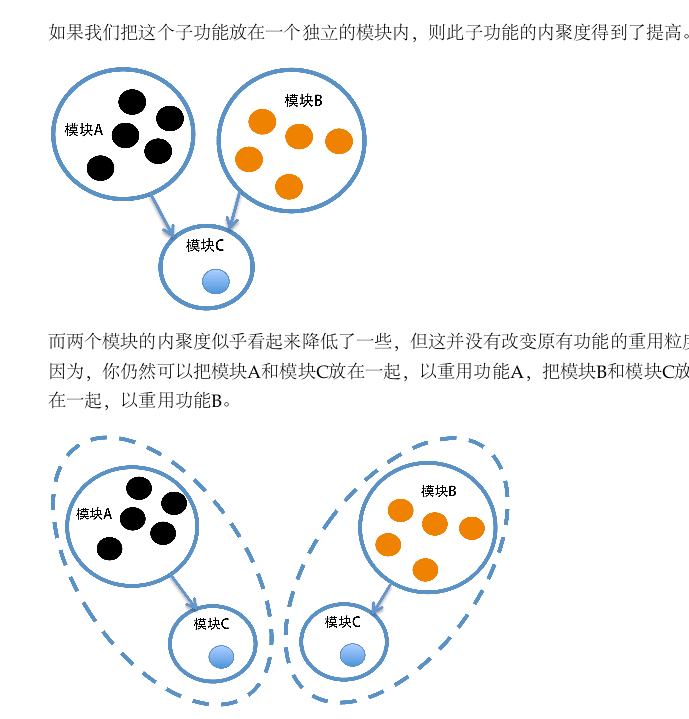

## 第一部分:设计原则

[TOC]

### 1.1 为什么要做软件设计?

收益 - 成本 = 利润

开发团队可以做什么,能够帮助企业降低成本

#### 1.1.1 成本

**内在成本**：指的是解决一个问题的最简单方案所付出的成本。
**偶发成本**： 则是指为解决一个问题,一个解决方案相对于最简单方案多出的那部分成本。

#### 1.1.2 软件设计中的“偶发成本”

- 在开发人员“实现需求”时,如果原有系统中对于要实现的需求,可重用的部分越少,那么开发人员为了实现需求所需要付出的成本就越高;

- 如果一个系统有效的代码部分被设计和实现的非常难以理解,则开发人员就必须花费很大的时间和精力来理解系统,从而付出更高的成本;

- 如果一个系统的冗余代码越多,开发人员就会把时间浪费在它们身上,从而可以产生不必要的成本;

  - 对于一个问题,如果存在更简单的解决方案,但设计人员由于能力,或对于变化的恐惧,给出了一个复杂的方案。那么它相对于更简单方案所引入的复杂度,就是一种“冗余”。“冗余”的另外一种表现是:系统中充斥着大量已经完全无用的“死代码”。“冗余”的存在,会造成不必要的维护工作。而“冗余”毫无疑问会引入“偶发成本”

    

  我们的软件在如下三个方面越出色, 我们需要付出的“偶发成本”就越。

  • 易于重用
  • 易于理解
  • 没有冗余

#### 1.1.3 质量

绝大多数团队对于软件设计的理解仅限于“功能实现”，即,从客户的观点来看,只要一个系统是稳定的,正确的,健全的,那么软件设计就达到了它的目标，这就是所谓的“外部质量”。

相对于软件设计能力更好的团队,软件设计能力差的团队在相同的努力下,交付的速度更慢。换句话说,为了能够交付具有相同“外部质量”的软件,软件设计能力匮乏的团队需要付出更多的努力。


所以,单纯的“外部质量”并不能全面的衡量一个软件系统的价值所在。因为,如果一个软件开发企业需要为之付出的开发维护成本长期超过它所能带来的受益时,那么它为软件开发企业所带来的就是负价值。在正常情况下,这个软件也就走到了它生命周期的尽头。


“内部质量”和“外部质量”并非各自独立的事物,“内部质量”的优劣最
终会反映到“外部质量”上。更低的“内部质量”,在相同的条件下,会导致更慢的交付速度,更多的缺陷。并且这种情况,越往长期发展,就体现的越明显。

#### 1.1.4 没有失败的项目

**没有失败的项目,只有被取消的项目**

尽管一个具有糟糕内部质量的系统,需要付出高昂的维护成本;但只要它为企业创造的收益能够承担这样的成本,或远大于维护成本,那么企业就可以很好的活下去。但这并不意味着那部分成本并不存在。

这是“做正确的事情”和“正确的做事”之间的关系。一个错误的软件,无论内部质量有多好,如果不能给企业带来足够的收益,那么最终也是一个失败的项目。反过来,一个正确的软件,尽管错误的方法也可能导致成功,但正确的方法只会让它更成功,或者具备更高的成功概率。


#### 1.1.5 结论

对于软件设计,Kent Beck总结道“Design is there to enable you to keep changing the software easily in the long term”。之所以强调“长期”,是因为“对于一个不需要维护的一次性项目,有着完全不同
的方法学”。


### 1.2 重用

#### 1.2.1 修改

当要实现一个新的需求时,一种常见的“重用”方式是:在原有函数里塞入几行新的代码逻辑。

但如果所有人都使用这样的策略,那么原有函数的逻辑很快会变得复杂,进而晦涩难懂。从长期来看,团队需要付出更多的成本来理解和维护它。

#### 1.2.2 拷贝粘贴

另外一种常见方式是:为了不影响原有功能,将原有代码进行“copy-paste”,得到一份拷贝。然后在拷贝代码上修改了其中的一部分,得到另外一段代码。两段代码对应于两种不同的需求,同时存在于同一系统。

这种方式的动机也是“复用”,但造就的结果却只是“重复”。它的危害甚至比前一种方式还要大。

#### 1.2.3 重用

**一个已经存在的软件单位,无须任何修改,无须拷贝粘贴,就可以用于帮助实现某些需求。这样的重用方式无疑是最合理的。我们仅仅将这样的重用方式,定义为“重用”。**


#### 1.2.4 可重用

**一个已经存在的软件单位,无须任何修改,无须拷贝粘贴,就可以用于帮助实现某些需求;则我们称“这个软件单位”对于“这些需求”是“可重用的”。**

如果一个软件单位必须被修改,才能满足新的需要, 即便你只修改了其中的1%,看起来你好像“复用”了其中的99%。我们仍然称它对于这个需求“不可重用”。

如果这个软件单位的无须修改的部分中,能够与需要修改的部分进行分离,那么无须修改的部分对于这个需求就是“可重用”的。


#### 1.2.5 重用的范围

**一个“可重用”实体,只能在可见的范围内被重用。**

它描述了这样一些事实:

- 如果一个常量在一个函数内被定义,那么它就只能在当前函数内被重用;
-  如果一个类方法被定义为私有的,则它只能在当前类中被重用。
-  如果一个类被隐藏在一个模块内部,那么它就只能在一个模块内被重用。

如果一个可在更大范围内重用的单位被控制在较小的范围内,那么势必会造成重复。
如果一个可重用单元U,被模块A所定义,其初衷是仅供本模块内部使用,但却没有对U进行访问范围控制。 由于模块A被定义了明确的职责,现在由于U的公开,事实上造成了模块A提供了更多的职责。**造成不恰当的依赖**

#### 1.2.6 可重用性

没有绝对可重用的东西。只有对合适的问题,一个软件单位才可以被重用。一个软 件单位适用的范围越广泛,那么它被重用的可能性就越高。我们把重用的可能性,定义为“可重用性”。


如何让软件具有更好的可重用性？ 高内聚，低耦合。

### 1.3 高内聚,低耦合

我们已经讨论过,“重用”对于降低成本的意义。但问题是,如何才能让我们的软件具备更好的“可重用性。

**“高内聚,低耦合”**，是解决“可重用性”问题的最高原则。

#### 1.3.1 内聚


**内聚**,用来衡量一个单位( 函数、类、结构体、模块、子系统 )内部各种元素之间的关联紧密程度。元素之间关联度越高,则其内聚度越高。

- 一方面,高内聚强调,**紧密关联的事物应该放在一起**。这会增强一个软件单位的可重用性和可理解性。

  - 假设一个系统,有四个模块,提供三种功能。但三种功能的代码分散在四个模块内。由于这种分散性,为了重用某个功能,我们必须要把四个模块一起拿来,才可以重用。由于每个模块中都存在自己的环境和假设,比如对于具体操作系统的调用,对于某个具体硬件平台的依赖,或对于某种配置的依赖等等,这就会降低其中任何一个模块的“可重用性”。

- 另一方面,高内聚强调**,只有紧密关联的事物才应该被放到一起**。这同样会提高软件单位的可重用性和可理解性。

  - 同样是上述的例子,如果我们把其中两个功能的代码都放在模块B内,那么为了重用一个功能,却被迫引入另外一个功能的代码。并且,由于模块B的功能不单一,我们必须理解两个功能的代码,才可以对模块B进行有效的维护。

  

  

  **Do One Thing, Do It Well**

#### 1.3.2 耦合

耦合,用来衡量单位之间的关联程度。单位之间的关联度越高,则它们之间的耦合度就越高。
耦合产生耦合的原因是依赖。 对于任意两个代码元素,当一方依赖了另外一方,则两者之间就产生了耦合。所以耦合和依赖可以理解为同义词。

- 耦合会带来的问题是,对于耦合的双方,当被依赖的一方发生变化的时候,会导致依赖的一方也跟着变化。这就会导致可重用性的降低
- 一个模块直接或间接依赖的其它代码 元素越多,为了重用它,需要引入的元素也就越多,而这些元素会进一步的依赖其它元素,而那些元素中的很多东西可能是你并不需要的,但你必须为之付出更多的 代价

#### 1.3.3 内聚和耦合的关系

内聚和耦合是紧密关联的两个概念:提高内聚度,往往会降低耦合。反之,降低耦合的过程,往往会提高内聚性

#### 1.3.4 内聚耦合和正交

如果我们进一步思考，就会意识到：看似神秘的**内聚**与**耦合**，正好对应最初的两个问题:

1. 当我们划分模块时，要让每个模块都尽可能**高内聚**;
2. 而当我们定义模块之间的API时，需要让双方尽可能**低耦合**。

如果用图来展现，就是下面的过程与关系:



#### 1.3.5 正交

一个低内聚的系统,通常是高耦合的系统。高度耦合会造成糟糕的可重用性,一块代码的的变更很容易会导致大面的修改。

一块儿代码的修改不会引起其它代码的修改。这样的状态被称做“正交”(Orthogonal)。

一个系统的“高内聚,低耦合”的程度越强,则其“正交性”越强,其“可重用性”亦越好。所以,我们也可以用“正交性”来衡量一个系统的“可重用性”。

为了达到更好的“正交性”,我们可以采取如下策略:
• 消除重复
• 分离关注点
• 缩小依赖范围
• 向着稳定的方向依赖


### 1.4 策略1:消除重复

#### 1.4.1 什么是重复

**代码是对知识的描述**。“重复”则是不同的代码元素对**同一知识进行了多次描述**,无论它们的描述方式是否一致。

#### 1.4.2 重复的邪恶性


- 令人生厌

  - 重复,首先意味着:同样一件事情,需要被反复的,机械的执行;这无疑另人生厌。
- 冗余

    - 增加了代码量,从而增加了不必要的理解成本和维护成本。
- 低内聚

    - 两个重复的实现由于功能完全重合,所以它们之间的关联紧密程度是最高的;但现在它们被放置在同一系统的不同模块内,这就违背了“高内聚”原则

    
- 高耦合

    - 由于一个代码单元定义或描述了某种知识,那么这个代码单元就对这个知识产生了耦合。如果只存在一个定义,则系统对这个知识只存在一个耦合点,N次定义则对同一知识产生了N个耦合点。当这个知识发生变化的时候,则必须在N个地方同步修改。所以,重复会导致更高的耦合
- 掩盖问题
    - 表面的重复,往往意味着背后存在的共性概念没有得到发掘。共性和差异的充分发
        掘,很有可能会得到更为合理的概念划分,从而得到更加合理的设计

#### 1.4.3 重复类型

- 完全重复

  - 假定现在有一个函数 F1,可以完成某个子功能S。随后,在其“重用范围”内,有另外一个需求实现也需要子功能S,如果开发者并不知道它的存在,就需要重写另外一个函数F2。或者开发者即便知道F1的存在,但由于某种无法说明的原因,仍然通过copy-paste得到了函数F2。这就造成了“重复”,并且由于F1和F2都实现了子功能S,所以两者属于功能型“完全重复”。对于完全重复的事情,没什么可说的。直接删除其中一个,保留另外一个即可。

- 参数型重复

  - 参数型重复是指,两个函数的算法相同,只是处理的数据不同。消除这样的重复,只需要差异的数据“参数化”。

- 调用型重复

  - 如果两个函数的“重复部分”完全相同,可以将重复的部分提取为函数F,然后原函数各自对F直接进行调用

- 回调型重复

  - 如果两个函数的“重复部分”完全相同,可以将重复的部分提取为函数F,将差异的部分形成原型相同的两个函数s1和s2,然后通过F分别对s1和s2进行调用。

  回调型重复和参数型重复的唯一差别是,一个参数化的是数据,一个参数化的是行为。

#### 1.4.4 产生的原因

1. 低成本
2. 对于变化的恐惧
   消除重复的过程,往往意味着对于原有代码的修改,以提高其可重用性。但是基于对破坏原有功能的担心,“另起炉灶”往往是更加“理智”的选择。尤其是当原有代码的可维护状况越糟糕,重复就越容易产生
3. 不易识别
   重复的模式,完全被混乱的代码所掩盖。想理解它已经很困难,更不用说去识重复。造成开发人员“有心杀敌,无力回天”
4. 技能上的不足
   即便重复明确的摆在眼前,开发人员技能上的欠缺,比如对于语言特性的了解不够,对于消除重复的手段知之甚少,导致重复“合理”的产生,“合理”的存在。
5. 价值导向
   是的,重复让人生厌。但“消除重复”大多时候要比“制造重复”更困难。它需要个人更多的努力,更好的感觉,和更高的技能,更需要团队提供良好的机制。

#### 1.4.5 重复和重用

假设,现在要实现一个新需求。原有系统中已经存在此需求所需要的某个子功能的代码,

• 如果它可以“重用”,则开发人员无须“重复”编写这部分代码。
• 否则,开发人员就需要对此子功能进行再次实现,从而造成“重复”。
• 但是,当重复产生之后,如果开发人员通过重构消除了“重复”,那么得到的那个子功能代码就已经被“重用”,这就提高了原有系统的“可重用性”。


所以,“消除重复”的过程就是一个提高系统“可重用性”的过程;反过来,提高系统的“可重用性”,也就降低了未来产生“重复”的可能性。两者是“此消彼长”的关系。


#### 1.4.6 DRY

对于任何一项知识,在一个系统内,只应该存在一个明确而权威的表示。


#### 1.4.7 结论

重复是邪恶的,与“高内聚,低耦合”背道而驰,从而导致可维护性相关的一系列问题。通过“消除重复”,可以提高系统的“可重用性”。


### 1.5 策略2:分离关注点

消除重复”是提高可重用性的“被动型”策略。即在“重复”出现之后,在不影响“需求实现”的前提下,尽可能的消除它。而消除了“重复”,既让整个系统更加干净,又提高了系统内部元素的可重用性。

分离关注点”可以作为消除重复的一种手段，在重复出现前,“分离关注点”则可以防备一些未来的“重复”。


- **分离不同变化方向**，目标在于提高**内聚度**。因为**多个变化方向**，意味着一个模块存在多重职责。将不同的变化方向进行分离，也意味着各个变化方向职责的单一化。
- 因为,通过分离关注点,可以让原有软件单位的复杂性得到降低,更加容易理解和维护
- 粒度越小，越容易重用

#### 1.6 策略3:缩小依赖范围


#### 构造和SETTER

- 构造函数的目的,是为了创造出一个合法的,能够履行职责的,能够代表它要表现的概念实例。
- 而Setter函数,则是提供给Client的一个状态变更接口。它的存在,完全取决于
  客户是否需要。从这个意义上,Setter和任何其它服务函数没有任何差别。

#### 抽象的动机

软件之所以存在,不是为了对现实世界进行完整的描述,而是为了满足特定的需求。其每一行代码都应该由需求直接或间接驱动而来,无论你用何种方法学,代码
中的每一个元素都应该是需求驱动的产物,而不是对现实世界的完备描述——更何况,你也不可能对其真正完备的进行描述——因为,“所有抽象都是谎言”。

#### 命基类命名

这些命名事实上是根据类所具备的行为而产生的,从这个角度看,这些命名还是挺贴切的。但行为,只是一个概念根据需求而定义的;在概念不变的情况下,它的行为会随着需求的变化而变化。
**所以类的定义应该是先有概念,再定职责,然后才有行为**。 先看行为特征,然
后基于对行为的抽象来给类取名,是一种本末倒置。

- 类表示一个实体概念,所以类名一定是名词

简单地把动词名词化并没有解决真正的问题。真正的问题是,无论用名词或动
词,它所代表的概念是否正确。而概念又从哪里找?

首先尝试从“问题域”或者“隐喻模型”中寻找。对于本例,当这样一组重复
代码被抽取成一个类时,

```
struct ???
{
bool operator==(const Length& rhs) const;
bool operator!=(const Length& rhs) const;
};
```

不能因为它们具备相等性判断行为,就认为这是一个与“问题域”无关的东西,
就可以自己根据它行为创造出Compare这样的概念。而是要考虑在问题域中,
哪个概念具备这样的行为,那么那个概念就应该是这个类的名字。而本例中
“长度”则是一个这样的概念。

这并非意味着不能创造概念。在很多情况下,问题域都是以具体的概念来描述
问题的,并没有进行抽象。这种情况下,我们需要通过创造概念来描述抽象。

必须注意的是,“问题域”的类和抽取出来的公共基类所代表的概念之间具备
IS-A的关系。所以,你创造出来的概念名字,也必须经得起“祖母法则”的考
验。