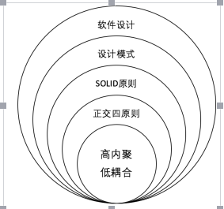

# 资料汇总

#### dci

[小类，大对象](http://www.jianshu.com/p/a830d2261392)

#### encapsulation

 [类与封装](http://www.jianshu.com/p/6a45a299e5f0)
 [容器与封装](http://www.jianshu.com/p/6860593dedc1)

#### inheritance

[The Virtues Of Bastard](http://www.jianshu.com/p/aa28a6a6d78d)

#### polymorphism

[C++泛型与多态：基础篇](http://www.jianshu.com/p/38f17600f19a)
[C++泛型与多态：模板特化](http://www.jianshu.com/p/fdd7cfeb63e6)
[C++泛型与多态：类模板特化](http://www.jianshu.com/p/9675085cb49e)
[C++泛型与多态: Duck Typing](http://www.jianshu.com/p/4939c934e160)
[多态，OO与FP](http://www.jianshu.com/p/9ad1a3cd6b7d)

#### orthogonal-design

 [变化驱动：正交设计](http://www.jianshu.com/p/d127b8afc8cb)
 [正交设计，OO与SOLID](http://www.jianshu.com/p/f7f5813882a1)

