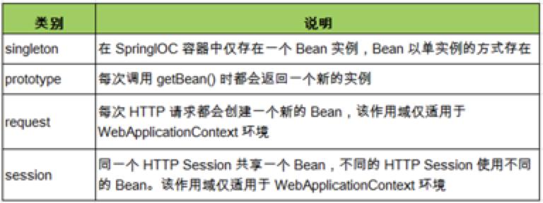

# spring

[toc]


1    Spring概述

①Spring是一个开源框架

②Spring为简化企业级开发而生，使用Spring，JavaBean就可以实现很多以前要靠EJB才能实现的功能。同样的功能，在EJB中要通过繁琐的配置和复杂的代码才能够实现，而在Spring中却非常的优雅和简洁。

③Spring是一个**IOC**(DI)和**AOP**容器框架。

④Spring的优良特性

[1]**非侵入式**：基于Spring开发的应用中的对象可以不依赖于Spring的API

[2]**依赖注入**：DI——Dependency Injection，反转控制(IOC)最经典的实现。

[3]**面向切面编程**：Aspect Oriented Programming——AOP

[4]**容器**：Spring是一个容器，因为它包含并且管理应用对象的生命周期

​    [5]**组件化**：Spring实现了使用简单的组件配置组合成一个复杂的应用。在 Spring 中可以使用XML和Java注解组合这些对象。

​    [6]**一站式**：在IOC和AOP的基础上可以整合各种企业应用的开源框架和优秀的第三方类库（实际上Spring 自身也提供了表述层的SpringMVC和持久层的Spring JDBC）。

2. Spring 模块划分

   1. core

      1. spring-beans-4.0.0.RELEASE.jar

         spring-context-4.0.0.RELEASE.jar

         spring-core-4.0.0.RELEASE.jar

         spring-expression-4.0.0.RELEASE.jar

   2. aop +aspect : 面向切面

      1. spring-aop-4.0.0.RELEASE.jar

         spring-aspect-4.0.0.RELEASE.jar

   3. Test

      1. spring-test-4.0.0.RELEASE.jar

   4. 数据访问 & integration

      1. spring-jdbc-4.0.0.RELEASE.jar

         spring-orm-4.0.0.RELEASE.jar

         spring-ox(xml)m-4.0.0.RELEASE.jar

         spring-jms.-4.0.0.RELEASE.jar

         spring-tx-4.0.0.RELEASE.jar

   5. web

      1. spring-websocket-4.0.0.RELEASE.jar

         spring-web-4.0.0.RELEASE.jar  原生web

         spring-webmvc-4.0.0.RELEASE.jar 开发web项目的

         spring-webflux-4.0.0.RELEASE.jar

3.  如何创建spring项目

   ①使用springboot创建项目

   ②根据需要创建Spring配置文件

   ```
   	<!-- 使用bean元素定义一个由IOC容器创建的对象 -->
   	<!-- class属性指定用于创建bean的全类名 -->
   	<!-- id属性指定用于引用bean实例的标识 -->
   	<bean id="student" class="com.atguigu.helloworld.bean.Student">
   		<!-- 使用property子元素为bean的属性赋值 -->
   		<property name="studentId" value="1001"/>
   		<property name="stuName" value="Tom2015"/>
   		<property name="age" value="20"/>
   	</bean>
   
   ```

   3. 通过Spring的ioc容器创建Student类实例

      ```
      //1.创建IOC容器对象
      ApplicationContext iocContainer = 
      		new ClassPathXmlApplicationContext("helloworld.xml");
      
      //2.根据id值获取bean实例对象
      Student student = (Student) iocContainer.getBean("student");
      
      //3.打印bean
      System.out.println(student);
      
      ```

      

## ioc

①IOC(**Inversion of Control**)：**反转控制**。

在应用程序中的组件需要获取资源时，传统的方式是组件主动的从容器中获取所需要的资源，在这样的模式下开发人员往往需要知道在具体容器中特定资源的获取方式，增加了学习成本，同时降低了开发效率。

反转控制的思想完全颠覆了应用程序组件获取资源的传统方式：反转了资源的获取方向——改由容器主动的将资源推送给需要的组件，开发人员不需要知道容器是如何创建资源对象的，只需要提供接收资源的方式即可，极大的降低了学习成本，提高了开发的效率。这种行为也称为查找的被动形式。

控制资源的获取方式，

1. 主动式：自己创建
2. 被动式：资源的获取有容器创建。

容器：管理所有的组件；容器可以自动的探查出哪些组件需要用到另一些组件；容器自动帮助创建，并赋值。

②DI(**Dependency Injection**)：**依赖注入**。

IOC的另一种表述方式：即组件以一些预先定义好的方式(例如：setter 方法)接受来自于容器的资源注入。相对于IOC而言，这种表述更直接。


③IOC容器在Spring中的实现

1. 在通过IOC容器读取Bean的实例之前，需要先将IOC容器本身实例化。
2. Spring提供了IOC容器的两种实现方式
   1.  BeanFactory：IOC容器的基本实现，是Spring内部的基础设施，是面向Spring本身的，不是提供给开发人员使用的。
   2. ApplicationContext：BeanFactory的子接口，提供了更多高级特性。面向Spring的使用者，几乎所有场合都使用ApplicationContext而不是底层的BeanFactory。


④ApplicationContext的主要实现类

[1]ClassPathXmlApplicationContext：对应类路径下的XML格式的配置文件

[2]FileSystemXmlApplicationContext：对应文件系统中的XML格式的配置文件


[3]在初始化时就创建单例的bean，也可以通过配置的方式指定创建的Bean是多实例的。

 

⑤ConfigurableApplicationContext

[1]是ApplicationContext的子接口，包含一些扩展方法

[2]refresh()和close()让ApplicationContext具有启动、关闭和文的能力。 

 

⑥WebApplicationContext

专门为WEB应用而准备的，它允许从相对于WEB根目录的路径中完成初始化工作


### bean

#### 1.获取bean

##### 通过类型获取

从IOC容器中获取bean时，除了通过id值获取，还可以通过bean的类型获取。但如果同一个类型的bean在XML文件中配置了多个，则获取时会抛出异常，所以同一个类型的bean在容器中必须是唯一的。

```
  HelloWorld  helloWorld = cxt.getBean(HelloWorld. class);  
```

##### 通过id获取

```
  Person person = (Person) iocContainer.getBean("person01");

```


#### 2.给bean的属性赋值

##### 2.1赋值的途经

1. 通过bean的setXxx()方法赋值

   ```
   
       <bean id ="person01" class ="com.ericzhang08.helloworld.Person">
           <property name="lastName" value="zs"/>
           <property name="age" value="5"/>
           <property name="gender" value="female"/>
           <property name="email" value="aaa"/>
       </bean>
   ```

   

2. 通过bean的构造器赋值

   ```
        <bean id="book" class="com.atguigu.spring.bean.Book" >
              <constructor-arg value= "10010" index ="0"/>
              <constructor-arg value= "Book01" index ="1"/>
              <constructor-arg value= "Author01" index ="2"/>
              <constructor-arg value= "20.2" index ="3"/>
        </bean >
   ```

   

   1. 通过索引值指定参数位置

      ```
      
           <bean id="book" class="com.atguigu.spring.bean.Book" >
                 <constructor-arg value= "10010" index ="0"/>
                 <constructor-arg value= "Book01" index ="1"/>
                 <constructor-arg value= "Author01" index ="2"/>
                 <constructor-arg value= "20.2" index ="3"/>
           </bean >
      
      ```

      

   2. 通过类型不同区分重载的构造器

      ```
      <bean id="book" class="com.atguigu.spring.bean.Book" >
            <constructor-arg value= "10010" index ="0" type="java.lang.Integer" />
            <constructor-arg value= "Book01" index ="1" type="java.lang.String" />
            <constructor-arg value= "Author01" index ="2" type="java.lang.String"/>
            <constructor-arg value= "20.2" index ="3" type="java.lang.Double" />
      </bean >
      
      ```

      

3. 给bean的级联属性赋值

   ```
        <bean id="action" class="com.atguigu.spring.ref.Action">
             <property name="service" ref="service"/>
             <!-- 设置级联属性(了解) -->
             <property name="service.dao.dataSource" value="DBCP"/>
        </bean>
   
   ```

   

4. p名称空间

   ```
   	id="studentSuper" 
   	class="com.atguigu.helloworld.bean.Student"
   	p:studentId="2002" p:stuName="Jerry2016" p:age="18" />
   
   ```

   

##### 2.2 可以使用的值

1. 字面量

   [1]可以使用字符串表示的值，可以通过value属性或value子节点的方式指定

   [2]基本数据类型及其封装类、String等类型都可以采取字面值注入的方式

   [3]若字面值中包含特殊字符，可以使用<![CDATA[]]>把字面值包裹起来

2. null值

   ```
              <property name= "bookName">
                  <null/>
              </property>
   
   ```

   

3. 外部已声明的bean

   ```
        <bean id="shop" class="com.atguigu.spring.bean.Shop" >
              <property name= "book" ref ="book"/>
        </bean >
   
   ```

   

4. 内部bean

   当bean实例仅仅给一个特定的属性使用时，可以将其声明为内部bean。内部bean声明直接包含在<property>或<constructor-arg>元素里，不需要设置任何id或name属性

   内部bean不能使用在任何其他地方

##### 2.3集合属性

1. 数组和list

   ```
        <bean id="shop" class="com.atguigu.spring.bean.Shop" >
                   <property name= "categoryList">
                  <!-- 以字面量为值的List集合 -->
                  <list>
                       <value> 历史</value >
                       <value> 军事</value >
                  </list>
              </property>
              <property name= "bookList">
                  <!-- 以bean的引用为值的List集合 -->
                  <list>
                       <ref bean= "book01"/>
                       <ref bean= "book02"/>
                  </list>
              </property>
        </bean >
   
   ```

2. map

   ```
   	<property name="bookMap">
   		<map>
   			<entry>
   				<key>
   					<value>bookKey01</value>
   				</key>
   				<ref bean="book01"/>
   			</entry>
   			<entry>
   				<key>
   					<value>bookKey02</value>
   				</key>
   				<ref bean="book02"/>
   			</entry>
   		</map>
   	</property>
   </bean>
   
   ```

3. properties

   ```
   <bean class="com.atguigu.spring.bean.DataSource" id="dataSource">
   	<property name="properties">
   		<props>
   			<prop key="userName">root</prop>
   			<prop key="password">root</prop>
   			<prop key="url">jdbc:mysql:///test</prop>
   			<prop key="driverClass">com.mysql.jdbc.Driver</prop>
   		</props>
   	</property>
   </bean>
   
   ```

### 通过工厂创建bean

#### 1. 静态工厂

调用静态工厂方法创建bean是将对象创建的过程封装到静态方法中。当客户端需要对象时，只需要简单地调用静态方法，而不用关心创建对象的细节。

声明通过静态方法创建的bean需要在bean的class属性里指定静态工厂类的全类名，同时在factory-method属性里指定工厂方法的名称。最后使用<constrctor-arg>元素为该方法传递方法参数。

```
    <bean id="static_person" class="com.ericzhang08.helloworld.PersonStaticFactory" factory-method="createPerson">
        <constructor-arg name="name" value="staticFactoryPerson"/>
    </bean>
```


#### 2. 实例工厂

实例工厂方法：将对象的创建过程封装到另外一个对象实例的方法里。当客户端需要请求对象时，只需要简单的调用该实例方法而不需要关心对象的创建细节。

```
public class PersonInstanceFactory {
    public Person createPerson(String name) {
        return new Person(name, 2, "", "");
    }
}

    <bean id="instance_person_factory" class="com.ericzhang08.helloworld.PersonInstanceFactory"/>

    <bean id="instance_person" class="com.ericzhang08.helloworld.PersonInstanceFactory" factory-bean="instance_person_factory" factory-method="createPerson">
        <constructor-arg name="name" value="instanceFactoryPerson"/>
    </bean>
```


##### 实现方式

1. 配置工厂类实例的bean
2. 在factory-method属性里指定该工厂方法的名称
3. 使用 construtor-arg 元素为工厂方法传递方法参数


#### 3. Factory Bean

Spring中有两种类型的bean，一种是普通bean，另一种是工厂bean，即FactoryBean。

工厂bean跟普通bean不同，其返回的对象不是指定类的一个实例，其返回的是该工厂bean的getObject方法所返回的对象。

工厂bean必须实现org.springframework.beans.factory.FactoryBean接口。

```
    <bean id="factory-bean_person" class="com.ericzhang08.helloworld.PersonFactoryBean"/>


package com.ericzhang08.helloworld;

import org.springframework.beans.factory.FactoryBean;

public class PersonFactoryBean implements FactoryBean<Person> {
    @Override
    public Person getObject() {
        return new Person("factoryBean", 1, "", "");
    }

    @Override
    public Class<?> getObjectType() {
        return Person.class;
    }

    @Override
    public boolean isSingleton() {
        return false;
    }
}

```


### bean的高级配置

#### 1. 配置信息的继承

```
	<property name="deptId" value="100"/>
	<property name="deptName" value="IT"/>
</bean>

<bean id="emp01" class="com.atguigu.parent.bean.Employee">
	<property name="empId" value="1001"/>
	<property name="empName" value="Tom"/>
	<property name="age" value="20"/>

	<!-- 重复的属性值 -->	
	<property name="detp" ref="dept"/>
</bean>

<bean id="emp02" class="com.atguigu.parent.bean.Employee">
	<property name="empId" value="1002"/>
	<property name="empName" value="Jerry"/>
	<property name="age" value="25"/>

	<!-- 重复的属性值 -->
	<property name="detp" ref="dept"/>
</bean>

<!-- 以emp01作为父bean，继承后可以省略公共属性值的配置 -->
<bean id="emp02" parent="emp01">
	<property name="empId" value="1002"/>
	<property name="empName" value="Jerry"/>
	<property name="age" value="25"/>
</bean>

```

Spring允许继承bean的配置，被继承的bean称为父bean。继承这个父bean的bean称为子bean

子bean从父bean中继承配置，包括bean的属性配置

​	子bean也可以覆盖从父bean继承过来的配置

**补充说明**
父bean可以作为配置模板，也可以作为bean实例。若只想把父bean作为模板，可以设置<bean>的abstract 属性为true，这样Spring将不会实例化这个bean
如果一个bean的class属性没有指定，则必须是抽象bean
并不是<bean>元素里的所有属性都会被继承。比如：autowire，abstract等。
也可以忽略父bean的class属性，让子bean指定自己的类，而共享相同的属性配置。但此时abstract必须设为true。


#### 2  bean的生命周期

①Spring IOC容器可以管理bean的生命周期，Spring允许在bean生命周期内特定的时间点执行指定的任务。

②Spring IOC容器对bean的生命周期进行管理的过程：
		②Spring IOC容器对bean的生命周期进行管理的过程：

    1. 通过构造器或工厂方法创建bean实例
    2. 为bean的属性设置值和对其他bean的引用
    3. 调用bean的初始化方法
    4. bean可以使用了
  5. 当容器关闭时，调用bean的销毁方法

③在配置bean时，通过init-method和destroy-method 属性为bean指定初始化和销毁方法

④bean的后置处理器

1. bean后置处理器允许在调用**初始化方法前后**对bean进行额外的处理

2. bean后置处理器对IOC容器里的所有bean实例逐一处理，而非单一实例。其典型应用是：检查bean属性的正确性或根据特定的标准更改bean的属性。

3. bean后置处理器时需要实现接口：org.springframework.beans.factory.config.BeanPostProcessor。在初始化方法被调用前后，Spring将把每个bean实例分别传递给上述接口的以下两个方法

-   postProcessBeforeInitialization(Object, String)
-    postProcessAfterInitialization(Object, String)

​     

 ⑤添加bean后置处理器后bean的生命周期

    1. 通过构造器或工厂方法**创建****bean****实例**
    2. 为bean的**属性设置值**和对其他bean的引用
    3. 将bean实例传递给bean后置处理器的**postProcessBeforeInitialization()**方法
    4. 调用bean的**初始化**方法
    5. 将bean实例传递给bean后置处理器的**postProcessAfterInitialization()**方法
    6. bean可以使用了
  7. 当容器关闭时调用bean的**销毁方法**


#### 3  bean的作用域

在Spring中，可以在<bean>元素的scope属性里设置bean的作用域，以决定这个bean是单实例的还是多实例的。

默认情况下，Spring只为每个在IOC容器里声明的bean创建唯一一个实例，整个IOC容器范围内都能共享该实例：所有后续的getBean()调用和bean引用都将返回这个唯一的bean实例。该作用域被称为singleton，它是所有bean的默认作用域。



#### 自动装配

##### 自动装配的概念

1. 手动装配：以value或ref的方式**明确指定属性值**都是手动装配
2. 自动装配：根据指定的装配规则，**不需要明确指定**，Spring**自动**将匹配的属性值**注入**bean中。

##### 装配模式

1. 根据**类型**自动装配：将类型匹配的bean作为属性注入到另一个bean中。若IOC容器中有多个与目标bean类型一致的bean，Spring将无法判定哪个bean最合适该属性，所以不能执行自动装配
2. 根据**名称**自动装配：必须将目标bean的名称和属性名设置的完全相同
3. 通过构造器自动装配：当bean中存在多个构造器时，此种自动装配方式将会很复杂。不推荐使用。

##### 基于xml进行自动装配

Autowired 有四个值

1. default 默认值，不自动装配

2. byName

   按照名字，以属性名作为id去容器中找到这个组件，给他赋值，如果找不到就装配null。

   ```
       <bean id="car" class="com.ericzhang08.helloworld.Car">
           <property name="name" value="car"/>
       </bean>
   
       <bean id="person" class="com.ericzhang08.helloworld.Person" autowire="byName">
       </bean>
   ```

   

3. byType

   以属性的类型作为id去容器中找到这个组件，给他赋值。

   ```
   <bean  class="com.ericzhang08.helloworld.Car">
       <property name="name" value="car"/>
   </bean>
   
   <bean id="person" class="com.ericzhang08.helloworld.Person" autowire="byType">
   </bean>
   ```

4. Constructor 按照构造器进行赋值

   1. 先按照有参构造器参数类型进行装配，没有就直接为组件装配null

   2. 如果找到多个， 使用参数的名称为id进行装配，找不到就装配null

      ```
          <bean  class="com.ericzhang08.helloworld.Car">
              <property name="name" value="car"/>
          </bean>
      
          <bean id="person" class="com.ericzhang08.helloworld.Person" autowire="constructor">
          </bean>
      ```

      


#### 通过注解配置bean

##### 概述

相对于XML方式而言，通过注解的方式配置bean更加简洁和优雅，而且和MVC组件化开发的理念十分契合，是开发中常用的使用方式。

##### 基于注解添加bean

1.1    使用注解标识组件

①普通组件：@Component

标识一个受Spring IOC容器管理的组件

②持久化层组件：@Respository

标识一个受Spring IOC容器管理的持久化层组件

③业务逻辑层组件：@Service

标识一个受Spring IOC容器管理的业务逻辑层组件

④表述层控制器组件：@Controller

标识一个受Spring IOC容器管理的表述层控制器组件

⑤组件命名规则

[1]默认情况：使用组件的简单类名首字母小写后得到的字符串作为bean的id,默认生命周期为单实例，

可以使用 @Scope(value = "prototype")注解改变其生命周期

```
@Repository
@Scope(value = "prototype")
public class UserRepository {
}
```

[2]使用组件注解的value属性指定bean的id


##### 扫描组件

组件被上述注解标识后还需要通过Spring进行扫描才能够侦测到。

①指定被扫描的package

```
    <context:component-scan base-package="com.ericzhang08.helloworld"/>

```

 

②详细说明

[1]**base-package**属性指定一个需要扫描的基类包，Spring容器将会扫描这个基类包及其子包中的所有类。

[2]当需要扫描多个包时可以使用逗号分隔。

[3]如果仅希望扫描特定的类而非基包下的所有类，可使用resource-pattern属性过滤特定的类，示例：

```
  <context:component-scan      base-package="com.atguigu.component"      resource-pattern=*"autowire/\*.class"*/>  
```

 

[4]包含与排除

●<context:include-filter>子节点表示要包含的目标类

注意：通常需要与use-default-filters属性配合使用才能够达到“仅包含某些组件”这样的效果。即：通过将use-default-filters属性设置为false，禁用默认过滤器，然后扫描的就只是include-filter中的规则指定的组件了。

```
    <context:component-scan base-package="com.ericzhang08.helloworld" use-default-filters="false">
        <context:include-filter type="annotation" expression="org.springframework.stereotype.Service"/>

    </context:component-scan>
    
```

●<context:exclude-filter>子节点表示要排除在外的目标类

​	

```
    <context:component-scan base-package="com.ericzhang08.helloworld">
        <context:exclude-filter type="annotation" expression="org.springframework.stereotype.Repository"/>
        
    </context:component-scan>
```

●component-scan下可以拥有若干个include-filter和exclude-filter子节点

●过滤表达式

| 类别       | 示例                      | 说明                                                         |
| ---------- | ------------------------- | ------------------------------------------------------------ |
| annotation | com.atguigu.XxxAnnotation | 过滤所有标注了XxxAnnotation的类。这个规则根据目标组件是否标注了指定类型的注解进行过滤。 |
| assignable | com.atguigu.BaseXxx       | 过滤所有BaseXxx类的子类。这个规则根据目标组件是否是指定类型的子类的方式进行过滤。 |
| aspectj    | com.atguigu.*Service+     | 所有类名是以Service结束的，或这样的类的子类。这个规则根据AspectJ表达式进行过滤。 |
| regex      | com\.atguigu\.anno\.*     | 所有com.atguigu.anno包下的类。这个规则根据正则表达式匹配到的类名进行过滤。 |
| custom     | com.atguigu.XxxTypeFilter | 使用XxxTypeFilter类通过编码的方式自定义过滤规则。该类必须实现org.springframework.core.type.filter.TypeFilter接口 |

#####   组件装配

①需求

Controller组件中往往需要用到Service组件的实例，Service组件中往往需要用到Repository组件的实例。Spring可以通过注解的方式帮我们实现属性的装配。

 ②实现依据

在指定要扫描的包时，<context:component-scan> 元素会自动注册一个bean的后置处理器：AutowiredAnnotationBeanPostProcessor的实例。该后置处理器可以自动装配标记了**@Autowired**、@Resource或@Inject注解的属性。

 ③@Autowired注解

[1]根据类型实现自动装配。

[2]构造器、普通字段(即使是非public)、一切具有参数的方法都可以应用@Autowired注解

[3]默认情况下**，所有使用@Autowired注解的属性都需要被设置。当Spring找不到匹配的bean装配属性时，会抛出异常。**

[4]若某一属性允许不被设置，可以设置@Autowired注解的required属性为 false

[5]默认情况下，当IOC容器里存在多个类型兼容的bean时，Spring会尝试匹配bean的id值是否与变量名相同，如果相同则进行装配。如果bean的id值不相同，通过类型的自动装配将无法工作。此时可以在**@Qualifier注解里提供bean的名称**。Spring甚至允许在方法的形参上标注@Qualifiter注解以指定注入bean的名称。

[6]@Autowired注解也可以应用在数组类型的属性上，此时Spring将会把所有匹配的bean进行自动装配。

[7]@Autowired注解也可以应用在集合属性上，此时Spring读取该集合的类型信息，然后自动装配所有与之兼容的bean。

[8]@Autowired注解用在java.util.Map上时，若该Map的键值为String，那么 Spring将自动装配与值类型兼容的bean作为值，并以bean的id值作为键。

​            ④@Resource

@Resource注解要求提供一个bean名称的属性，若该属性为空，则自动采用标注处的变量或方法名作为bean的名称。 J2ee：java的标准

⑤@Inject

@Inject和@Autowired注解一样也是按类型注入匹配的bean，但没有reqired属性。


使用元注解时不用autowired也会自动装配


注解方式声明 xml文件注入bean

```
@ContextConfiguration(locations = "classpath:ioc.xml")
```

## aop

#### 

##### 什么是aop

①要在Spring中声明AspectJ切面，只需要在IOC容器中将切面声明为bean实例。

②当在Spring IOC容器中初始化AspectJ切面之后，Spring IOC容器就会为那些与 AspectJ切面相匹配的bean创建代理。

③在AspectJ注解中，切面只是一个带有@Aspect注解的Java类，它往往要包含很多通知。

④通知是标注有某种注解的简单的Java方法。

⑤AspectJ支持5种类型的通知注解：

[1]@Before：前置通知，在方法执行之前执行

[2]@After：后置通知，在方法执行之后执行

[3]@AfterRunning：返回通知，在方法返回结果之后执行

[4]@AfterThrowing：异常通知，在方法抛出异常之后执行

[5]@Around：环绕通知，围绕着方法执行

#####   AOP术语

切面(Aspect)：封装横切关注点信息的类，每个关注点体现为一个通知方法。

通知(Advice) ：切面必须要完成的各个具体工作

目标(Target)：被通知的对象

代理(Proxy)：向目标对象应用通知之后创建的代理对象

连接点(Joinpoint)

横切关注点在程序代码中的具体体现，对应程序执行的某个特定位置。例如：类某个方法调用前、调用后、方法捕获到异常后等。

切入点(pointcut)：

定位连接点的方式。每个类的方法中都包含多个连接点，所以连接点是类中客观存在的事物。如果把连接点看作数据库中的记录，那么切入点就是查询条件——AOP可以通过切入点定位到特定的连接点。切点通过org.springframework.aop.Pointcut 接口进行描述，它使用类和方法作为连接点的查询条件。众多连接点中感兴趣的点。使用切入点表达式

##### 如何定义切面类和目标类

1. 在springboot中导入依赖

   ```
   		<dependency>
   			<groupId>org.springframework.boot</groupId>
   			<artifactId>spring-boot-starter-aop</artifactId>
   		</dependency>
   ```

2. 使用注解 `@Aspect`标注切面类

   ```
   package com.ericzhang08.helloworld.aoptest;
   
   import org.aspectj.lang.annotation.Aspect;
   import org.springframework.stereotype.Component;
   
   @Component
   @Aspect
   public class LogUtil {
       public static void logStart() {
           System.out.println("method  start");
       }
   
       public static void logReturn() {
           System.out.println("method return");
       }
   
       public static void logException() {
           System.out.println("throw exception, exception is...");
       }
   
       public static void logEnd() {
           System.out.println("method end");
       }
   }
   ```

##### 通知类型

- @Before：前置通知，在方法执行之前执行

- @After：后置通知，在方法执行之后执行

- @AfterRunning：返回通知，在方法返回结果之后执行

- @AfterThrowing：异常通知，在方法抛出异常之后执行

- @Around：环绕通知，围绕着方法执行

  

  

##### 切入点表达式

1. 语法格式：

  execution([权限修饰符] [返回值类型] [简单类名/全类名] [方法名]([参数列表]))  

2. `*` 和`.`符号

   `*`号可以代表任意修饰符及任意返回值

   `..`匹配任意数量、任意类型的参数

   

   ```
   execution(* com.spring.ArithmeticCalculator.*(..))
   第一个“*”代表任意修饰符及任意返回值。
   第二个“*”代表任意方法。
   “..”匹配任意数量、任意类型的参数。
   若目标类、接口与该切面类在同一个包中可以省略包名。
   
   ```

3. 在AspectJ中，切入点表达式可以通过 “&&”、“||”、“!”等操作符结合起来。

   ```
   execution (* *.add(int,..)) || execution(* *.sub(int,..))
   任意类中第一个参数为int类型的add方法或sub方法
   ```

   ```
   public class LogUtil {
       @Before("execution(public  int com.ericzhang08.helloworld.aoptest.Calculator.*(int, int))")
       public static void logStart() {
           System.out.println("method  start");
       }
   
       @AfterReturning("execution(public  int com.ericzhang08.helloworld.aoptest.Calculator.*(int, int))")
       public static void logReturn() {
           System.out.println("method return");
       }
   
       @AfterThrowing("execution(public  int com.ericzhang08.helloworld.aoptest.Calculator.*(int, int))")
       public static void logException() {
           System.out.println("throw exception, exception is...");
       }
   
       @After("execution(public  int com.ericzhang08.helloworld.aoptest.Calculator.*(int, int))")
       public static void logEnd() {
           System.out.println("method end");
       }
   }
   ```

   


##### 通知方法执行顺序

```
try{

@Before
method.invode()
@AfterReturning
}catch(){
afterThrowing
}finally{
@after
}
```

正常执行 @Before   => after => afterReturning

异常执行 before  => after  => afterThrowing

## 

##### 通知方法运行时获取详细信息

1. 通知方法的参数列表传入JoinPion参数

2. JoinPoint中封装了对应的参数

3. 注解中的returning可以指定使用哪个参数接受返回值

4. Throwing 来接受异常，可以使用异常类来限定接受哪种异常

   ```
       @AfterReturning(value = "execution(public  int com.ericzhang08.helloworld.aoptest.Calculator.*(int, int))", returning = "result")
       public static void logReturn(int result) {
           System.out.println("method return value:" + result);
           System.out.println("method return");
       }
   
       @AfterThrowing(value = "execution(public  int com.ericzhang08.helloworld.aoptest.Calculator.*(int, int))", throwing = "exception")
       public static void logException(Exception exception) {
           System.out.println("throw exception, exception is...");
       }
   
   ```

   

##### 重用切入点定义

 在AspectJ切面中，可以通过@Pointcut注解将一个切入点声明成简单的方法。切入点的方法体通常是空的，因为将切入点定义与应用程序逻辑混在一起是不合理的。

在编写AspectJ切面时，可以直接在通知注解中书写切入点表达式。但同一个切点表达式可能会在多个通知中重复出现。

1. 声明一个空无返回值的方法
2. 使用@Pointcut标记
3. 在通知注解位置引用方法

```
@Aspect
@Component
public class LogUtil {
    @Pointcut("execution(public  int com.ericzhang08.helloworld.aoptest.Calculator.*(int, int))")
    public void pointcut(){}

    @Before(value = "pointcut()")
    public static void logStart(JoinPoint joinPoint) {
        System.out.println("args:" + Arrays.toString(joinPoint.getArgs()));
        System.out.println("method  start");
    }

    @AfterReturning(value = "pointcut()", returning = "result")
    public static void logReturn(int result) {
        System.out.println("method return value:" + result);
        System.out.println("method return");
    }

    @AfterThrowing(value = "pointcut()", throwing = "exception")
    public static void logException(Exception exception) {
        System.out.println("throw exception, exception is...");
    }

    @After("pointcut()")
    public static void logEnd() {
        System.out.println("method end");
    }
}
```


##### 环绕通知

1. @Around 

   1. l 环绕通知是所有通知类型中功能最为强大的，能够全面地控制连接点，甚至可以控制是否执行连接点。

      l 对于环绕通知来说，连接点的参数类型必须是ProceedingJoinPoint。它是 JoinPoint的子接口，允许控制何时执行，是否执行连接点。

      l 在环绕通知中需要明确调用ProceedingJoinPoint的proceed()方法来执行被代理的方法。如果忘记这样做就会导致通知被执行了，但目标方法没有被执行。

      注意：环绕通知的方法需要返回目标方法执行之后的结果，即调用 joinPoint.proceed();的返回值，否则会出现空指针异常

      ```
          @Around("pointcut()")
          public static int logAround(ProceedingJoinPoint joinPoint) {
              System.out.println("around start");
              int result = 0;
              try {
                  result =  (int)joinPoint.proceed(joinPoint.getArgs());
                  System.out.println("around after involk");
      
              } catch (Throwable throwable) {
                  throwable.printStackTrace();
              }
              System.out.println("around after return");
              return result;
          }
      ```

      

##### 多切面的运行顺序

l  在同一个连接点上应用不止一个切面时，除非明确指定，否则它们的优先级是不确定的。

l  切面的优先级可以通过实现Ordered接口或利用@Order注解指定。

l  实现Ordered接口，getOrder()方法的返回值越小，优先级越高。

l  若使用@Order注解，序号出现在注解中

##### aop的使用场景

1. 日志
2. 权限验证
3. 安全检查
4. 事务控制

## JDBC template

#### 概述

为了使JDBC更加易于使用，Spring在JDBC API上定义了一个抽象层，以此建立一个JDBC存取框架。

作为Spring JDBC框架的核心，JDBC模板的设计目的是为不同类型的JDBC操作提供模板方法，通过这种方式，可以在尽可能保留灵活性的情况下，将数据库存取的工作量降到最低。

#### 配置

1. 使用springboot配置

```
spring:
  datasource:
    url: jdbc:mysql://localhost:3306/jdbc_template
    username: root
    platform: mysql
    driver-class-name: com.mysql.jdbc.Driver
    password:
```

2. 自动装配

   ```
   @Autowired
   JdbcTemplate jdbcTemplate;
   ```

#### 增删改查

```
package com.yuzhang2.dbctemplatedemo;

import org.junit.jupiter.api.Test;
import org.springframework.beans.factory.annotation.Autowired;
import org.springframework.boot.test.context.SpringBootTest;
import org.springframework.jdbc.core.BeanPropertyRowMapper;
import org.springframework.jdbc.core.JdbcTemplate;

import java.util.ArrayList;
import java.util.List;

@SpringBootTest
class JdbctemplatedemoApplicationTests {
    @Autowired
    JdbcTemplate jdbcTemplate;

    @Test
    void contextLoads() {
        System.out.println(jdbcTemplate);
    }

    //更新
    @Test
    void update() {
        String sql = "INSERT INTO employee(emp_name,salary) VALUE(?,?)";
        jdbcTemplate.update(sql, 1300.00);
    }

    @Test
    void batchUpdate() {
        String sql = "INSERT INTO employee(emp_name, salary) VALUE(?,?)";
        List<Object[]> batchArgs = List.of(new Object[]{"zhangsan", 100},
                new Object[]{"lisi", 200});
        jdbcTemplate.batchUpdate(sql, batchArgs);
    }

    @Test
    void queryForObject() {
        String sql = "SELECT emp_id empId, emp_name empName, salary FROM employee WHERE emp_id=?";
        Employee employee = jdbcTemplate.queryForObject(sql, new BeanPropertyRowMapper<>(Employee.class), 1);
        System.out.println(employee);
    }

    @Test
    void queryForList() {
        String sql = "SELECT emp_id empId, emp_name empName, salary FROM employee WHERE salary>?";
        final List<Employee> query = jdbcTemplate.query(sql, new BeanPropertyRowMapper<>(Employee.class), 1);
        System.out.println(query);
    }

    @Test
    void queryMaxSalary() {
        String sql = "SELECT max(salary)  FROM employee ";
        double max = jdbcTemplate.queryForObject(sql, Double.class);
        System.out.println(max);
    }


}

```

#### 事务

##### 声名式事务

使用spring aop可以使用注解的方式自动完成编程式事务的功能

##### aop：环绕通知

//获取连接

设置非自动提交

目标代码执行

正常提交

异常回滚

最终关闭


事务切面为PlatFormTransactionManager


##### 编程式事务

```
TransactionFilter{
try{
//获取连接
//设置非自动提交
chain.dofilter();
//提交
}catch(Exception){
//回滚
}finally{
关闭连接释放资源
}
}
```

##### 如何使用transactional

1. 配置事务管理器进行事务控制
2. 

## 问题记录

1. 构造器注入和属性注入的优劣，为什么推荐使用构造器注入
2. ioc的源码是怎么实现的
3. @springboottest注解做了哪些事情
4. 如何获取springboot 的ioc container
5. training 时进项一次画线任务
6. Java 的依赖最后都会打到一个jar包中吗

