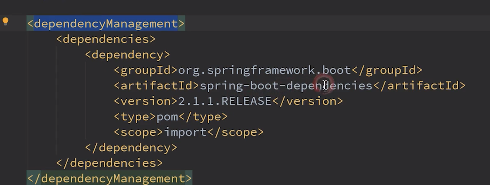
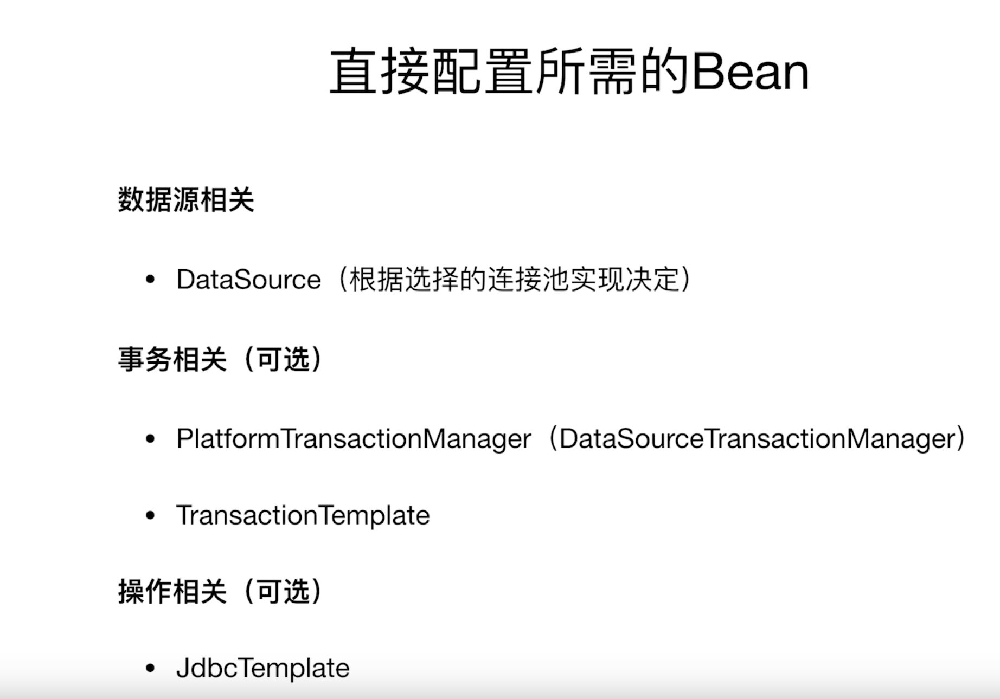
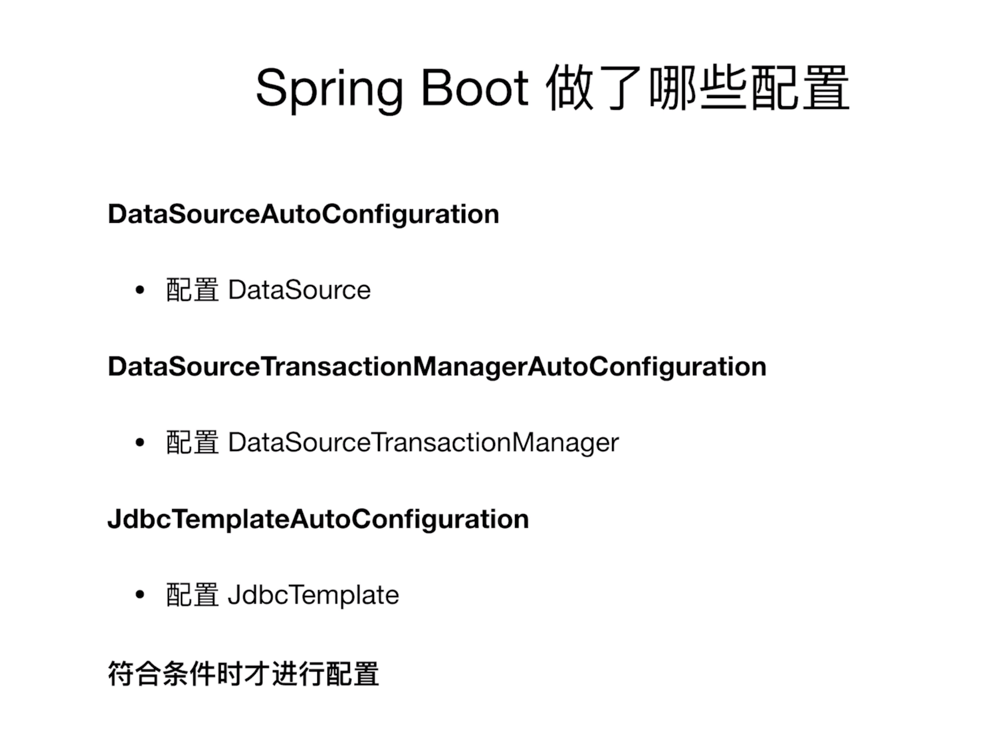
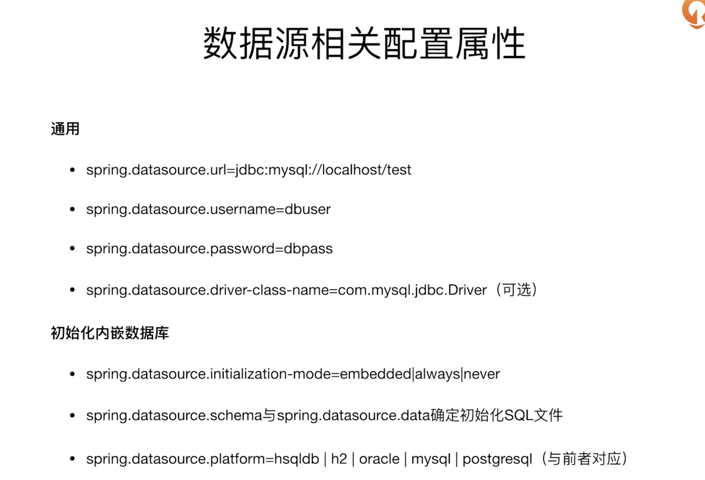

###  初识spring

#### 1 spring 课程介绍

课程分为：

1. 初识Spring
   1. Spring家族的主要成员
   2. 跟着Spring了解技术趋势
   3. 编写第一个Spring应用程序
2. 数据操作
   1. JDBC 必知必会
   2. O/R Mapping实践
   3. NoSQL实践
   4. 数据访问进阶
3. Web开发
   1. Spring MVC
   2. Web 开发进阶
   3. 访问Web资源
4. Spring Boot
   1. 自动配置原理及实现
   2. 起步依赖原理及定制
   3. 配置文件加载机制
   4. 获取运行状态
   5. 配置运行容器
   6. 可执行Jar背后的秘密

#### 2 认识spring家族的主要成员

1. 对标ejb
2. spring Boot ： build anything
3. Spring cloud: coordiNate Anything
4. spring cloud Data Flow: connect Anything

成员：

1. spring framework

2. spring boot

   1. 快速构建基于Spring的应用程序
      1. 快
      2. 开箱即用

3. spring cloud

   1. 简化分布式系统的开发
      1. 配置管理
      2. 服务注册发现
      3. 熔断
      4. 服务追踪

   #### 3 跟着Spring了解技术趋势

   1. Kotlin可以起步去了解了
   2. WebFlux 异步编程的崛起
   3. spring boot 和cloud 是趋势

   spring framework 就是把最佳实践集成到框架中。

   #### 4 编写第一个Spring程序

   1. spring项目 的pom文件是继承于spring-starter文件的。

   2. spring-boot-maven-plugin作用是打一个可以运行的web jar包

   3. java  -jar hello.jar 就可以执行web程序

   4. 如何使用自己项目pom的parent，使用spring-boot-dependencies解决这个问题。

      ### JDBC必知必会

      #### 5. 如何配置单数据源

      

      

   

#### 6. 如何配置多个数据源

