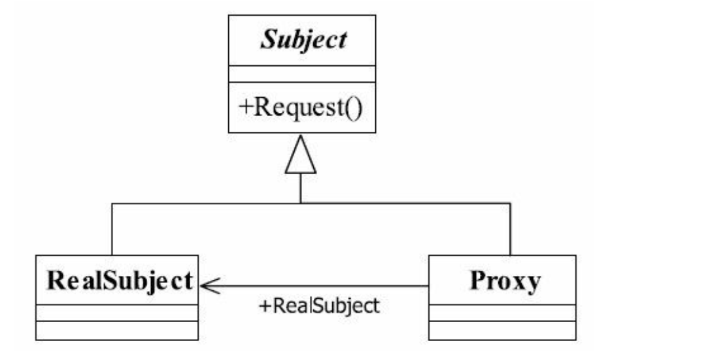

## 代理模式

## 1定义

Provide a surrogate or placeholder for another object to control access to it()

#### 1.1通用类图



#### 1.2通用代码

```java
public interface Subject {
//定义一个方法
public void request();
}
```

```java
public class RealSubject implements Subject {
//实现方法
public void request() {
//业务逻辑处理
}
}
```

```java
public class Proxy implements Subject {
private Subject subject = null;
public Proxy(){
this.subject = new Proxy();
}
public Proxy(Object...objects ){}/
public void request() {
this.before();
this.subject.request();
this.after();
}
private void before(){
}
private void after(){
//do something
}
}
```

## 2.优缺点

#### 2.1优点

1. 职责清晰

2. 高扩展性

## 6.  扩展

#####  普通代理 

它的要求就是客户端只能访问代理角色， 而不能访问真实角色， 这是比较简单的

##### 强制代理

你必须通过真实角色查找到代理角色， 否则你不能访问。

##### 动态代理

后续学习