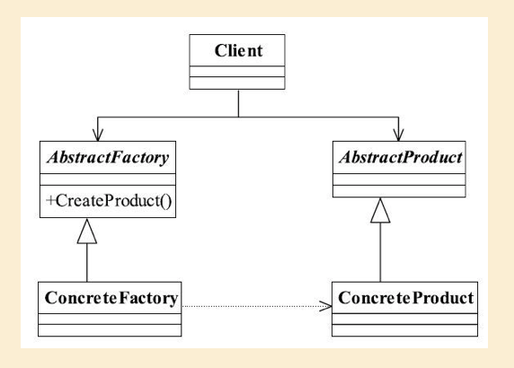
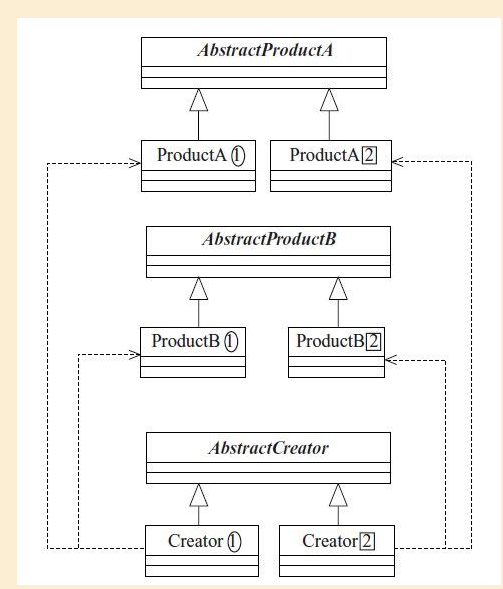

##  抽象工厂模式

## 1定义

Provide an interface for creating families of related or dependent objects without specifying their concrete classes.（为创建一组相关或相互依赖的对象提供一个接口， 而且无须指定它们的具体类。 ）

#### 1.1通用类图

#### 



#### 1.2通用代码

```java
public abstract class AbstractFactory {
    abstract AbstractProductA createA();
    abstract AbstractProductB createB();

}
```

```java
public class ConcreteFactory1 extends AbstractFactory {
    @Override
    AbstractProductA createA() {
        return new ProductA1();
    }

    @Override
    AbstractProductB createB() {
        return new ProductB1();
    }
}

```

```java
public class ConcreteFactory2 extends  AbstractFactory{

    @Override
    AbstractProductA createA() {
        return new ProductA2();
    }

    @Override
    AbstractProductB createB() {
        return new ProductB2();
    }
}
```

```java
public abstract class AbstractProductA {
    abstract void doA();
}

```

```java
public class ProductA1 extends AbstractProductA {
    @Override
    void doA() {

    }
}

```

```
public class ProductA2 extends AbstractProductA {

    @Override
    void doA() {

    }
}
```

```java
public abstract class AbstractProductB {
    abstract void doB();
}
```

```java
public class ProductB1 extends AbstractProductB {
    @Override
    void doB() {

    }
}
```

```java
public class ProductB2 extends AbstractProductB {
    @Override
    void doB() {

    }
}
```


## 2.优缺点

#### 2.1抽象工厂的优点

- 封装性， 每个产品的实现类不是高层模块要关心的， 它要关心的是什么？ 是接口， 是抽象。
- 产品族内的约束为非公开状态。

#### 2.2抽象工厂的缺点

抽象工厂模式的最大缺点就是产品族扩展非常困难， 

## 3.使用场景

抽象工厂模式的使用场景定义非常简单： 一个对象族（或是一组没有任何关系的对象）都有相同的约束， 则可以使用抽象工厂模式。

## 4.注意事项

在抽象工厂模式的缺点中， 我们提到抽象工厂模式的产品族扩展比较困难， 但是一定要清楚， 是产品族扩展困难， 而不是产品等级。 在该模式下， 产品等级是非常容易扩展的， 增加一个产品等级， 只要增加一个工厂类负责新增加出来的产品生产任务即可。 **也就是说横向扩展容易， 纵向扩展困难**。


#####  