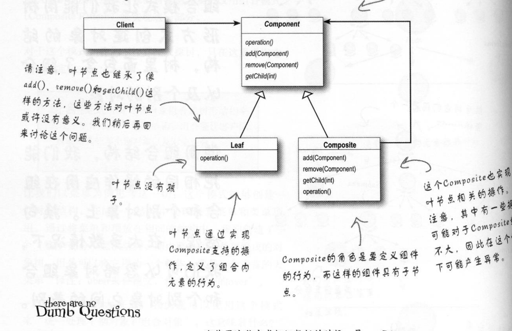

## 组合模式

## 1定义

Compose objects into tree structures to represent part-whole hierarchies.Composite lets clients treat individual objects and compositions of objects uniformly.（允许你将对象组合成树形结构，来表现"整体/部分"层次结构。组合能让客户以一致的方式处理个别对象以及对象组合 ）

#### 1.1通用类图



#### 1.2通用代码

```java

```

```java

```

```java

```

```java

```

```java

```

```java

```

```java

```

```java

```

## 2.优缺点

#### 2.1优点

1. 高层模块调用简单
2. 节点自由增加

## 3.使用场景

1.  维护和展示部分-整体关系的场景， 如树形菜单、 文件和文件夹管理。
2. 从一个整体中能够独立出部分模块或功能的场景。

## 4.注意事项

## 5.设计原则

## 6.  扩展

#####  