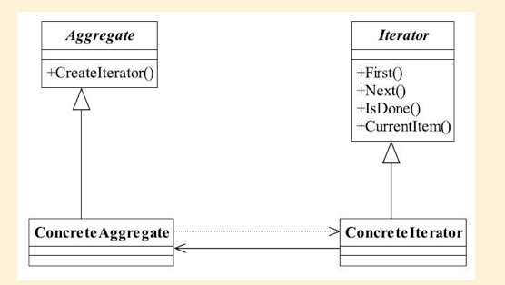

## 迭代器模式

## 1定义

Provide a way to access the elements of an aggregate object sequentially without exposing its
underlying representation.（它提供一种方法访问一个容器对象中各个元素， 而又不需暴露该
对象的内部细节。 ）

#### 1.1通用类图



#### 1.2通用代码

```java

```

```java

```

```java

```

```java

```

```java

```

```java

```

```java

```

```java

```

##### 


#####  