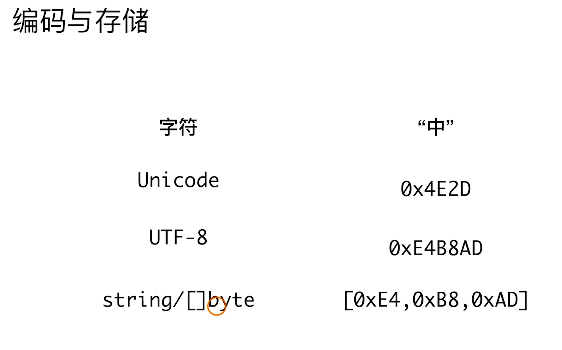
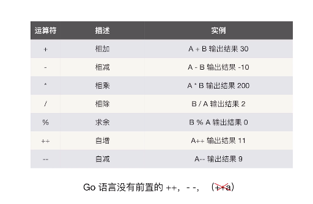
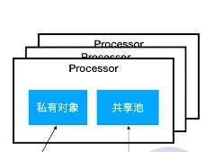
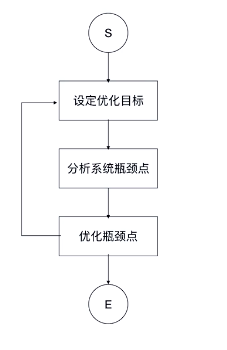
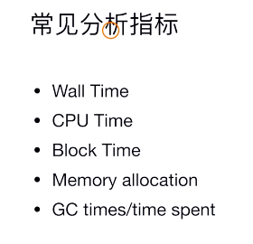
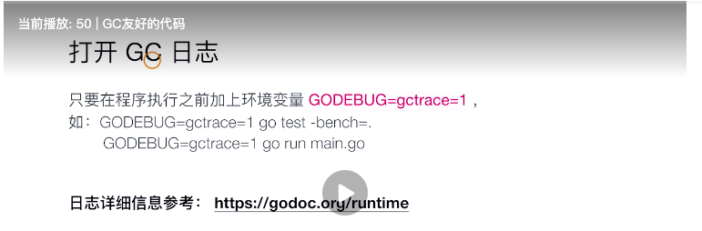

## go语言从入门到实践

### variable

全局变量只能使用var方式

### const

```
const(
Mondy = iota +1
)

const(
Open = 1 << iota
)
```

##### iota

Within a [constant declaration](https://golang.org/ref/spec#Constant_declarations), the predeclared identifier `iota` represents successive untyped integer [constants](https://golang.org/ref/spec#Constants). Its value is the index of the respective [ConstSpec](https://golang.org/ref/spec#ConstSpec) in that constant declaration, starting at zero. It can be used to construct a set of related constants:


### 基础数据类型

1. go语言不支持隐形数据转换

2. int类型在32位系统为32，64位系统为64
3. math包中有预定义的最大最小值

```
bool
string
int int8 int16 int32 int64
uint uint8 uint16 uint32 uint64 uintpr
byte //alias for uint8
rune //alias for int32,represents a unicode code point
float32 float64
complex64 complex128
```

https://blog.golang.org/strings

### Array

```
var buffer [256]byte
```

An array with 512 bytes would be of the distinct type `[512]byte`.

The data associated with an array is just that: an array of elements. Schematically, our buffer looks like this in memory.

```
buffer: byte byte byte ... 256 times ... byte byte byte
```

`len(buffer)` returns the fixed value 256.

### slice

A slice is a data structure describing a contiguous section of an array stored separately from the slice variable itself. *A slice is not an array*. A slice *describes* a piece of an array.


What exactly is this slice variable? It's not quite the full story, but for now think of a slice as a little data structure with two elements: a length and a pointer to an element of an array. You can think of it as being built like this behind the scenes:

```
type sliceHeader struct {
    Length        int
    Capacity      int
    ZerothElement *byte
}
slice := iBuffer[0:0]
slice := sliceHeader{
    Length:        0,
    Capacity:      10,
    ZerothElement: &iBuffer[0],
}
```

The `Capacity` field records how much space the underlying array actually has; it is the maximum value the `Length` can reach.The `Capacity` field is equal to the length of the underlying array, minus the index in the array of the first element of the slice (zero in this case). 

##### Passing slices to functions

It's important to understand that even though **a slice contains a pointer, it is itself a value**. Under the covers, it is a struct value holding a pointer and a length. It is *not* a pointer to a struct.

```
func SubtractOneFromLength(slice []byte) []byte {
    slice = slice[0 : len(slice)-1]
    return slice
}

func main() {
    fmt.Println("Before: len(slice) =", len(slice))
    newSlice := SubtractOneFromLength(slice)
    fmt.Println("After:  len(slice) =", len(slice))
    fmt.Println("After:  len(newSlice) =", len(newSlice))
}
```

Here we see that the *contents* of a slice argument can be modified by a function, but **its *header* cannot.** The length stored in the `slice` variable is not modified by the call to the function, since the function is passed a copy of the slice header, not the original.

thus if we want to write a function that modifies the header, we **must return it as a result parameter**, just as we have done here.

##### Pointers to slices: Method receivers

Another way to have a function modify the slice header is to pass a pointer to it. Here's a variant of our previous example that does this:

```
func PtrSubtractOneFromLength(slicePtr *[]byte) {
    slice := *slicePtr
    *slicePtr = slice[0 : len(slice)-1]
}

func main() {
    fmt.Println("Before: len(slice) =", len(slice))
    PtrSubtractOneFromLength(&slice)
    fmt.Println("After:  len(slice) =", len(slice))
}
```

##### copy

When we doubled the capacity of our slice in the previous section, we wrote a loop to copy the old data to the new slice. Go has a built-in function, `copy`, to make this easier. Its arguments are two slices, and it copies the data from the right-hand argument to the left-hand argument. Here's our example rewritten to use `copy`:

```
    newSlice := make([]int, len(slice), 2*cap(slice))
    copy(newSlice, slice)
```

1.  the number of elements it copies is the minimum of the lengths of the two slices. 
2. **The `copy` function also gets things right when source and destination overlap,** which means it can be used to shift items around in a single slice. Here's how to use `copy` to insert a value into the middle of a slice.

```
// Insert inserts the value into the slice at the specified index,
// which must be in range.
// The slice must have room for the new element.
func Insert(slice []int, index, value int) []int {
    // Grow the slice by one element.
    slice = slice[0 : len(slice)+1]
    // Use copy to move the upper part of the slice out of the way and open a hole.
    copy(slice[index+1:], slice[index:])
    // Store the new value.
    slice[index] = value
    // Return the result.
    return slice
}
```


##### append

append在容量不够时会自动扩容

##### nil

what the representation of a `nil` slice is. Naturally, it is the zero value of the slice header:

```
sliceHeader{
    Length:        0,
    Capacity:      0,
    ZerothElement: nil,
}
```

The key detail is that the element pointer is `nil` too

As should be clear, an empty slice can grow (assuming it has non-zero capacity), bu**t a `nil` slice has no array to put values in and can never grow to hold even one element**.

That said, a `nil` slice is functionally equivalent to a zero-length slice, even though it points to nothing. It has length zero and can be appended to, with allocation.

##### strings

Strings are actually very simple: they are just read-only slices of bytes with a bit of extra syntactic support from the language.

### Strings, bytes, runes and characters in Go

1. the difference between a byte, a character, and a rune。
2. the difference between Unicode and UTF-8
3.  the difference between a string and a string literal, and other even more subtle distinctions.
4. string 的byte数组可以存放任何数据

##### UTF-8 and string literals，Code points, characters, and runes

To summarize, strings can contain arbitrary bytes, but when constructed from string literals, those bytes are (almost always) UTF-8.

- Go source code is always UTF-8.
- A string holds arbitrary bytes.
- A string literal, absent byte-level escapes, always holds valid UTF-8 sequences.
- Those sequences represent Unicode code points, called runes.
- No guarantee is made in Go that characters in strings are normalized.

遍历字符

```go
    const nihongo = "日本語"
    fmt.Println("Byte loop:")
    for i := 0; i < len(nihongo); i++ {
        fmt.Printf("%x ", nihongo[i])
    }
    fmt.Printf("\n")

    for index, runeValue := range nihongo {
        fmt.Printf("%#U starts at byte position %d\n", runeValue, index)
    }
```

```go
    const nihongo = "日本語"
    for i, w := 0, 0; i < len(nihongo); i += w {
        runeValue, width := utf8.DecodeRuneInString(nihongo[i:])
        fmt.Printf("%#U starts at byte position %d\n", runeValue, i)
        w = width
    }
```

##### unicode 和 utf-8

unicode是一种字符集

UTF-8是Unicode的存储实现(转换为字节序列)



##### 字符串处理函数包

strings

strconv

##### Conclusion

To answer the question posed at the beginning: **Strings are built from bytes so indexing them yields bytes, not characters**. **A string might not even hold characters.** In fact, the definition of "character" is ambiguous and it would be a mistake to try to resolve the ambiguity by defining that strings are made of characters.

#### operator



#### map/Set

mapkey不存在时返回0值

使用map实现，value设置为bool值

#### 函数

函数一等公民

函数可以作为参数和返回值

可变参数

```
func sum(ops ... int) int
```

#### 面向对象

没有继承，没有 泛型

值和指针的区别：值会复制原有的结构体。

##### 接口

ducktype接口

#### 扩展和服用

##### 继承

没有继承，使用组合实现：

1. 不支持继承泛型

##### 多态实现

使用接口多态

空接口可以表示任何类型

通过断言来判断类型

```
v, ok := p.(int)

switch v:= p.(type){
case int : 
}
```

##### go接口的最佳实践

1. 倾向于使用小的接口定义，很多接口只包含一个方法。
2. 较大的接口定义，可以由小的接口定义组合而成
3. 只依赖于必要功能的最小接口

#### 错误处理

1. go语言没有异常处理，使用多返回值处理。
2. error类型实现error接口
3. 可以通过errors.New来快速创建错误实例
4. 判断错误类型定义错误

os.exxit退出时不会调用defer

这种recover有风险：

1. 形成僵尸服务进程，导致health check 失效。

```
defer func(){
if err:= recover(); err != nil{
log.Error("recover panic err")
}
}
```

#### package

1. 基本服用模块单元
   - 以首字母大写来表明可被包外代码访问
2. 代码的package可以和所在目录不一致
3. 同一目录里的go代码的package要保持一直

所有的init都会被

#### 并发编程

##### Thread vs Goroutine

1. 创建时默认的stack的大小

   - jdk5以后 java thread stack 默认为 1m

   - GROUTINE 的stack初始化为2k

2. 和 KSE(kernel Space Entity)的对应关系

   - java Thread 是1：1
   - groutine 是M：N

1：1线程切换会导致内核对象的切换

M:N 

#### 并发机制

##### 共享内存并发机制

1. sync.Mutex

2. sync.RWmutex

3. waitGroup  用来阻塞主携程

4. ```
   var wg sync.WaitGroup
   for i :=0; i < 5000 ; i++{
   	wg.add(1)
   	go func(){
   		defer func(){
   		wg.Done
   		}
   	}
   }
   ```

   

###### CSP（communicating sequential processed）并发机制

使用管道进行通信

channel ： buffer channel 和无buffer channel

1. 异步返回
   - go 一个协程，然后传入chan， 后续在chan中读取

##### 多路选择和超时空值

多路选择在两个case上都有值时选择哪个？随机的

多路选择如何控制退出？

```
select {
	case ret := <-retch1:
	case ret := <-time.after(time.second *1):
		timeout..	
	default :
}
```

无default阻塞

##### channel的关闭和广播

```
v, ok <- ch; ok 为bool值， true表示正常接收， false表示关闭，v为该类型的0值
```

1. 向关闭的通道发消息会panic

2. 接收关闭的通道： 立即返回并获得通道类型的0值

#### 任务取消

##### 广播方式关闭

1. 共享内存方式一般是通过一个变量，判断变量的值判断任务是否需要取消。

2. 使用 通道方式，直接关闭cancel通道，会广播所有通道，其他通道可以关闭。

##### 关联任务的取消

使用context包，传递context停止子协程


#### 典型并发任务


##### 只运行一次

使用sync.once

##### 仅需任意任务完成

使用chan，当制定数量任务完成时退出，注意不要导致协程泄露。

##### 所有任务完成

1. 使用wait group
2. 在csp模式下，和任意任务相似，取到制定数量的然后退出

##### 对象池

使用 buffered channel实现对象池

每次从chan中取用完后还回来，在获取时设置超时未获取到返回错误，放入时满chan 返回错误

##### sync.Pool对象缓存

1. 适合服用，降低复杂对象的创建个GC代价
2. 协程安全，会有锁的开销
3. 生命周期受GC影响，不适合于做连接池等，序自己管理生命周期的资源的池化

原理:



1. 私有对象协程安全，共享池需要加锁
2. 尝试从私有对象获取
3. 私有对象不存在，尝试从当前processor的共享池获取
4. 从其他processor共享池获取
5. 使用new函数创建

#### 11. 测试

##### 单元测试

Fail, Error: 该测试失败，该测试继续， 其他测试据需执行

FailNow该测试失败，该测试终止，其他测试继续执行

##### benchmark

```
b.ResetTimer()
b.StopTimer()
```

go test -bench =. -bechmem


#### 12. 反射和unsafe

##### 反射编程

```
reflect.TypeOf() 返回一个type类型的接口 可以调用kind方法返回kind  kind是所有类型的枚举值
reflect.Valueof()
reflect.ValueOf(*e).FieldByName("Name")
reflect.valueof(e).MethodByName("updateAge").Call([]reflect.Value(reflect.ValueOf(1)))
```

反射的作用？

用于写动态程序

反射会大大降低程序的性能

##### 万能程序

```
reflect.DeepeEqual()
```


##### 不安全编程

package unsafe

1. 强制类型转换
2. atomic

atomic包的使用

#### 14 常见架构模式

##### pipe-filter framework

##### micro-kernel framework

#### 15常见任务

##### 内置json解析

FeildTag 实现原理？？？

json marshal 和unmarshal实现原理。、？？？

反射性能比较低，对于高性能使用的不推荐。

##### easyjson 

easyjson并未使用反射，而是直接生成代码，性能更好

##### http服务

```
http.handleFunc
http.listenAndServer(":8080", nil) 第二个参数为路由规则
```

#### 性能调优


runtime  pprof

1. 在程序中内嵌代码
2. http
3. 

##### 性能调优





##### 别让性能被锁住

加锁的性能损失？

1. 减少锁的影响范围
2. 减少发生锁冲突的概率
   1. sync.Map
   2. ConcurrentMap
3. 避免锁的使用
   1. LAMX disruptor

sync.Map 的原理？

1. 适合读多写少，且key相对稳定的环境(在写得多的情况下比普通加锁的的map性能更差)
2. 采用了空间换时间的方案

concurrent Map ?

将大的map分割成小的map

##### GC友好的代码

染色标记GC

1. 避免内存的分配和复制
   1. 复杂对象尽量传递引用
      1. 数组的传递
      2. 结构体传递
   2. 
   3. go tool  trace
   4. 为什么在传值和传引用对gc的压力不同

2. 避免内存分配和复制
   1. 初始化至合适的大小
      1. 自动扩容是有代价的
   2. 复用内存


#### 16 高可用服务设计

##### 高效字符串连接

字符串拼接的几种方式

strings.builder

+

bytes.buffer

stringBuilder实现原理？

