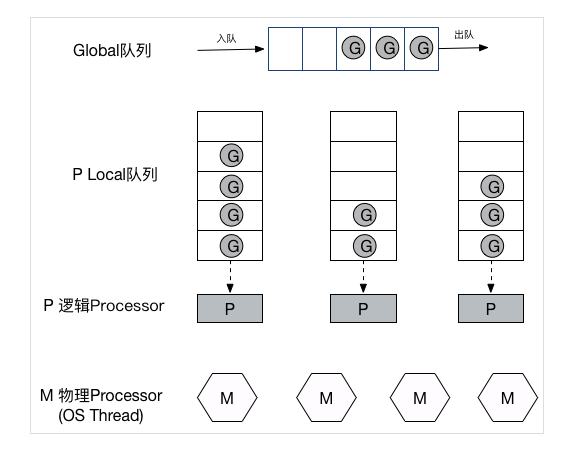
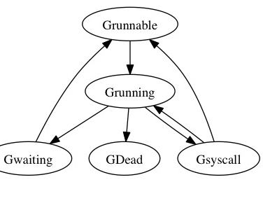
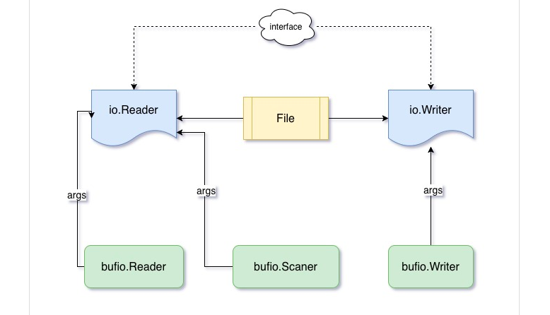

#### go的环境配置以及工具使用

#### 基础问题

1. go的基本数据类型有哪些

   ```
   bool
   string
   int int8 int16 int32 int64
   uint uint8 uint16 uint32 uint64 uintpr
   byte //alias for uint8
   rune //alias for int32,represents a unicode code point
   float32 float64
   complex64 complex128
   ```

2. 如何在go中定义枚举

   ```
   const(
   Mondy = iota +1
   ) iota代表下标，从0开始
   ```

3. make和new的区别

   1. new 分配内存并返回指针
   2. make 返回一个普通的T。通常情况下，T内部有一些隐式的指针。用于slice，map，chan的初始化

4. copy内置函数的功能

   1.  copy(newSlice, slice)复制右边的切片到左边，copy会保证两点
      1. 复制的长度为两个切片中短的一个
      2. copy保证切片覆盖时的正确性

5. go 如何进行类型断言

#### 基本数据结构

1. golang中的数组

   1. go中的数组就是一块连续分配的内存，每个不同长度的数组都是一个新的类型。\

   2. 初始化会自动分配内存。go的数组是一个值。如果使用数组直接传递，则会传递整个数组的值，而不是指针

      1. ```
         	var a [25]int;
            	var b *[25]int;
            	c := a;
            	b = &a;
            	a[1] = 2;
            	fmt.Println(b[1]);//2
            	fmt.Println(c[1]);//0
         ```

         

2. golang中的切片

   1. sliece是一个结构体，它有三个字段，指向第一个元素的指针，长度，容量

      ```
      slice := sliceHeader{
          Length:        0,
          Capacity:      10,
          ZerothElement: &iBuffer[0],
      }
      ```

   2. 初始化

      1. ```go
         func make([]T, len, cap) []T
         s := make([]byte, 5)
         ```

   3. 扩容
      1. 使用append操作时，如果容量不够，会自动扩容
         1. 如果新的大小是当前大小的2倍以上，则大小增长为新的大小
         2. 负责循环一下操作：如果当前大小小于1024，按每次2倍增长，负责每次按当前大小1/4增长，直到增长大小超过或等于新大小。
         3. 在函数中传递时，如果只是传结构体，则不能改变切片本身的长度和容量

3. 长度为0的切片和空切片的区别

   1. 长度为0的切片指向底层数组的指针不为空
   2. 空切片一个0值得 切片结构体，其指向底层数组的指针为空，所以其不能扩容
   3. 但是使用append方法时，功能上时相等的

4. map

   1. 底层是一个bucket数组。每个bucket中最多存放8个键值对，如果多余8个，会申请新的bucket，并将它与之前的bucket连起来。
   2. 扩容
      1. hash表的扩容每次都会为原来大小的两倍，
      2. 为了提过map的响应时间，go语言使用增量扩容
         1. 扩容会建立一个大小是原来2倍的新的表，将旧的bucket搬到新的表中，并不会将旧的bucket从oldbucket中删除，而是加上一个已删除的标记。只有当所有的bucket都从旧表移到新表中后，才会将oldbucket释放掉。
         2. 查找
            1. 根据key计算出hash值
            2. 如果存在oldtable，首先在old table中查找，如果找到的bucket已经evacuated，转到步骤3。反之，返回对应的value
            3. 在new table 中查找对应的value
         3. 插入
            1. 根据key算出hash值，进而得到对应的bucket
            2. 如果bucket在old table中，将其重新散列到newtable中
            3. 在bucket中，查找空闲的位置，如果已经存在需要插入的key，跟新奇对应的value
            4. 根据table中元素的个数，判断是否grow table
            5. 如果对应的bucket已经full，重新申请新的overbucket
            6. 将key value pair 插入到bucket中

5. unsafe包的作用

6. concurrentmap的实现原理

#### 字符串

1. string的基本实现
   1. 字符串的底层是一个byte切片
   2. 使用for range去迭代，会使用utf-8去解码。使用长度去迭代，会得到二进制
   3. 每个rune代表一个 unicode code point
2. 字符串的常用操作
   1. strings包中
   2. strconv 转换操作

#### 接口

1.  go接口的实现
   1. 接口值可以看做包含值和具体类型的元组：(value, type)，接口值调用方法时会执行其底层类型的同名方法。
2. 底层值为 nil 的接口值和nil接口值的区别
   1. nil 接口值既不保存值也不保存具体类型。
   2. 底层值为nil的接口不保存值但是保存具体类型

#### 日期和时间

#### 异常

1. golang的错误体系
   1. golang使用多返回值来返回错误，go中只要实现了error接口的都是错误
2. defer, panic, recover分别是什么
   1. defer是一个常用的操作，一般用于在函数退返回执行释放资源的操作。
      1. 被defer 的函数参数是在函数被压栈时的值
      2. 由于defer 可以看做一个栈的操作，所以defer 是后进先出的
      3. defer可以操作外围函数的返回值。
   2. panic是一个内置的函数。当panic函数被调用时，函数会返回，该过程一直向上移动，直到当前goroutine中的所有函数都返回
   3. Recover是一个内置函数，用于恢复被panic的协程。Recover 只有在deffer的函数中才有效。如果当前goroutine处于恐慌状态，则对recover的调用将捕获 panic（）中的值并恢复正常执行。recover获得的值将是panic中传入的值。

#### 多线程

1. 线程和协程的区别

   1. 线程的创建，切换都要使用系统调用，需要进行用户态和内核态的切换，开销比较大。协程是运行在用户态的。
   2. 协程使用的内存更小，
   3. 协程需要在用户态实现一套调度模型

2. go的调度模型

   1. G: Gourtines, 每个Goroutine对应一个G结构体，G保存Goroutine的运行堆栈，即并发任务状态。G并非执行体，每个G需要绑定到P才能被调度执行。

   2. P: Processors, 对G来说，P相当于CPU核，G只有绑定到P(在P的local runq中)才能被调度。对M来说，P提供了相关的执行环境(Context)，如内存分配状态(mcache)，任务队列(G)等

   3. M: Machine, OS线程抽象，负责调度任务，和某个P绑定，从P的runq中不断取出G，切换堆栈并执行，M本身不具备执行状态，在需要任务切换时，M将堆栈状态写回G，任何其它M都能据此恢复执行。

   4. 调度流程

      1. 在M与P绑定后，M会不断从P的Local队列(runq)中取出G(无锁操作)，切换到G的堆栈并执行，当P的Local队列中没有G时，再从Global队列中返回一个G(有锁操作，因此实际还会从Global队列批量转移一批G到P Local队列)，当Global队列中也没有待运行的G时，则尝试从其它的P窃取(steal)部分G来执行
      2. 阻塞：当Goroutine因为Channel操作而阻塞(通过gopark)时，对应的G会被放置到某个wait队列(如channel的waitq)，该G的状态由`_Gruning`变为`_Gwaitting`，而M会跳过该G尝试获取并执行下一个G。
      3. syscall：当G被阻塞在某个系统调用上时，此时G会阻塞在`_Gsyscall`状态，M也处于block on syscall状态，此时仍然可被抢占调度: 执行该G的M会与P解绑，而P则尝试与其它idle的M绑定，继续执行其它G。如果没有其它idle的M，但队列中仍然有G需要执行，则创建一个新的M。
      4. 当系统调用完成后，G会重新尝试获取一个idle的P，并恢复执行，如果没有idle的P，G将加入到Global队列。

      

3. goroutine的生命周期

   1. runtime.newproc创建goroutine
   2. 

4. go的协程同步和并发方法

   1. sync.Mutex
   2. sync.RWmutex
   3. waitGroup  用来阻塞主携程
   4. channel 

5. goroutine关闭

   1. 共享内存一般是通过一个变量，判断变量的值判断任务是否取消
   2. 使用通道方式，直接关闭通道，会广播所有通道
   3. 关联任务：使用context包，传递context停止子协程

6. 典型的并发任务

   1. ##### 只运行一次：使用sync.once

   2. ##### 仅需任意任务完成：使用chan，当制定数量任务完成时退出，注意不要导致协程泄露。

   3. ##### 所有任务完成

      1. 使用wait group
      2. 在csp模式下，和任意任务相似，取到制定数量的然后退出

7. 多协程任务实现

   1. 无容量管道可以实现java的 wait - notify机制

8. sync.pool对象实现原理

9. channel的底层实现

   1. channel 数据结构
      1. 有一个存放channel数据的的环形队列
      2. 两个链表，一个recvq 和 sendq分别存储被chan阻塞的goroutine，链表中的节点（sudog）有两个主要属性：一个是g代表goroutine，一个是elem，代表读或者写的数据
   2. 写chan的操作：runtime.chansend函数
      1. 在同步情况下，查看 recv q链表是否为空，即是否有因为读该管道而阻塞的goroutine。如果有，则可以正常写channel。否则会阻塞
         1. recvq不为空的情况下，讲一个sudoG结构体出队列，将传给通道的数据拷贝到sudoG结构体中的elem域，并将sudoG中的g放到就绪队列中，状态置位ready，函数返回
         2. 如果recvq为空，将当前goroutine阻塞，此时讲一个sudoG结构体挂到通道的sendq链表中，该sudog的elem为写入的数据，然后把当前goroutine设置为waiting状态
      2. 在异步情况，
         1. 如果缓冲区满了，将当前数据和goroutine一起作为sudog结构体挂在sendq队列中，否则，
         2. 看recvq有没有等待，有就唤醒
         3. 缓冲区没满，直接写入
   3. 读操作类似
   4. 空通道：读写空通道直接将doroutine放到等待队列
   5. 读关闭的通道会返回0值，和正常读操作相同，只是读的数据不同

10. select的实现

    1. select-case中的操作编译成了if-else。
    2. select的本质也是调用了chanrecv函数，只不过通过参数告诉该函数调用失败是不要阻塞当前协程。
    3. select中保存了所有case随机排列的数组
    
11. context

    1. 接口

       1. ```go
          type Context interface {
          	Deadline() (deadline time.Time, ok bool)
          
          	Done() <-chan struct{}
          
          	Err() error
          
          	Value(key interface{}) interface{}
          }
          ```

2. background 和 TODO

   1. backgroud主要用于main函数，作为Context这个树接口的最顶层Context
   2. 一个是todo目前还不知道具体的使用场景 不止道使用什么时使用
   3. 两个本质都是空的context

3. 产生子context

   1. ```go
      func WithCancel(parent Context) (ctx Context, cancel CancelFunc)
      func WithDeadline(parent Context, deadline time.Time) (Context, CancelFunc)
      func WithTimeout(parent Context, timeout time.Duration) (Context, CancelFunc)
      func WithValue(parent Context, key, val interface{}) Context
      ```

      1. `WithCancel`函数，传递一个父Context作为参数，返回子Context，以及一个取消函数用来取消Context。
      2. `WithDeadline`函数，和`WithCancel`差不多，它会多传递一个截止时间参数，意味着到了这个时间点，会自动取消Context，当然我们也可以不等到这个时候，可以提前通过取消函数进行取消。
      3. `WithTimeout`和`WithDeadline`基本上一样，这个表示是超时自动取消，是多少时间后自动取消Context的意思。
      4. `WithValue`函数和取消Context无关，它是为了生成一个绑定了一个键值对数据的Context，这个绑定的数据可以通过`Context.Value`方法访问到，后面我们会专门讲。

#### 反射

 1. golang的反射是使用 接口里面存储的具体类型和值来实现的。

 2. reflect.typeOf() 返回接口的类型

 3. reflect.valueOf() 返回接口存的值

    


#### io




1. file本事的read write
2. buffio.reader()
3. buffio.writer()
4. buffio.Scanner()

#### 内存分配，垃圾回收

1. go的内存分配

2. go的垃圾回收算法

   1. 三色标记算法

      1. 起初所有的对象都是白色，从gcroot开始，标记直接引用的为灰色，加入灰色队列，
      2. 从灰色队列取出对象，将该对象的直接引用标记为灰色，并加入灰色队列，将灰色元素本身标记为黑色。持续，直到灰色队列为空
      3. 回收白色对象

   2. 写屏障

      1. 插入屏障
         1. 插入屏障拦截将白色指针插入黑色对象的操作，标记其对应对象为灰色状态，这样就不存在黑色对象引用白色对象的情况了，
      2. 删除屏障
         1. 删除屏障也是拦截写操作的，但是是通过保护灰色对象到白色对象的路径不会断来实现的。
         2. 在这种实现方式中，回收器悲观的认为所有被删除的对象都可能会被黑色对象引用。
      3. 区别
         1. 插入屏障和删除屏障各有优缺点，Dijkstra的插入写屏障在标记开始时无需STW，可直接开始，并发进行，但结束时需要STW来重新扫描栈，标记栈上引用的白色对象的存活；Yuasa的删除写屏障则需要在GC开始时STW扫描堆栈来记录初始快照，这个过程会保护开始时刻的所有存活对象，但结束时无需STW。

   3. 步骤

      1. mark：打开写屏障，找到所有根对象表标记为灰色
      2. 并发标记：将灰色对象标记为黑色，将灰色对象相连的对象加入队列，可能会出现出现黑色引用白色的情况(使用写屏障解决)
      3. rescan 使用插入写屏障解决的话：重新扫描灰色队列和栈，对栈上指针的写屏障成本高，所以使用重新扫描，标记确保黑色引用的白色正确标记
      4. 使用混合屏障不需要rescan。堆上的白色指针被栈上黑色指针引用时，会在断开堆上灰色指针式触发删除写屏障
      5. 清理白色对象

   4. 触发gc的方式

      1. 自动检测

         1. 当分配的对象>32kb或是分配小对象是发现span已经满了时，会触发gc

         2. 用户调用

         3. 状态监控：两分钟未触发gc，会触发gc

            

3. golang的内存模型

   1. Go语言的内存模型规定了一个goroutine可以看到另外一个goroutine修改同一个变量的值的条件

   2. happens Before原则：r如何要看到w，必须满足一下条件

      1. w先行发生于r
      2. 其他对共享变量v的写操作要么在w前，要么在r后。

      在串行环境下，程序的执行顺序就天然满足happens-before原则，在并行环境下，需要同步手段保证

   3. 对变量的0值初始化和写操作相同，对打一个字的变量的读写操作表现的像以不确定顺序对多个一字大小的变量的操作

   4. channel 发送操作 happens -before channel 读操作

   5. channel 关闭操作 happens-before 接收到0值

   6. 无缓冲channel的接收先行发生于发送完成

   7. 

   8. 
   
4. 内存模型

   1. golang的内存分配
      1. 再分配前会做逃逸分析。
      2. 一般情况下，golang会把局部变量分配到栈帧上，如果变量不能确保函数返回后不在被引用，则在对上分配
      3. 如果一个局部变量非常大， 它也会被分配到堆上
      4. mcache
         1. 每个p独享，这样的好处是不用加锁
      5. mcentral
         1. 全局cache，当mcache不够时，向全局cache申请
      6. mheap
         1. 当 mcentral 也不够用的时候，通过 mheap 向操作系统申请。
      7. mspan
         1. span 在 tcmalloc 中作为一种管理内存的基本单位而存在
      8. 内存分配的过程
         1. objectsize > 32k 则使用mheap直接分配
         2. <16byte使用mcache的小对象分配器分配
         3. 16byte -32k之间，使用mcache中对应的size class 分配
         4. mcache 没有向mcentral申请，mcentral没有向mheap申请，如果mheap也没有合适的，则向操作系统申请。

    

   

#### 

#### 