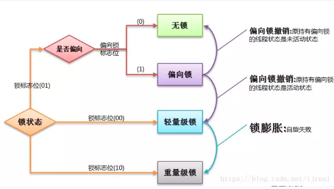
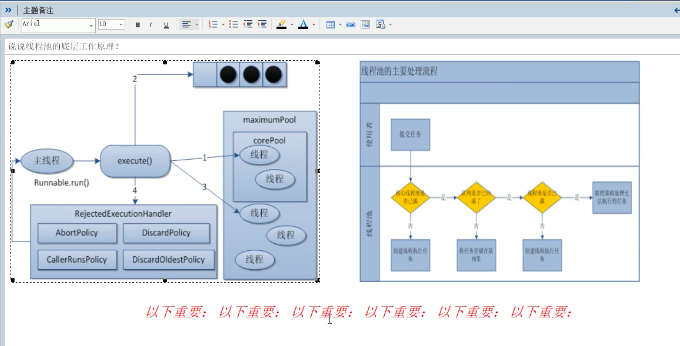

## java知识点汇总

### java基础

#### java环境配置

1. jdk和jre有什么区别

   1. JDK：Java Development Kit 的简称，java 开发工具包，提供了 java 的开发环境和运行环境。
   2. JRE：Java Runtime Environment 的简称，java 运行环境，为 java 的运行提供了所需环境。

   具体来说 JDK 其实包含了 JRE，同时还包含了编译 java 源码的编译器 javac，还包含了很多 java 程序调试和分析的工具。简单来说：如果你需要运行 java 程序，只需安装 JRE 就可以了，如果你需要编写 java 程序，需要安装 JDK。

2. java的项目结构，java安装配置的各项的作用

   

#### 基础问题

1. **== 和 equals 的区别是什么**
   1. == 对于基本类型比较的是值相等，对于引用类型比较的是 是否是同一个引用
   2. equals()在object中的默认实现是 ==，一般都会重写为比较值。
2. equals方法的作用， 如何重写equals()方法
   1. equals方法用于对象的比较
   2. 判断对象相等
   3. 判断实例是否相同
   4. 判断数据域相同
3. java的8中基本数据类型是什么
   1. byte、boolean、char、short、int、float、long、double
4. hashcode方法的作用？hashCode方法和equeals方法的关系？
   1. hashCode相等，equals不应定相等。equals相等，hashCode必须相等，所以当重写equals方法时，必须重写hashCode方法。
   2. hashCode()用来计算hash值，用于HashMap和Set。具体细节，和map处相同
5. hashCode的作用？hashCode是如何实现才高效，object中的hashcode是如何实现的？√
   1. object中的hash调用native方法，根据内存地址生成
6. final在java中的作用？
   1. final用来修饰类，则此类不能被其它类继承
   2. 用来修饰方法，则该方法不能被重写
      1. 比如  object的getClass()
   3. final修饰变量： 则该变量为常亮。
   4. final修饰的属性 赋值的位置有，显示初始化，代码块中初始化，构造器中初始化。
7. static关键字的作用
   1. static声明的都是类公有的
      1. 修饰属性
         1. 静态变量随着类的加载而加载，每个类中只会存在方法
         2. 可以通过类名和对象进行调用
      2. 修饰方法
         1. 可以通过类名和对象进行调用
         2. 内部只能使用静态方法
      3. 修饰代码块
      4. 修饰内部类
8. abstract 关键字的作用
   1. 用abstract修饰的类是抽象类，用abstract修饰的方法是抽象方法
   2. 抽象类不可以实例化，包含抽象方法的类，一定是抽象类，抽象类不一定有抽象方法
   3. 抽象方法只有方法声明，没有方法体
9. 普通类和抽象类的区别
   1. 普通类不可以有抽象方法，抽象类可以有抽象方法
   2. 抽象类的子类如果没有全部实现抽象方法，也必须为抽象类
   3. 抽象类不能实例化
10. 接口如何定义，都可以定义什么方法
    1. 抽象方法
    2. 全局常亮
    3. 静态方法
    4. 默认方法(非静态的，实现类默认有)
    5. 私有方法
11. 接口和抽象类的区别
    1. 抽象类是一种模板，而接口是规范
    2. 接口只能定义全局常量，而抽象方法有属性
    3. 抽象类单继承，接口可以多实现
    4. 抽象类可以有构造函数，接口不可以
12. 抽象类能使用final修饰吗？
    1. 定义抽象类就是为了让别人继承，使用final修饰没有意义。

#### 字符串

1. string的底层实现？
   1. jdk1.8以前String是一个final类型的实现了 Serializable, Comparable的类，内部是一个final修饰的char[]类型的数组，所以说String是不可变字符串
   2. jdk1.9以后，由于使用char存储的话，对于大部分字符，只需要一个字节就可以存储，但以char存储就需要两个字节，浪费内存，所以优化为使用byte数组存储
2. StringBuffer的底层实现
   1. 底层创建一个默认长度为指定串+16的数组。
   2. 当长度不够时，创建一个容量为原有容量左移1位并加二容量，并复制原有数组。
   3. StringBuffer可以指定底层数组容量创建。
3. String 与 StringBuilder 与StringBuffer的区别
   1. String 是不可变字符串
   2. Stringbuilder与StringBuffer是可变字符串。
   3. StringBuilder非线程安全，StringBuffer线程安全
4. String str1 = "abc" 与String str2 = new String("abc");的区别，String s1 = "a" String s2 ="b" String s3= "ab";  String s4 = s1 + s2;  s5 = s1 + "b" .s4 == s3?  s5 == s3?
   1. 使用字面量方法声明，临时变量中存储的是常量池中的地址。使用new方法，会先在堆中开辟内存，临时变量指向堆中的地址，堆中分配的内存指向常量池中对应的字符串。
   2. true, false.有变量参与的字符串相加，都会现在堆中开辟内存。常量与常量的拼接，直接在常亮池中，且常量池中不会有相同常量的内容。
5. 字符串常亮池的位置，以及实现
   1. 设计思想
      1. 字符串的分配，和其他的对象分配一样，耗费高昂的时间与空间代价，作为最基础的数据类型，大量频繁的创建字符串，极大程度地影响程序的性能
      2. 为字符串开辟一个字符串常量池，类似于缓存区，创建字符串常量时，首先坚持字符串常量池是否存在该字符串，存在该字符串，返回引用实例，不存在，实例化该字符串并放入池中
      3. 运行时实例创建的全局字符串常量池中有一个表，总是为池中每个唯一的字符串对象维护一个引用,这就意味着它们一直引用着字符串常量池中的对象，所以，在常量池中的这些字符串不会被垃圾收集器回收
   2. 字符串常量区位于方法区
6. String与其它类型的转换？
   1. 与基本类型的转换
      1. Integer.parseInt(str1);
      2. String.valueOf(num);
   2. 与char[]之间的转换
      1. String.toCharArray();
      2. String.new(char[] ch)
   3. 与byte[]之间的转换
      1. "".getBytes();可以用参数指定字符集
      2. new String() 同样可以指定编码集
7.  String 类的常用方法都有那些？
   1. ndexOf()：返回指定字符的索引。
   2. charAt()：返回指定索引处的字符。
   3. replace()：字符串替换。
   4. trim()：去除字符串两端空白。
   5. split()：分割字符串，返回一个分割后的字符串数组。
   6. getBytes()：返回字符串的 byte 类型数组。
   7. length()：返回字符串长度。
   8. toLowerCase()：将字符串转成小写字母。
   9. toUpperCase()：将字符串转成大写字符。
   10. substring()：截取字符串。
   11. equals()：字符串比较。

#### 日期和时间

1. Date类(大多数方法已经过时了)
   1. java.lang.System.CurrentMillis()获取时间戳
   2. date可以无参数保存当前时间，也可以使用ms数创建。

2. Calendar类(抽象类)

   1. Calendar.getInstance();
   2. get/set/add/getTime/SetTime
   3. 月份1月是0.星期 周日是1

3. java.text.simpleDateFormat用于格式化日期输出。

   ```
   SimpleDateFormat  sdf = new SimpleDateFormat(“yyyy-MM-dd”);
   解析：java.util.Date date = sdf.parse(“2017-08-16”);
   
   DateTimeFormatter dtf= DateTimeFormatter.ofPattern(“yyyy-MM-dd”); 
   ```

4. JDK 8之前和JDK8中日期、时间相关的类分别有哪些？

   1. java.util.Date 和 java.sql.Date  ->  Instant

   2. SimpleDateFormat  -> DateTimeFormatter

   3. Calendar  -> LocalDate、LocalTime、LocalDateTime

##### Math类

1. java 中的 Math.round(-1.5) 等于多少？

   等于 -1，因为在数轴上取值时，中间值（0.5）向右取整，所以正 0.5 是往上取整，负 0.5 是直接舍弃。


#### 异常

1. 异常体系结构是什么？

   1. Throwable
      1. Error(不可捕获)
      2. Exception
         1. Runtime Exception(不可捕获)运行时异常一般不会去处理
            1. NullPointerException
            2. ArrayIndexOutOfBoundsException
         2. 其它Exception();
            1. IOException

2. Error， runtimeException，和 其它Exception的区别

   1. Error

      程序无法处理的错误，表示运行应用程序中较严重问题。大多数错误与代码编写者执行的操作无关，而表示代码运行时 JVM（Java 虚拟机）出现的问题。

   2. Exception：是程序本身可以处理的异常

      1. RuntimeException:这些异常一般是由程序逻辑错误引起的，程序应该从逻辑角度尽可能避免这类异常的发生。
         1. NullPointerException   
         2. IndexOutOfBoundsException  
      2. 其它异常：检查异常，程序员必须对这些异常进行处理，一般都与外部因素有关。
         1. IOException

3. 异常和错误的区别是什么
   1. 异常和错误的区别：异常能被程序本身可以处理，错误是无法处理
4. 异常的处理方式？分别对应那种场景
   1. try-catch-finally：
   2. throws + 异常类型
5. final、finally、finalize 有什么区别？
   1. final可以修饰类、变量、方法，修饰类表示该类不能被继承、修饰方法表示该方法不能被重写、修饰变量表示该变量是一个常量不能被重新赋值。
   2. finally一般作用在try-catch代码块中，在处理异常的时候，通常我们将一定要执行的代码方法finally代码块中，表示不管是否出现异常，该代码块都会执行，一般用来存放一些关闭资源的代码。
   3. finalize是一个方法，属于Object类的一个方法，而Object类是所有类的父类，该方法一般由垃圾回收器来调用，当我们调用System的gc()方法的时候，由垃圾回收器调用finalize(),回收垃圾。
6. try-catch-finally 中哪个部分可以省略？
   1. catch可以省略

#### 多线程

1. 线程创建的方式有哪些

   1. 继承 Thread 类，重写run()方法。使用start启动。
   2. 实现runnable接口，使用Thread包装实现类。使用Thread start方法启动Thread。start方法会判断target是不是为空。
   3. 实现callable接口
      1. 与实现runable接口的区别
         1. 获取返回值
         2. 可以抛出异常
      2. 实现方法，实现callable接口，然后通过futuretask 类启动线程。futuretask支持对
   4. 使用线程池。

2. runnable 和 callable的区别?

   1. callable可以有返回值
   2. 可以抛出异常
   3. 可以使用泛型

3. runnable和Thread类两种方式的比较？

   1. java是单继承的，使用继承方式会影响继承体系
   2. 同一个runnable实现对象可以传给多个Thread，这样可以使共享数据封装在更小的对象范围内。

4. start方法的作用以及实现

   1. 启动线程(调用了native方法启动线程)
   2. 调用run方法
   3. 同一个现场只能start一次，在start方法中有状态锁。

5. 线程的优先级有多少个，最小是多少，最大是多少，正常线程优先级是什么

   1. 最高为10，最小为1， 正常为5

6. java守护线程的用户线程的区别？

   1. 所谓守护线程，是指在程序运行的时候在后台提供一种通用服务的线程，比如垃圾回收线程就是一个很称职的守护者，并且这种线程并不属于程序中不可或缺的部分。因此，当所有的非守护线程结束时，程序也就终止了，同时会杀死进程中的所有守护线程。反过来说，只要任何非守护线程还在运行，程序就不会终止。
   2. setDaemon(boolean on)可以设置是否为守护线程

7. 线程的生命周期，以及他们的转换方法

   1. 

8. java线程同步的方法?

   1. 同步代码块:同步监视器：锁。任何一个类的对象都可以充当为锁。但是必须是同一个锁。
      1. runnable中可以考虑使用this作为锁
      2. 在继承方式中可以考虑使用当前类作为锁。
   2. 同步方法:非静态同步方法的锁是this。静态的同步方法的锁是当前类本身。
   3. ReentrantLock

9. 线程的通信

   1. wait  notify 唤醒被wait的线程，多个线程被wait，唤醒优先级高的。 notifyall 唤醒所有wait的方法。

10. sleep和wait的区别

    1. 执行后当前线程都会阻塞
    2. sleep方法则Thread中声明， wait在object中声明
    3. sleep在任何地方都可以使用，wait只能在同步代码块中
    4. sleep不会释放锁，wait会释放锁

11. java的内存模型是什么？

    java内存模型规定了所有变量都存储在主内存中，每条线程还有自己的工作内存，线程的工作内存中保存了被该线程使用到的变量的主内存的拷贝，线程对所有变量的操作都必须在工作内存中进行

12. vloatile关键字的作用？

    1. 在多个线程操作共享数据时，可以保证内存中的数据可见，相较于synchronized 是一种较为轻量的同步策略，
    2. volatile 不保证互斥性和原子性
    3. 保证可见性
    4. 禁止指令重排
       1. 编译器会自动优化，如果没有数据依赖性，会进行指令重排，使用volitile会禁止这种重排

13. synchronized 的底层实现

    1. synchronized是通过对象内部的一个叫做监视器锁（monitor）来实现的）监视器锁本质又是依赖于底层的操作系统的Mutex Lock来实现的。而操作系统实现线程之间的切换这就需要从用户态转换到核心态，这个成本非常高，状态之间的转换需要相对比较长的时间，

    2. 优化

       1. 无锁，偏向锁，轻量级锁，

          一个对象刚开始实例化的时候，没有任何线程来访问它的时候。它是可偏向的，意味着，它现在认为只可能有一个线程来访问它，所以当第一个
          线程来访问它的时候，它会偏向这个线程，此时，对象持有偏向锁。偏向第一个线程，这个线程在修改对象头成为偏向锁的时候使用CAS操作，并将
          对象头中的ThreadID改成自己的ID，之后再次访问这个对象时，只需要对比ID，不需要再使用CAS在进行操作。
          一旦有第二个线程访问这个对象，因为偏向锁不会主动释放，所以第二个线程可以看到对象时偏向状态，这时表明在这个对象上已经存在竞争了，检查原来持有该对象锁的线程是否依然存活，如果挂了，则可以将对象变为无锁状态，然后重新偏向新的线程，如果原来的线程依然存活，则马上执行那个线程的操作栈，检查该对象的使用情况，如果仍然需要持有偏向锁，则偏向锁升级为轻量级锁，（**偏向锁就是这个时候升级为轻量级锁的**）。如果不存在使用了，则可以将对象回复成无锁状态，然后重新偏向。
                 轻量级锁认为竞争存在，但是竞争的程度很轻，一般两个线程对于同一个锁的操作都会错开，或者说稍微等待一下（自旋），另一个线程就会释放锁。 但是当自旋超过一定的次数，或者一个线程在持有锁，一个在自旋，又有第三个来访时，轻量级锁膨胀为重量级锁，重量级锁使除了拥有锁的线程以外的线程都阻塞，防止CPU空转。。

          

          

14. reentrantLock和synchronized

    1. 1. Synchronized是jvm层面的，底层使用了monitorenter和monitorexit。调用了操作系统级别的锁.reentrantLock是api级别实现的。
       2. synchronizeed自动释放锁，lock手动释放锁
       3. synchronized不可以中断， reentrantLock可以中断
       4. ReentrantLock既可以创建非公平锁，也可以创建公平锁
       5. reentrant绑定多个条件condition
          1. 用来实现分组唤醒需要唤醒的线程们，可以精确唤醒。

15. 原子变量是什么？

    1. java.util.concurrent.atomic包下提供了常用的原子变量，使用原子变量可以实现轻量级的数据共享。
       1. 使用volatile保证可见性
       2. CAS(Compared-and-Swap) 保证并发操作共享数据的支持，CAS算法包含了两个原子步骤的操作
          1. 读取内存值 V
          2. 预估值  A
          3. 更新值B   当且仅当  V==A 时，更新值B。1为原子操作， 2，3为原子操作。
          4. 使用有cpu提供的原语。

16. CAS有什么缺点？

    1. 循环时间长，开销大 
    2. 只能保证一个共享变量的操作
    3. 引出ABA问题

17. 什么是ABA问题？

    1. 线程A发现值没有改过，其实期间已经被改过好几次，巧合最后一次正好改成了线程A读取时的值。
    2. 尽管线程one的操作成功了，但是不代表这个过程就是没有问题的。
    3. 使用原子引用解决ABA问题

18. synchronized 和 volatile 的区别是什么？

    1. volatile本质是在告诉jvm当前变量在寄存器（工作内存）中的值是不确定的，需要从主存中读取； synchronized则是锁定当前变量，只有当前线程可以访问该变量，其他线程被阻塞住。
    2. volatile仅能使用在变量级别；synchronized则可以使用在变量、方法、和类级别的。
    3. volatile仅能实现变量的修改可见性，不能保证原子性；而synchronized则可以保证变量的修改可见性和原子性。
    4. volatile不会造成线程的阻塞；synchronized可能会造成线程的阻塞。
    5. volatile标记的变量不会被编译器优化；synchronized标记的变量可以被编译器优化。

19. 线程池的体系结构

    1. java.util.Concurrent.Executor :负责线程的使用与调度的根接口
       1. ExecutorService ： 子接口:线程池的主要接口
          1. ThreadPoolExecutor:线程池的实现类
          2. ScheduledExecutorService : 线程调度的子接口
             1. ScheduledThreadPoolExecutor:实现类 ： 继承ThreadPoolExecutor 实现ScheduledExecutorService

20. 线程池的初始化

    1. Executors.newFixedThreadPool():创建固定大小的线程池
    2. Executors.newCachedThreadPool():缓存线程池，线程池数量不固定，根据需求自动更改数量。
    3. Executors.newSingleThreadExecutor():创建一个单个的线程池。
    4. Executors.newScheduledThreadPool():创建固定大小的线程池，可以延迟或者定时的执行任务。

21. 为什么用线程池，优势？

    1. 降低资源消耗。通过重复利用已创建的线程降低降低线程创建和销毁造成的消耗。创建 和销毁线程需要通过系统调用，设计到用户态和内核态的转换，非常消耗资源。
    2. 提高响应速度，当任务到达时，任务可以不需要线程创建就能立即执行
    3. 提高线程的可管理性

22. 线程池的几个重要参数介绍

    1. coolPoolSize: 线程池中常驻核心线程数

    2. maxnumPoolSize：线程池中能够容纳同时执行的最大线程数，此值必须大于等于1

    3. keepAliveTime:多余的空闲线程的存活时间

       当前线程池数量超过coolPoolSize时，当空闲时间达到keepAliveTime值时，多余空闲线程会被销毁直到只剩下corePoolSize个线程为止。

    4. unit：keepAliveTime的单位

    5. workQueue:任务队列，被提交但尚未被执行的任务。

    6. threadFactory:表示生成线程池中工作线程的线程工厂，御用创建线程一般用默认的即可

    7. handler：拒绝策略，表示当队列满了并且工作线程大于等于线程池的最大线程数。

    8. ```
       public ThreadPoolExecutor(int corePoolSize,
                                 int maximumPoolSize,
                                 long keepAliveTime,
                                 TimeUnit unit,
                                 BlockingQueue<Runnable> workQueue,
                                 ThreadFactory threadFactory,
                                 RejectedExecutionHandler handler)
       ```

23. 说说线程池的底层工作原理

    1. 在创建了线程池后，等待提交过来的请求

    2. 当调用Execute()方法添加一个请求任务时，线程池会做如下判断：

       1. 如果正在运行的线程数量少于corePoolSize，那么马上创建线程运行这个任务
       2. 如果正在运行的线程数量大于或等于corePoolSize,那么将这个任务放入队列；
       3. 如果这时候队列满了且正在运行的线程数量小于maxinumPoolSize，那么还是要创建非核心线程立刻运行这个任务
       4. 如果队列满了且正在运行的线程数量大于或等于maxinumPoolSize,那么线程池会启动饱和拒绝策略来执行

    3. 当一个线程完成任务时，他会从队列中取下一个任务来执行

    4. 当一个线程无事可做超过一定的时间时，线程池会判断关闭超过corePoolSize的线程

       

24. 线程池的拒绝策略？

    1. AbortPolicy:直接抛出RejectExecutionException异常阻止系统正常运行。
    2. CallerRunsPolicy:将任务会退给调用者
    3. DiscardOldestPolicy:抛弃队列中等待最久的任务，然后把当前任务加入队列中尝试再次提交当前任务
    4. DiscardPolicy:直接丢弃任务，不予任何处理也不抛出异常。如果允许任务丢失，这是最好的一章方案

25. 线程池中用哪个创建线程池？

    1. 实际生产环境中不要使用默认提供的构造方法
       1. FixedThreadPool 和SingleThreadPool 允许的请求队列长度为Integer.Max可能会堆积大量的请求，从而导致oom
       2. CachedThreadPool和ScheduledThreadPood
          1. 允许创建的线程数量为Integer.MaxValue可能会创建大量的线程，从而导致OOM

26. 如何配置线程池的最佳数量

    1. Runtime.getruntime().avaliableProcessors()获取核数
    2. cpu密集型
       1. cpu核数 + 1
    3. io密集型
       1. cpu核数 * 2
       2. cpu核数 /(1- 阻塞系数)  阻塞系数 一般是 0.8 - 0.9

27. 多线程的实现方式

    1. 判断
    2. 干活
    3. 通知

28. countDownLatch,CyclicBarrier,Semaphore,分别的作用

    1. countDownLatch
    2. CyclicBarrier：让一组线程到达一个屏障时被阻塞，知道最后一个线程到达屏障时
    3. Semaphore: 信号量主要用于两个目的
       1. 用于多个共享资源的互斥使用，
       2. 用于并发线程数的控制  

29. 什么是阻塞队列，常用过得阻塞队列，阻塞队列的常用方法

    1. 当阻塞队列是空时，从队列中获取元素的操作将会被阻塞，

##### 代码实现

1. 实现一个生产者消费者，notify wait ； lock awati， singal； 阻塞队列
2. 实现一个自旋锁。
3. 多线程之间按顺序调用，实现A-》b-》c-》三个线程启动，要去如下：aa打印5次，bb打印10次，cc打印15次，10轮