[TOC]

### 第五章抽象类和抽象方法

#### 抽象类和抽象方法

1. 什么是抽象类和抽象方法？以及各自特点

1. 用abstract修饰的类是抽象类，用abstract修饰的方法是抽象方法
2. 抽象类不可以实例化
3. 抽象方法只有方法声明，没有方法体
4. 包含抽象方法的类，一定是抽象类，抽象类不一定有抽象方法
5. abstract 不能修饰私有方法，静态方法，final方法，final类。


2. 抽象类和接口的区别
   1. 抽象类单继承，接口可以多个实现
   2. 抽象类作为模板， 接口是表示一个标准或一种能力
   3. 接口只能定义全局常量，而抽象方法有属性
   4. 抽象类和接口都不可以实例化
3. java8

#### 接口

1. 如何定义接口

   1. jdk7及以前：只能定义全局常亮和抽象方法
      1. 全局常亮  public static final
      2. 抽象方法  public abstract 的
   2. jdk8:除了定义全局常亮和抽象方法外，还可以定义静态方法，默认方法为非静态的，实现类默认有的方法
   3. jdk9：接口可以有私有方法

   

#### 内部类

1. 什么是内部类？
   1. 在java中，允许一个类的定义位于另一个类的内部，前者称为内部类，后者称为外部类
   2. 内部类的分类
      1. 成员内部类
         1. static 内部类
         2. 非static内部类

#### 第七章 异常

1. 异常体系结构
   1. Throwable
      1. Error(不可捕获)
      2. Exception
         1. Runtime Exception(不可捕获)运行时异常一般不会去处理
            1. NullPointerException
            2. ArrayIndexOutOfBoundsException
         2. 其它Exception();
            1. IOException
2. 异常的处理方式？分别对应那种场景？
   1. try-catch-finally：
   2. throws + 异常类型

#### 第八章 多线程

##### 1. 程序，进程，线程

##### 2. *线程的创建和使用*

1. 线程有哪些创建方式？
   1. 继承 Thread 类，重写run()方法。使用start启动。
   
   2. 实现runnable接口，使用Thread包装实现类。使用Thread start方法启动Thread。start方法会判断target是不是为空。
   
   3. 实现callable接口
   
      1. 与实现runable接口的区别
         1. 获取返回值
         2. 可以抛出异常
      2. 实现方法，实现callable接口，然后通过futuretask 类启动线程。futuretask支持对
   
   4. 使用线程池。
   
      ```
      Executors.newFixedThreadPool(10)
      service.submit()
      service.run()
      ```
   
      
   
2. runnable 和 callable的区别

   1. callable可以有返回值
   2. 可以抛出异常
   3. 可以使用泛型

3. runnable和Thread类两种方式的比较？
   1. 推荐使用runnable接口
   2. java是单继承的，使用继承方式会影响继承体系
   3. 同一个runnable实现对象可以传给多个Thread，这样可以使共享数据封装在更小的对象范围内。

4. start方法的作用以及实现？？ 未解决
   1. 启动线程
   2. 调用run方法
   3. 同一个现场只能start一次，在start方法中有状态锁。

5. Thread的常用方法
   1. getName()； setName();
   2. join();在线程a中调用线程b，此时线程a进入阻塞状态，知道线程b完全执行完成以后，线程a才结束阻塞状态。

6. 线程的优先级有多少个，最小是多少，最大是多少，正常线程优先级是什么。

   1. 最高为10，最小为1， 正常为5

7. join实现原理？？

8. java守护线程的用户线程的区别？

   1. 守护线程是服务与用户线程的

##### 3. 线程的生命周期

 1. Thread.State定义了java线程的状态

 2. ```
    new , runnable， block， waitting  timedWaiting ,terminated
    
    新建， 就绪， 运行， 阻塞，死亡
    ```

    

##### ***4. 线程的同步***

1. java线程同步的方法?
  
   1. 同步代码块
   
      ```
      synchronized(同步监视器){
          //需要同步的代码。
        }
        操作共享数据的代码被称为需要同步的代码。
        
       同步监视器：锁。任何一个类的对象都可以充当为锁。但是必须是同一个锁。
       runnable中可以考虑使用this作为锁
       在继承方式中可以考虑使用当前类作为锁。
      ```
   
   2. 同步方法：非静态同步方法的锁是this。静态的同步方法的锁是当前类本身。
   
      如果操作共享数据的代码完整的声明在一个方法中，可以把该方法生命为同步方法。
   
   3. ReentrantLock
   
   
   

##### 5. 线程的通信

1. 一下三个方法中只能放在同步代码块中和同步方法中，并且调用者必须是同步监视器

   wait  notify 唤醒被wait的线程，多个线程被wait，唤醒优先级高的。 notifyall 唤醒所有wait的方法。

2. sleep和wait的区别

   1. 执行后当前线程都会阻塞
   2. sleep方法则Thread中声明， wait在object中声明
   3. sleep在任何地方都可以使用，wait只能在同步代码块中
   4. sleep不会释放锁，wait会释放锁

3. 实现一个生产者消费者

   1. 生产者
   2. 消费者
   3. channel

#### 第九章 java常用类

##### 1. String 

1. string的底层实现？

   1. String 是final的，不能被继承。
   2. 实现了 Serializable, Comparable接口
   3. 底层是一个不可变的char数组。

2. String str1 = "abc" 与String str2 = new String("abc");的区别

   使用字面量方法声明，临时变量中存储的是常量池中的地址。使用new方法，会先在堆中开辟内存，临时变量指向堆中的地址，堆中分配的内存指向常量池中对应的字符串。

3. String s1 = "a" String s2 ="b" String s3= "ab";  String s4 = s1 + s2;  s5 = s1 + "b" .s4 == s3?  s5 == s3?

   true, false.有变量参与的字符串相加，都会现在堆中开辟内存。

   常量与常量的拼接，直接在常亮池中，且常量池中不会有相同常量的内容。

   只要其中有一个变量，结果就会在堆中。  

5. String与其它类型的转换？

   1. 与基本类型的转换
      1. Integer.parseInt(str1);
      2. String.valueOf(num);
   2. 与char[]之间的转换
      1. String.toCharArray();
      2. String.new(char[] ch)
   3. 与byte[]之间的转换
      1. "".getBytes();可以用参数指定字符集
      2. new String() 同样可以指定编码集

6. String.Intern()方法返回常量池中的地址

7. String, StringBuffer, stringBuilder之间的区别

   1. StringBuffer线程安全的，都是同步方法。可变字符串
   2. StringBuilder非线程安全的，效率更高。可变字符串

   

7. StringBuffer的底层实现和扩容。

   1. 底层创建一个默认长度为指定串+16的数组。
   2. 当长度不够时，创建一个容量为原有容量左移移位并加二容量，并复制原有数组。
   3. StringBuffer可以指定底层数组容量创建

8. 字符串常亮池的位置，以及实现

   1. 设计思想
      1. 字符串的分配，和其他的对象分配一样，耗费高昂的时间与空间代价，作为最基础的数据类型，大量频繁的创建字符串，极大程度地影响程序的性能
      2. 为字符串开辟一个字符串常量池，类似于缓存区，创建字符串常量时，首先坚持字符串常量池是否存在该字符串，存在该字符串，返回引用实例，不存在，实例化该字符串并放入池中
      3. 运行时实例创建的全局字符串常量池中有一个表，总是为池中每个唯一的字符串对象维护一个引用,这就意味着它们一直引用着字符串常量池中的对象，所以，在常量池中的这些字符串不会被垃圾收集器回收
   2. 字符串常量区位于方法区


  

##### 2. 日期和时间

1. Date类(大多数方法已经过时了)

   1. java.lang.System.CurrentMillis()获取时间戳
   2. date可以无参数保存当前时间，也可以使用ms数创建。

2. java.text.simpleDateFormat用于格式化日期输出。

   ```
   SimpleDateFormat  sdf = new SimpleDateFormat(“yyyy-MM-dd”);
   解析：java.util.Date date = sdf.parse(“2017-08-16”);
   
   DateTimeFormatter dtf= DateTimeFormatter.ofPattern(“yyyy-MM-dd”); 
   
   ```

3. Calendar类(抽象类)

   1. Calendar.getInstance();
   2. get/set/add/getTime/SetTime
   3. 月份1月是0.星期 周日是1

4. java.time包

   1. date相关类
      1. 一下三个都是不可变的，设置以后会返回新的。
      2. LocalDate
      3. LocalTime
      4. DlocalDateTime.of()  .now()
   2. instant(类似于date)
   3. DateTimeFormatter (类似于SampleDateFormat)

5. JDK 8之前和JDK8中日期、时间相关的类分别有哪些？

   java.util.Date 和 java.sql.Date  ->  Instant

   SimpleDateFormat  -> DateTimeFormatter

   Calendar  -> LocalDate、LocalTime、LocalDateTime

##### 3 .java比较器

​	Comparable或 Comparator

1. comparable接口
2. Comparator

##### 4. System类

​	表示系统。有很多系统相关方法

​	1. in，out， err。表示输入，输出，错误。

##### 5. Math类

​	关于数学的方法。

##### 6. BigInteger 与BigDecimal

​	BigInteger表示不可变的任意精度的整数。

​	BigDecimal类似，代表浮点型。


##### 

##### 第十章枚举类和注解

##### 枚举类

1. 什么是枚举类，什么时候使用枚举类
   1. 类中的对象个数是确定的，有限的。
   2. 当需要定义一组常亮时，使用枚举类。
2. 如何定义枚举类
   1. 使用enum关键字定义
   2. 使用enum关键字的类继承在java.lang.Enum类
3. Enum类常用方法
   1. values() 列举枚举类的所有状态
   2. valueOf()根据obj名返回枚举对象。
4. 使用enum关键字定义的枚举类实现接口
   1. 直接让枚举类实现方法
   2. 让枚举类里的每一个对象实现接口方法

##### 注解(annotation)

1. 注解概述
   1. 代码里的特殊标记，在编译，类加载，运行时被读取，并执行相应的处理。
2. 常见的注解
   1. 生成文档相关的注解。
   2. 编译时进行格式检查
      1. @override  @ deprecated  @suppressWarnings(抑制编译器警告)
   3. 跟踪代码依赖性，实现替代配置的功能
3. 自定义注解
   1. 声明@interface
   2. 自动继承java.lang.annotation.Annotation接口
   3. 成员变量使用无参数方法来声明
4. 什么是元注解，Retention注解和target注解的作用。
   1. 修饰其它注解的注解
   2. Retention:用于指定注解的生命周期。有三个枚举值source：在编译器扔掉， Class：保留在class中(默认行为)  RunTime ：保留至运行时
   3. Target：由于指定注解可以修饰那种类型。
   4. Documented：表示所修饰的注解在javadoc解析时保留下来
   5. Inherited ： 注解会被子类继承。
6. jdk8中注解的新特性
   1. 可重复注解：@Repeatable()修饰注解。
   2. 类型注解新增两个：增加了泛型类型，类型注解
7. 注解的底层实现？

#### 第十一章 java集合

##### 1. Collection 接口方法

1. 概述集合框架的体系

   ```
   Collection接口： 单列数据，定义了存取一组对象的方法的结合
   	List：元素有序，可重复的集合。
   		vector
   		ArrayList
   		LinkedList
   	Set： 元素无序，不可重复的集合。
   		HashSet
   			LinkedHashSet
   		SortedSet
   			TreeSet
   Map接口：双列数据，保存具有映射关系key-value对的集合。
   		HashMap
   			LinkedHashMap
   		HashTable
   			properties
   		SortedMap
   			TreeMap
   ```

   

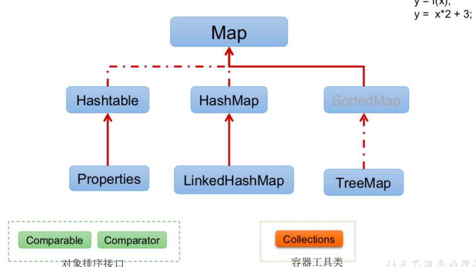

2. Collection接口的方法。

   1. 15个方法。
   2. add()/addAll(Collection);
   3. size()/isEmpty();
   4. clear();
   5. contains()/containsall();调用equals()方法。
   6. remove()/removeAll(Collection) 需要重写equals()方法。
   7. retainAll(Collection) 获取交集
   8. equals()： 所有集合元素相等则相等。有序的和元素顺序相关。
   9. hashCode() 
   10. 集合转换为数组：toArray(); 数组转集合Arrays.asList(T … a);
   11. Iterator() 返回Iterator实例。每次调用都会返回迭代器方法。

3. Iterator迭代器接口有什么方法？

   1. next()
   2. hasNext()
   3. remove()

   ##### 2. Collection 子接口一：List

   1. ArrayList
   2. LinkedList
   3. Vector

   1. ArrayList, linkedList, Vector的异同
      1. 相同点
         1. 实现了List接口， 存储有序，元素可重复
         2. Vector 和ArrayList 底层都是[]Object数组。
      2. 不同点
         1. ArrayList 非线程安全， Vector线程安全。
         2. ArrayList和Vector底层使用[]Object 数组存储,对于频繁查找使用。
         3. LinkedList 非连续存储，底层使用双向链表存储，对于频繁插入和删除操作使用linkedList
   2. ArrayList的源码分析
      1. jdk7	
         1. 底层存储结构是一个Object[]数组
         2. 构造器
            1. 空参构造器：初始化一个容量为10的数组。
            2. 带容量构造器：直接初始化一个指定容量的底层数组。
         3. 添加操作
            1. 确认容量是否够，如果不够扩容，扩容为当前容量 + 当前容量右移1位(1.5倍)
            2. 复制原有的数组。
      2. jdk8的变化：
         1. 构造器
            1. 空参构造器：赋值为一个长度为0的空数组，不提前分配内存。
         2. 添加操作
            1. 第一次添加操作时，底层创建长度为10的数组，然后添加。
         3. 更节省内存，延迟初始化。

4. LinkedList 源码分析

   1. 底层是一个双向链表。保存First, Last节点
   2. 初始花式 first 和last都为空

5. Vector源码分析

   1. 扩容方式和ArrayList有区别，其它都相同，默认使用长度为10的初始化
   2. 扩容新的容量为2倍。
   3. vector使用的较少。多线程情况下也可以用arrayList解决。

6. ListIterator和 collection Iterator的区别？

   1. ListIterator可以添加元素
   2. ListIterator可以定位当前索引的位置
   3. ListIterator可以双向迭代

   ##### 3. Collection 子接口二：Set

   1. Set接口的结构

      ```
      Set
      	HashSet
      		LinkedHashSet作为HashSet的子类出现，遍历内部顺序时会按照添加时顺序遍历。
      	SortedSet
      		TreeSet：使用红黑树存储，可以按照指定属性排序。
      ```

   2. HashSet的实现

      1. 底层是使用了hashMap实现。
      2. jdk 1.7初始化一个  长度为16的数组 + 链表， jdk1.8在添加时初始化，底层有变化。
      3. 添加
         1. 使用hash值通过散列函数计算出在数组中的位置
            1. 判断此位置是否有元素，如果此位置无元素，则直接添加成功
            2. 如果此位置有元素，则比较hash值，
               1. 如果hash值不相同，则添加成功
               2. 如果hash值相同，则比较equals()方法
                  1. 不相同则添加。
                  2. 相同则添加失败
         2. 在jdk1.7中 新元素链接旧元素，jdk1.8中旧元素链接新元素。
      4. 扩容
         1. 当装填因此大于0.75，则扩容

   3. 向set中添加的元素有什么要求

      1. 必须重写hashCode()方法和queals()方法，相同的对象必须具有相同的散列码。
      2. 对象中用作equal作为比较的Field()，都应该用来计算hashCode().

   4. HashCode()方法的实现？

      1. 在object中的hashCode()方法是一个随机数。

   5. equals()方法的实现?

   6. linkedHashSet()的实现

      1. 在原有的基础上根据每个数据增加了前后数据的指针。

      

   7. HashSet的遍历顺序是什么？

   ##### 4. Map接口

   1. map接口继承结构是什么

   ```
   Hashtable(古老实现类，线程安全)
   
   	Properties -- 常用来处理配置文件，key和value都是String类型
   
   HashMap(线程不安全，效率高)
   
   	LinkedHashMap(保证在遍历时可以按照添加的顺序实现遍历)
   
   SortedMap
   
   	TreeMap(进行按顺序排序，按照顺序遍历) 底层是一个红黑树
   ```

   2. HashMap和HashTable的区别
      1. hashMap非线程安全，效率高。HashTable线程安全，效率低
      2. HashMap可以存储null的key和val。HashTable不可以。

   

   3. HashMap的底层实现？1.7和1.8有什么区别。

      1. 初始化： java 1.7 数组 + 链表  java 1.8 数组 + 链表 + 红黑树

         1. 1.7 首次创建时分配初始长度为 16的数组，1.8在首次添加时分配。

      2. 添加

         1. 判断是否存在，存在则更新值，判断是否存在和set相同
         2. 在jdk1.7中 新元素链接旧元素，jdk1.8中旧元素链接新元素。

      3. 扩容

         1. 1.8 当链表长度超过8， 当底层数组长度小于64 ，扩容，当地城数组长度大于64， 将链表改位红黑树。
         2. 当超出临界值，则扩容为原来的两倍， 并重新计算hash

         

    4. map key，value，entry的存储结构

       1. map中的key：无序的， 不可重复的，使用Set存储所有的key
       2. map中的value：无序的，不可重复的，使用Collection存储所有的value
       3. 一个键值对过程一个Entry对象，Map中的entry：无序的，不可重复的，使用Set存储所有的entry

   5. linkedHashmap的实现

      1. 增加了前后指针，在添加时会使用前后指针维护顺序。

   6. map常用方法？

      1. put()/putAll()
      2. remove(Object o);
      3. clear()
      4. get() size(), containsKey() containsValue() isEmpty() 
      5. equeal() 存的数据相同
      6. keySet() Values() entrySet()

   7. TreeMap的底层实现

   8. CurrentHashMap的实现？

   9. 左右移和乘除法效率对比。

   10. hash冲突的解决方法

   11. hash算法？

##### 5. Collections 工具类

1. 排序相关

   1. reverse(List)
   2. shuffle(List)
   3. sort(List)
   4. sort(List, Comparator)
   5. swap(List, int , int)

2. 查找，替换

   1. max(Collection)/max(Collection, Comparator)

   2. min()/min()与max类似

   3. frequency(collection， object) 返回指定对象出现的次数

   4. copy(dest, src)

      1. ```
         List dest = Arrays.asList(new Object[List.size()]);
         Collections.copy(dest, list);
         ```

         

   5. replaceAll(list, oldVal, newVal)

3. 同步控制

   1. synchronizedxxx(list) 返回的list即为线程安全的。

#### 第12章 泛型

##### 1. 为什么要有泛型(Generic)

 	1. 什么是泛型
      	1. 所谓泛型，就是允许在定义类、接口是通过一个标识类中某个属性的类型或者是某个方法的返回值机参数类型，这个类型参数在使用时确定。
      	2. 自己的理解：类型参数化。
	2. 为什么使用泛型
        	1. 类型参数化

##### 3. 自定义泛型结构

​	使用<E1,E2,E3>

 	1. 泛型方法怎么定义
      	1. public<E> List<E> copyFromArrayToList(E[] arr
	2. A是类B的父类，G<A> 和G<B>二者不具备父子类关系

##### 5. 通配符的使用

```
List<?> list 
```

使用通配符只能读不能写

有限制条件的通配符

```
List<?extends Person>
List<? Super Person>
```

​	

#### IO流

##### 1.File类的使用

1. 新建file对象的三种方法

```
public File(String pathname) 以pathname为路径创建File对象，可以是绝对路径或者相对路径，如果 pathname是相对路径，则默认的当前路径在系统属性user.dir中存储。
 绝对路径:是一个固定的路径,从盘符开始  相对路径:是相对于某个位置开始
 public File(String parent,String child) 以parent为父路径，child为子路径创建File对象。
 public File(File parent,String child) 根据一个父File对象和子文件路径创建File对象
```

2. File的常用方法

   1. 获取功能

      1.  public String getAbsolutePath():获取绝对路径
      2.   public String getPath() :获取路径
      3.   publi sc String getName() :获取名称
      4.   public String getParent():获取上层文件目录路径。若无，返回null
      5.   public long length() :获取文件长度(即:字节数)。不能获取目录的长度。 
      6.  public long lastModified() :获取最后一次的修改时间，毫秒值 
      7.  public String[] list() :获取指定目录下的所有文件或者文件目录的名称数组  public File[] listFiles() :获取指定目录下的所有文件或者文件目录的File数 
      8. public boolean renameTo(File dest):把文件重命名为指定的文件路径

   2. 判断

      1. public boolean isDirectory():判断是否是文件目录 

      2.  public boolean isFile() :判断是否是文件
           public boolean exists() :判断是否存在
           public boolean canRead() :判断是否可读 

          public boolean canWrite() :判断是否可写  public boolean isHidden() :判断是否隐藏 

   3. File类的创建功能

      1.  public boolean createNewFile() :创建文件。若文件存在，则不创建，返回false  public boolean mkdir() :创建文件目录。如果此文件目录存在，就不创建了。 

         如果此文件目录的上层目录不存在，也不创建。
           public boolean mkdirs() :创建文件目录。如果上层文件目录不存在，一并创建 

         注意事项:如果你创建文件或者文件目录没有写盘符路径，那么，默认在项目 路径下。 

   4. File类的删除功能

      1. public boolean delete():删除文件或者文件夹 

         删除注意事项: 

         Java中的删除不走回收站。 要删除一个文件目录，请注意该文件目录内不能包含文件或者文件目录 

##### 2. IO流原理及流的分类

1. 流是如何分类的？

   1. 按照数据单位不同：分为字节流(8bit), 字符流(16 bit)(char)(多用于处理文本)
   2. 按照数据流的流向不同：输入流，输出流
   3. 按流的角色的不同分为：节点流（直接作用于文件上的流），处理流	(包装节点流的流)

2. Io的抽象基类

   | 抽象基类 | 字节流       | 字符流 |
   | -------- | ------------ | ------ |
   | 输入流   | InputStream  | Reader |
   | 输出流   | OutputStream | Writer |

3. 如何实现一个文件读取

   1. 实例化File类
   2. 提供具体的流
   3. 数据读入read()
      1. 方法返回第一个字符，如果达到文件末尾，则返回-1.
      2. read方法可以指定缓存数组。此时返回的时该次读取数据的长度。
   4. 关闭流

4. 如何写出数据

   1. 实例化File类对象，指明写出到的文件
      1. 文件可以不存在，不存在会创建
      2. 文件存在可以设置为在后续继续写或者追加
   2. 提供FileWriter的对象，用于数据的写出
   3. 写出操作
   4. 流资源关闭
      1. 关闭外层流内存会自动关闭

5. 节点流(或文件流)有什么
   1. FileInputStream
   2. FileOutputStream
   3. FileReader
   4. FileWriter

6. 文件读写在操作系统中的操作？

8. 字节流的默认编解码方式？

9. 常用的处理流有哪些，作用是什么？
   1. 缓冲流的作用，为什么？
      1. BufferedInputStream
      2. BufferedOutputStream
      3. BufferedReader
      4. BufferedWriter
      5. 提高读写的效率
      6. 提供了一个默认的8k的缓冲区。
   2. 转换流都有什么？作用是什么？
      1. 提供了字符流和字节流之间的转换
      2. InputStreamReader  :将字节的输入流转换为字符的输入流(解码)
      3. OutputStreamWriter：将字符的输出流转换为字节的输出流(编码)	
   3. 数据流是什么，什么作用
      1. 为了方便操作java语言的基本数据类型和String的数据，可以使用数据流
      2. DataInputStream 和DataOutputStream
   4. 对象流是什么，什么作用
      1. 用于存储个读取基本数据类型或对象的处理流，它的强大之处就是可以把java的对象写入到数据源中，也能把对象从数据源中还原出来。
      2. ObjectInputStream  (序列化)
      3. ObjectOutputStream(反序列化)

10. 标准输入，输出流是什么有什么作用

    1. System.in 生成标准输入
    2. System.out生成标准输出
    3. 默认是键盘和显示器，可以使用set方法重新设置

11. 打印流是什么，有什么作用？

    1. PrintStream
    2. PrintWriter

12. 对象的序列化机制是什么

    1. 循序把内存中的java对象转换为平台无关的二进制流，并保存或传输。同时可以通过二进制流还原成原来的java对象
    2. 可序列化对象必须实现Serializable接口和Externalizable

13. 如何自定义类实现序列化

    1. 实现Serializable标识接口，没有具体的实现方法
    2. 当前类提供全局常亮：serialVesionUID:标识。如果没有该字段，java会自动生成，但是类改变时，该字段会改变。
    3. 所有的属性也需要时可序列化的。

14. serialVersionUID如何生成才不会重复？

15. 什么是随机存取文件流（RandomAccessFile类）

    1. 直接继承与 object类
    2. 实现了DataInput DataOutput这两个接口。
    3. 该对象包含一个记录指针，用以标示当前读写位置，该对象可以自由移动该指针。


#### 15章反射(Reflection)

1. 反射机制是什么

   1. 动态语言的关键，反射允许程序在执行期间借助于Reflection Api取得任何类的内部信息，并能直接操作任意对象的内部属性及方法。
   2. 加载完类之后，在堆内存的方法区中就产生了一个class类型的对象（一个类只有一个class对象），这个对象包含了完成的类的结构信息。我们可以通过这个对象看到类的结构。这个对象就像一面镜子，通过这个镜子看到类的结构，我们形象的称之为：反射。

2. 反射提供的功能

   1. 在运行时判断任意对象所属的类
   2. 在运行时构造任意一个类的对象
   3. 判断类所具有的成员和方法
   4. 获取泛型信息
   5. 调用人一个对象的成员变量和方法
   6. 运行时处理注解
   7. 生成动态代理

3. 反射的主要APi

   1. java.lang.Class : 代表一个类
   2. java.lang.reflect.Method代表类的方法
      1. 可以调用私有方法
   3. java.lang.reflect.Field代表类的成员变量
   4. java.lang.reflect.Constructor 代表类的构造器

4. class类是什么，如何获取class实例？重要

   1. class的每个实例代表每个运行时类。

   2. 调用运行时类的属性 .class

      1. ```
         Person.class
         ```

   3. 通过运行时类的对象，调用getClass()

   4. 调用Class的静态方法：ForName(String classPath)

      1. ```
         Class.ForName("java.lang.Person")
         ```

   5. 使用classLoader获取
      1. 每个class对象都可以获取到ClassLoader
      2. ClassLoader.loadClass("com.lang.String")

5. 如何创建运行时类的对象？重要

   1. class.newInstance()
   1. 在对应类中有构造器
      2. 有权限
   3. 所以很多时候需要定义空参构造器
   
8. 反射的应用：动态代理

   1. 后续和代理模式一起学习

9. 动态语言和静态语言的区别

   1. 动态语言实质在运行时可以改变其结构的语言：例如新的函数，对象，甚至代码可以被引进，已有的函数可以被删除或是其它结构上的变化。**在运行时代码可以根据某些条件改变自身结构**。主要动态语言：python JavaScript
   2. 静态语言：运行时结构不可变。如：java ， c ， c++
   3. java不是动态语言，但可以称之为准动态语言。java可以利用反射机制，字节码操作获得类似动态语言的特性。

10. new 一个对象到底做了什么？

11. 什么时候用反射？

    1. 在编译时不能确定实例化的是什么，需要使用反射

12. java项目结构

13. 哪些类型可以有class对象

    1. class
    2. interface
    3. 数组
    4. enum
    5. annotation
    6. primitive type
    7. void


#### 第15章 java8

##### lambda表达式√

1. lambda表达式是什么？
   1. 是一个匿名函数，本质是一个函数式接口的实例。
   2. 以前匿名实现类实现的都可以使用lambda表达式
2. lambda表达式的格式？
   1. -> lambda操作符
   2. 左边:lambda形参列表 右边：lambda体(其实就是重写的抽象方法的方法体)
   3. lambda形参列表的参数类型可以省略（类型推断），如果只有一个参数，括号也可以省略
   4. 正常有一个大括号，如果lambda只有一条语句，大括号和return省略

##### 函数式接口

1. 什么是函数式接口？
   1. 如果一个接口中只声明了一个抽象方法， 则此接口称为函数式接口
   2. 可以使用@FunctionInterface注解检验是否是函数式接口
   3. java.util.Function定义了丰富的函数接口

2. java内置四大核心函数式接口
   1. Consumer<T>     void  accept(T t)  接收参数，不返回
   2. BICounsumer(T, U)  void accept(T, U)
   3. Suplier<T>     T get()  无参， 只有返回值
   4. Function<T, R>  R  apply(T)    接受一个参数，并有一个返回值
      1. UnaryOperator <T>  T apply<T> Function 的子类
   5. BiFunction<T, U, R>    R apply(T, U)
      1. BinaryOperator<T,> T appley(T, T)  BIFunction 的子类
   6.  Predicate<T>   boolean test(T t)
   7. BiPredicate<T, U > boolean test(T, U )
3. 转换式函数接口
   1. ToIntFunction<T>  IntFunction<R>
   2. ToLongFunction<T> LongFunction<R>


##### 方法引用/构造器引用

​	什么是方法引用？

 	1. 当要传递给lambda提的操作，已有实现的方法，可以使用方法引用替换
 	2. 方法引用，本质上就是lambda表达式，用lambda表达式作为函数接口的实例， 方法引用也可以作为函数式接口的实例。
 	3. 方法引用三种方式  
      	1. 对象 ：：非静态方法
      	   2. 类：：静态方法
      	   3. 以上两种必须 返回值和参数相同才可以。
      	   4. 类 ：： 非静态方法
      	         1. 可以把调用者当做第一个参数

##### Stream API

​	和重构中 用pipeline循环替换for

1. 什么是stream?

   1. 用于操作数据源所生成的元素序列
   2. stream不会存储元素
   3. stream不会改变源对象，他们会返回一个持有结果的新stream
   4. stream操作是延迟的，这意味着他们会等到需要结果的时候才执行

2. Stream操作的三个步骤

   1. 创建 Stream的方式

      1. 通过集合创建,集合接口的两个默认方法

         1. ```
            default Stream<E> stream()：返回一个顺序流
            default Stream<E> parallelStream()返回一个并行流
            ```

      2. 通过数组

         1. 使用Arrays.stream()静态方法

      3. 通过Stream的of方法

         1. Stream.of(1,2,3,4,5,6)

      4. 创建无限流

         1. Stream的Iterate()
         2. Stream 的generate()

   2. Stream中间操作有哪些

      1. 筛选与切片
         1. filter(Predicate p) ：接手lambda， 从流中排除元素
         2. distinct() 去重
         3. limit() 截断，是元素不超过给定数量
         4. skip(long n) 返回一个扔掉了前n个的流
      2. 映射
         1. map(Function f) 转换
         2. flatMap(Function f) 将流中的每一个值都换成另一个流，然后把所有的流连城一个流
         3. mapToInt
         4. mapToDouble
         5. mapToLong
      3. 排序
         1. sorted()
         2. sorted(comparator)

   3. Stream终止操作有哪些

      1. 匹配与查找
         1. allMathch(Predicte p)/anyMatch(p)/noneMatch(p);
         2. findFirst()/findAny()
         3. count/max(comparator c)/min();
         4. forEach(Consumer c)
      2. 规约
         1. reduce(T iden, BinaryOperator b) 规约到  iden为初始值
         2. reduce(BinaryOperator b)  
      3. 收集
         1. collect(Collector c) 将流转换为其它形式
         2. Collectors中提供了很多静态方法，可以方便的收集
            1. toList()
            2. toSet()
            3. toCollection()

3. 并行流和顺序流的区别


```
x -> Character.toString(x)
```

transfer int to character string


##### 接口的增强

##### Optional类

什么是Optional类？

1. 是一个容器类，它可以保存类型T的值，代表这个值存在。或者仅仅保存一个null， 表示这个值不存在
2. 以前用null表示一个值不存在，现在Optional可以更好的表达这个概念。并且可以避免空指针异常。
3. 创建
   1. Optional.of(T t):创建一个Optional实例，t必须非空
   2. Optional.empty():创建一个空的Optional实例
   3. Optional.ofNullable(T t) : t可以为空
4. 判断包含对象
   1. ifPresent
   2. ifPresent(Consumer )
5. 获取Optional容器的对象
   1. get() 包含值，返回值，否则，抛异常
   2. orElse(T other) 如果有值返回值，否则返回other
   3. orElseGet(Supplier)

##### 新的时间和日期API


#### 第16章java9新特性

##### 模块化系统

1. 本质上讲，模块(module)的概念，其实就是package外再包裹一层，不声明默认就是隐藏
2. 使用时需要导入导出，导入以后才会加载。

##### jshell命令

交互式工具

##### 接口的私有方法

接口可以有私有方法，该方法不会对外暴露

##### try语句升级

java8可以自动关闭资源：

​	try()将资源放在try（语句）中

java9中：try(变量)这些变量都会被自动关闭。

##### String存储变更

动机：

1. 根据调查，String占据的堆空间最大，并且大部分String都是latin-1的，这些character只需要一个byte就可以存储，使用character导致浪费空间
2. 改成byte数组，加上编码标志字段。
3. Stringbuffer和StringBuilder也同时变化

##### 集合工厂方法创建只读集合：

##### inputStream新增方法

InputStream 新方法 transferTo方法直接转换为输出流

##### 

##### 增强stream API

​	optrional新增stream方法

##### 全新的http客户端API

##### 学习的思维方式

1. 大处着眼，小处着手

   

#### java10

1. 局部变量的类型推断
   1. 使用var定义的局部变量会自动推断类型
   2. lambda左边的函数式接口不能声明var
2. 使用copyof()创建不可变集合

#### java11(长期支持版本)

两种gc。

1. epsilon
2. zgc

编译运行合成一个命令


查漏补缺

1. java四种修饰符是什么？
   1. private  类内部
   2. 缺省    类内部， 同包
   3. protected   类内部， 同包， 不同包的子类
   4. public   类内部 同一个工程


#### hashCode 和  equeals方法汇总

1. hashCode的作用？hashCode是如何实现才高效，object中的hashcode是如何实现的？

   1. hashCode是为了计算散列值，用于map中。
   2. object中的hash调用native方法，根据内存地址生成
   3. 

   

2. equals方法的作用， 如何重写equals()方法
   1. equals方法用于对象的比较
   2. 判断对象相等
   3. 判断实例是否相同
   4. 判断数据域相同
3. hashcode方法的作用？hashCode方法和equeals方法的关系？
   1. hashCode相等，equals不应定相等。equals相等，hashCode必须相等，所以当重写equals方法时，必须重写hashCode方法。
   2. hashCode()用来计算hash值，用于HashMap和Set。具体细节，和map处相同

#### 代码块

1. 代码块的作用是什么，代码块的分类

   1. 用来初始化类，对象

   1. 静态代码块
      1. 随着类的初始化执行
      2. 只能调用静态属性，方法
   2. 非静态代码块
      1. 随着对象的创建而执行

#### final关键字

1. final作用？
   1. final用来修饰类，则此类不能被其它类继承
   2. 用来修饰方法，则该方法不能被重写
      1. 比如  object的getClass()
   3. final修饰变量： 则该变量为常亮。
   4. final修饰的属性 赋值的位置有，显示初始化，代码块中初始化，构造器中初始化。
   
2. static关键字的作用

   static声明的都是类公有的

   1. 修饰属性
      1. 静态变量随着类的加载而加载，每个类中只会存在方法
      2. 可以通过类名和对象进行调用
   2. 修饰方法
      1. 可以通过类名和对象进行调用
      2. 内部只能使用静态方法
   3. 修饰代码块
   4. 修饰内部类

#### JVM 

1. jvm整体结构是什么

   1. 类加载子系统
   2. 运行时数据区
   3. 执行引擎
   4. 本地方法接口

   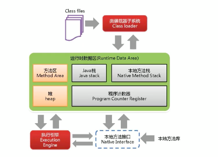

2. java的运行时数据区都有哪些部分，分别有什么作用？

   方法区和堆是线程共享的，每个线程有自己的zhan内存和程序计数器和本地方法栈。

   1. 方法区

      方法区：方法区被所有线程共享的。方法区存放了静态变量 + 常量 + 类信息 + 运行时常量池。永久代可以看做方法区的一种实现

   2. 堆

      1. java堆分为新生区，老年区，永久区。新生区又分为Eden区，From Survivor , to Survivor.
      2. 堆中存储的都是对象的实例，在来及回收时，新生区最频繁，老年区较少，永久区基本不动
      3. 新生代默认为1/3的堆空间， 老年代默认是2/3的堆空间。 Eden : 0 : 1 = 8: 1:1
         1. 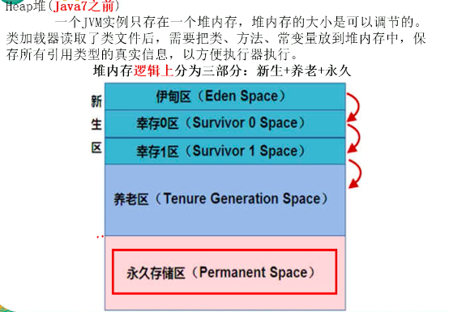

   3. vm stack

      1. 虚拟机栈描述的是java方法执行的内存模型，每个方法在执行的同时，会创建一个栈帧。用于存放局部变量表，操作数栈，动态链接，方法出口等信息。
      2. 局部变量表中存储了8种基本类型的数据，和对象的引用
      3. 如果线程申请的内存超过了虚拟机允许的最大范围，则会抛出stackOverflow

   4. 本地方法栈

      1. 本地方法栈和 虚拟机栈类似，只不过是提供给native方法。

   5. 程序计数器

      1. 指向当前线程正在执行的虚拟机字节码指令的地址。
      
   6. java8中永久代已经被移除，被一个称为元空间的区域所取代，元空间的本质和永久代类似。java8与java7最大的区别在于：永久代使用的jvm的堆内存，但是java8以后的元空间并不在虚拟机中而是使用本机物理内存。

3. 简述类加载子系统

   1. 虚拟机把描述类的数据，从Class文件加载到内存，并对数据进行校验，转换解析和初始化，最终形成可以被虚拟机直接使用的java类型，这就是虚拟机的类加载机制。
   2. 类加载的过程包含 加载， 验证，准备，解析，初始化
      1. 加载阶段：通过类的完全限定查找此类的字节码文件，并在内存中生成一个代表这个类的lava.lang.Class对象，作为方法取中这个类的各种数据的访问入口
      2. 验证阶段：确保class文件的字节流符合虚拟机要求，不会危害虚拟机自身的安全。
      3. 准备：为类变量分配内存并且设置该类变量的初始值，不包含final修饰的static，因为final在编译时候就分配了。
      4. 解析：将符号引用替换为直接引用的过程
      5. 初始化：执行静态初始化器和静态初始化成员变量

4. 双亲委派模型是什么？java有哪些类加载器？

   1. 四种类加载器
      1. Bootstrap类加载器：由c++实现，负责加载lib/rt.jar
      2. Extension 类加载器：负责加载 /lib/ext目录下的类库
      3. 系统加载器：负责加载用户类路径上所指定的类库，默认的类加载器
      4. 自定义类加载器
   2. 双亲委派模型：
      1. 如果一个类加载器收到了一个加载类的请求，其会先调用自己的父类区加载这个类，如果父类不能加载(父类找不到该类) 自己才会加载该类，这个机制给类加载提供了优先级。

5. 简述垃圾回收算法

   1. 引用计数算法
      1. 维持每个对象的引用次数，当引用次数为0时，可回收
      2. 缺点：无法解决循环引用问题。
   2. 可达性分析算法
      1. 从GC root为起点向下开始搜索，当一个对象到gcroot没有任何引用链时，则证明对象不可用
      2. 可作为gc roots的对象包括：
         1. 虚拟机栈中引用的对象
         2. 方法去中类静态属性引用的对象
         3. 方法区中常亮引用的对象
         4. 本地方法栈中引用的对象
   3. 复制算法
      1. 从 gc root开始，找到引用的对象，连同from 区域的一起复制到to区域，如果to区域满了，或者引用次数大于16，则复制到养老区。
      2. 优点
         1. 无内存碎片
      3. 缺点：
         1. 当每次存活对象特别多时，复制效率低，所以复制算法适合新生区。
         2. 浪费部分内存
   4. 标记清除算法
      1. 标记：从gc roots开始扫描，标记存活的对象
      2. 清除：再次扫描，清除未被标记的对象。
      3. 优点
         1. 不浪费内存
      4. 缺点：
         1. 两次扫描，效率低
         2. 有内存碎片
   5. 标记整理算法
      1. 和标记清除类似，只不过是清除变为移东
   6. 标记清除整理
      1. 多次清除后整理。

6. 概述gc的流程

   ​	Eden满了以后启动轻gc（minor gc）在 Eden Space 。未被回收则进入幸存0区，或者1区。当15次未被回收，则放入养老区。养老区满时，则 MagorGC(FullGC)启动 在养老区启动回收。还是没有空间，则出现oo

7. 垃圾回收的方式

   1. serial

      1. 为单线程环境设计且只用一个线程进行垃圾回收，会暂停所有的用户线程。所以不适合服务器环境

   2. parallel

      1. 多个垃圾收集线程并行工作，此时用户线程是暂停的，适用于科学计算等弱交互环境

   3. CMS

      1. 用户线程和垃圾收集线程同时执行(不一定是并行，可能交替执行)不需要停顿用户线程，互联网公司多用，适用对响应时间有要求的场景

   4. G1

      1. g1垃圾回收器将堆内存分割成不同的区域，然后并发的对其进行垃圾回收

      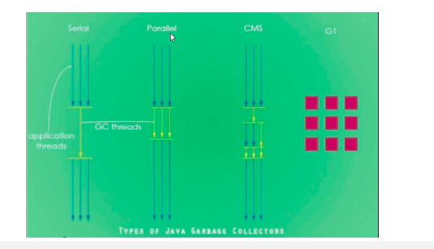

8. 垃圾回收器的种类

   1. 新生代

      1. 串行收集器(Serial )
         1. 暂停其它工作线程，使用一个线程回收，是java虚拟机运行在client模式下默认的收集器
         2. 使用参数-XX:+UseSerialGC  
         3. 开启后会使用：serial(young区用) + serial old(old区用)的收集器组合
         4. 表示新生代老年代都会使用串行回收器，新生代使用复制算法，老年代使用标记-整理算法
      2. 并行收集器（ParNew）
         1. 使用多线程来进行垃圾回收，其它和serial相同，很多java虚拟机运行在server模式下新生代的默认收集器
         2. 使用参数 -XX:+UseParNewGC 只影响新生代的收集，不影响老年代,这种方式被遗弃
         3. 开启上述参数后，会使用ParNew(Young区用) + serial Old的手机去组合，新生代使用复制算法，老年代采用标记-整理算法
      3. 并行回收(parallel、parallel Scavenge)  吞吐量优先 日志中使用(PSYoungGen)
         1. 作用
            1. 可控制的吞吐量
            2. 自动 调节停顿时间
         2. 使用UseParallelOldGC 或UseParallelGC 自动互相激活，在老年代自动使用 ParallelOld
         3. 新生代使用复制算法，老年代使用标记整理算法

   2. 老年代收集器

      1. parallel old是parallel Scavenge的老年代版本，使用多线程标记整理算法。 1.8以后
         
         1. 参数 -XX:+UseParallelOldGC
      2. cms收集器(并发标记清除)
         1. 是一种以过去最短回收停顿时间为目的的收集器，垃圾回收与用户线程一起执行。适合应用在互联网或者b/s系统的服务器上，这类应用尤其终试服务器的响应速度，希望系统停顿时间最短。
         2. cms非常适合堆内存大、cpu核数多的服务器端应用，也是G1出现之前大型应用的首选
         3. -XX：+useConcMarkSweepGC 开启该参数后会自动将-XX:useParNewGC打开，如果出现异常，则会用SerialOld
         4. cms的流程
            1. 初始化标记（cms initial mark）：标记一下 GC Roots能直接关联的对象，**速度很快**，仍需要暂**停所有的工作线程**
            2. 并发标记(CMS concurrent mark) 和用户线程一起
               1. 进行gcroot 跟踪的过程，和用户线程一起工作，不需要暂停工作线程，主要标记过程，标记全部对象
            3. 重新标记(CMS remark)
               1. 为了修正并发标记期间，用户程序继续运行而导致标记产生变动的那一部分对象的标记记录，仍需暂停所有的工作线程
            4. 并发清除(CMS concurrent sweep)和用户线程一起
               1. 清除gc不可达对象
            5. 优缺点
               1. 优点
                  1. 并发收集低停顿
               2. 缺点
                  1. 并发执行，对cpu压力大
                     1. cms必须要在老年代内存用尽之前完成垃圾回收，否则cms回收是被，将触发担保机制，使用串行老年代收集器以STW方式进行一次GC。
                  2. 会产生内存碎片
                     1. 可以配置多少次以后来及整理
   3. serialold收集器(已经没有了)
      
   1. 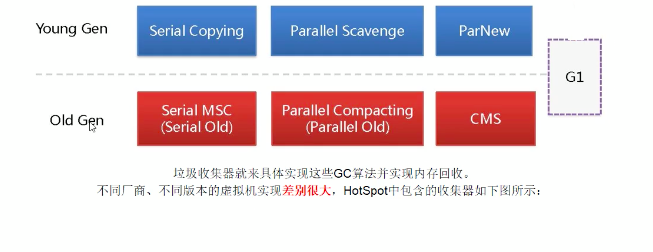
      
         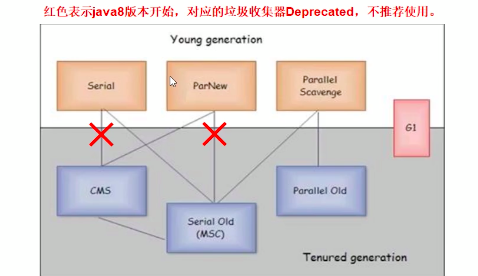

9. 如何选择哪个收集器

   1. 单cpu或小内存，单机程序： -XX:+UstSerialGC
   2. 多cpu，需要大吞吐量，：-XX:UseParallelOldGC
   3. 多cpu，追求低停顿，需快速响应：-XX:UseConcMarkSweepGC
   4. 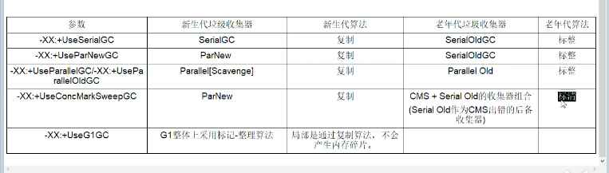

10. g1垃圾回收器？

   1. 以前收集器的特点
      1. 年轻代和老年代是各自独立且连续的内存块
      2. 年轻代收集使用Eden + s0 + s1进行复制算法
      3. 老年代收集必须扫描整个老年代区域
      4. 都是以尽可能少而快速地执行gc为设计原则
   2. g1是什么
      
      1. 是一种服务器端的收集器，应用在多处理器和大容量内存环境中，在实现高吞吐量的同事，尽可能满足垃圾收集暂停时间的要求
   3. 比cms收集器的优点
      1. g1是一个有整理内存过程的垃圾收集器，不会产生很多内存碎片
      2. g1 的stop the world 更可控，g1在停顿时间上添加了预测机制，用户可以指定期望停顿时间
   4. 底层原理
      1. Region区域化垃圾收集器
         1. 将连续的内存块分为region块，避免全内存扫描，只需按照区域来扫描即可
            1. Eden区，Survivor 区 Old 区   
            2. Humongous区：如果一个对象超过了分区容量50%以上，G1就认为这是一个巨型对象，会将它分到Humongous区，如果一个Humongous区放不下，G1 会寻找连续的H分区。
         2. 每个分区不会固定的为某个代服务，可以按需在年轻代和老年代之间切换。启动时可以通过参数-XX:G1HeapRegionSize = n 可指定分区大小(1MB ~ 32MB，必须是2的幂)，默认将整堆划分为2048个分区
      2. 回收步骤
         1. Eden区收集：Eden区耗尽后会被处罚，主要是小区域收集 + 形成连续的内存块，避免内存碎片
            1. Eden区数据移动到Survivor区，假如Survivor区空间不足，Eden区数据会晋升到old区
            2. Survivor区的数据移动到新的Survivor区，部分数据晋升到old区
            3. 最后Eden区收拾干净，GC结束，用户程序继续执行
            4. 具体步骤
               1. 初始标记：只标记GC Roots能直接关联到的对象
               2. 并发标记：进行GC Roots Tracing的过程
               3. 修正并发标记期间，因程序运行导致标记发生变化的那一部分对象 t
               4. 筛选回收，根据时间来进行价值最大化回收
               5. 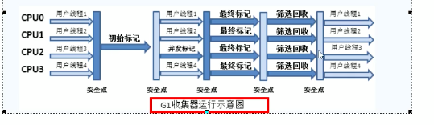
         2. 参数 -XX：MaxGCPauseMillis = 100 最大暂停时间

11. g1 和cms的区别

    1. g1没有内存碎片
    2. 可以精确控制停顿：jvm将尽可能停顿小于该时间

12. full GC 和minorgc的区别

13. jvm垃圾回收时为什么要暂停用户线程

14. jvm 的server/client模式分别是什么意思

    1. 

15. 怎么查看默认的垃圾回收器

    1. -XX:+UseSerialGC
    2. -XX:+UseParallelGC
    3. -XX:PrintCommandLineFlags

16. 出现oom的原因是什么？

    1. 出现oom是因为老年代调用fullGC以后，依然无法释放出更多的空间，分配内存不出内存导致。所有可能有以下两个原因
       1. java虚拟机堆内存设置不够，可以通过参数  -Xms、-xmx来调整
          1. jmap - heap 可以查看堆各个区的内存分配情况
       2. 代码中创建了大量的大对象，并且长时间不能被垃圾收集器收集
          1. jmap -histo:live 对象显示存活对象的信息
       3. -xx: +PrintGCDetails 打因GC日志，使用工具分析


8. 如何进行堆参数调优

   1. jvm运行时堆大小

      1. -xms 设置初始的堆大小 初始分配大小，默认为物理内存的 1/64
      2. -xmx 最大分配内存，默认为物理内存的1/4

   2. -XX:+PrintGCDetails：打印 gc 详细信息。

   3. -XX:MaxTenuringThreshold —设置在新生代存活的次数

   4. 新生代堆空间大小调整  

      -XX:NewSize新生代的最小值  

      -XX:MaxNewSize新生代的最大值  

      -XX:NewRatio=4：设置年轻的和老年代的内存比例为 1:4；

      -XX:SurvivorRatio=8：设置新生代 Eden 和 Survivor 比例为 8:2；

      

   5. –XX:+UseParNewGC：指定使用 ParNew + Serial Old 垃圾回收器组合；

   6. -XX:+UseParallelOldGC：指定使用 ParNew + ParNew Old 垃圾回收器组合；

   7. -XX:+UseConcMarkSweepGC：指定使用 CMS + Serial Old 垃圾回收器组合；

   8. -XX:+PrintGC：开启打印 gc 信息；

   9. -Xss 初始栈空间

9. 堆参数调优工具有什么？

   1. jconsole 和 jvisualvm 
   2. jmap
   3. jvm的参数类型
      1. xx参数
         1. Boolean 类型
            1. -XX: + 或者 -
            2. jinfo -flag 查看某个参数是否打卡
            3. +PrintGCDetails打印gc的细节
         2. kv 设值类型
            1. -XX:属性key=属性值value
            2. -XX:MetaspaceSize=128M
            3. -XX:MaxTenuringThreshold=15
         3. jinfo
            1. jinfo - flag 查看参数值
            2. jinfo -flags 不是默认的参数
         4. -xms
            1. -xms = -XX:initialHeapSize
            2. -xmx:MaxHeapSize
         5. 查看参数
            1. jps
            2. jinfo -flag  具体参数  java进程编号
            3. jinfo -flags   查看不是默认的参数
         6. 查看基本参数
            1. -XX：+PrintFlagsInitial  查看jvm初始参数
            2. -XX：+PrintFlagsFinal
            3. 显示有：的意思是修改过
            4. -XX:+PrintCommandLineFlags   可以查看一些关键参数和默认垃圾回收器
   4. jvm常用配置参数
      1. -xms  等价于 -xx:InitialHeapSize 堆初始大小，默认为物理内存的1/64
      2. -Xmx 等价于 -XX:MaxHeapSize
      3. -Xss 等价于 -XX:ThreadStackSize 设置单个线程栈的大小，linux 64位默认1024k
      4. -Xmn 设置年轻代的参数
      5. -XX:MetaspaceSize设置元空间的大小  一般默认值可能会比较小
         1. 元空间的本质和永久代类似，都是对jvm规范中方法区的实现。元空间并不是在虚拟机中，而是使用本地内存。因此元空间大小仅受本地内存限制。、
      6. -XX: +PrintGCDetails 收集gc的详细日志信息
      7. -XX:SurvivorRatio 设置幸存区比例   数字代表eden区
      8. -XX:NewRatio  设置新生代比例  数字代表老年代的比例
      9. -XX:MaxTenuringThreshold  设置垃圾的最大年龄  只能设置0 - 15
   5. 制造oom错误。
   6. 如何查看一个正在运行中的java程序，它的某个jvm参数是否开启，具体值是多少？
      1. jps
      2. jinfo - flag 查看参数值
      3. jinfo -flags 不是默认的参数

10. java有哪些引用类型？

   1. 强引用:最普遍的引用，不会被gc回收

   2. 软引用：只有在系统将要发生内存溢出之前，将会把这些引用回收，使用java.lang.ref.SoftReference类来实现,一般用于高速缓存。

      1. 使用场景
         1. 读取图片场景
            1. 每次读取图片都从硬盘读取会严重影响性能
            2. 如果一次性全部加载到内存中又可能造成内存溢出
         2. 用hashmap老保存图片的路径和相应图片对象关联的软引用映射关系，在内存不足时jvm会自动回收，使用弱引用也可以

   3. 弱引用：弱引用用来描述非必须的对象，被弱引用的对象只能生存到下一次垃圾收集发生之前。使用java.lang.ref.WeakReference

      1. WeakHashMap:解决缓存情况，key被置位空后，键值对会直接被回收

   4. 虚引用:虚引用是最弱的引用关系，它 不能单独使用，也不能通过它访问对象，唯一的作用是在对象被回收时得到一个系统通知，使用phantomReference实现。必须和引用队列一起使用。

   5. 引用队列：ReferenceQueue

      1. 创建引用的时候可以指定关联的队列，当gc释放对象内存的时候，会将引用加入到引用队列，如果当程序发现某个虚引用已经被加入到引用队列，那么就可以在锁引用的对象内存被回收之前采取必要的行动，这相当于是一种通知机制

   6. java.lang.Reference

      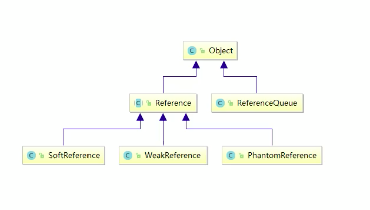 

堆参数调优

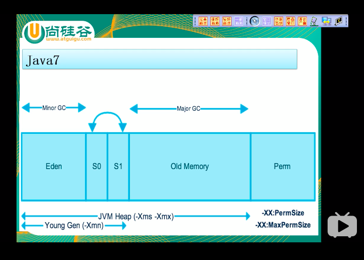

RunTime实例，代表了运行时


MAT工具

OOM以后如何分析？

-XX命令作用

1. OOM都有哪种类型？
   1. java.lang.StackOverflowError
   2. java.lang.OutOfMemoryError:java heap space
   3. java.lang.OutOfMemoryError:GC overhead limit exceeded
      1. 超过98%的时间用来做GC，并且回收不到2%的内存
   4. java.lang.OutOfMemoryError:direct buffer memory
      1. 本地内存满，一般出现在nio的情况下。nio的内存部分不在jvm堆内存，而在物理内存，gc无法管辖。
      2. 一般直接内存是物理内存的1/4
   5. java.lang.OutOfMemoryError:unable to create new native thread
      1. 一个应用进程创建了多个线程，linux规定一个进程最多创建1024个线程
      2. 如果真是需求要超过，则需要修改linux配置。
   6. java.lang.OutOfMemoryError: Metaspace
      1. 
2. jvm面试题
   1. JVM内存模型以及分区，需要详细到每个区放什么
   2. 堆里面的分区  Eden , survival from to , 老年代，各自的特点
   3. GC的三种收集方法：标记清楚、标记整理、复制算法的原理与特点，分别用在什么地方
   4. Minor Gc 与Full GC分别在什么时候发生
3. java8 jvm的变化
4. gc的作用域
5. jvm垃圾回收的垃圾回收如何确定垃圾？是否知道什么是GC Roots
6. jvm调优 和参数配置，如何盘点查看jvm系统默认值
7. jvm常用基本配置参数有哪些
8. 强引用，软引用，弱引用，虚引用分别是什么
9. 请谈谈你对oom的认识
10. GC垃圾回收算法和垃圾回收期的关系，分别是什么?
11. 怎么查看服务器默认的垃圾收集器是哪个
12. 生产上如何查看服务器默认的垃圾收集器是那个？生产如何配置垃圾收集器的？谈谈你对垃圾收集器的理解
13. g1垃圾收集器
14. 生产环境服务器变慢，诊断思路和性能评估谈谈
15. 生产环境出现cpu占用过高，请谈谈你的分析思路和定位


### JUC

1. java的内存模型是什么
  
   1. java内存模型规定了所有变量都存储在主内存中，每条线程还有自己的工作内存，线程的工作内存中保存了被该线程使用到的变量的主内存的拷贝。
   
2. vloatile关键字的作用？
   1. 在多个线程操作共享数据时，可以保证内存中的数据可见，相较于synchronized 是一种较为轻量的同步策略，
   2. volatile 不保证互斥性和原子性
   3. 保证可见性
   4. 禁止指令重排
      1. 编译器会自动优化，如果没有数据依赖性，会进行指令重排，使用volitile会禁止这种重排

3. 原子变量是什么？
   1. java.util.concurrent.atomic包下提供了常用的原子变量，使用原子变量可以实现轻量级的数据共享。
      1. 使用volatile保证可见性
      2. CAS(Compared-and-Swap) 保证并发操作共享数据的支持，CAS算法包含了两个原子步骤的操作
         1. 读取内存值 V
         2. 预估值  A
         3. 更新值B   当且仅当  V==A 时，更新值B。1为原子操作， 2，3为原子操作。
         4. 使用有cpu提供的原语。

4. CAS有什么缺点？

   1. 循环时间长，开销大 
   2. 只能保证一个共享变量的操作
   3. 引出ABA问题

5. 什么是ABA问题？

   1. 线程A发现值没有改过，其实期间已经被改过好几次，巧合最后一次正好改成了线程A读取时的值。
   2. 尽管线程one的操作成功了，但是不代表这个过程就是没有问题的。
   3. 使用原子引用解决ABA问题

6. Unsafe类的作用

7. ConcurrentHashMap实现原理
   1. 一个高效的线程安全的hashMap，采用"锁分段"技术,包含多个map，对每个段的map分别加锁。
   2. jdk1.8以后使用了cas算法。

8. CountDownLatch是什么？

   1. 闭锁可以延迟线程的进度直到其到达终止状态，闭锁可以用来确保某些活动直到其它活动都完成才继续执行。

      ```
      new CountDownLatch();
      latch.await();
      latch.countDown();
      ```

9. Condition控制线程通信

   1. Condition对象中，与wait、notify、notifyAll方法对应的分别是await、signal和signalAll.
   2. condition 使用 lock.newCondition();初始化。

10. 面试题交替打印实现

11. 为什么要使用线程池？

    1. 提供了一个线程队列，队列中保存着所有等待状态的线程。避免了创建与销毁额外开销，提高了相应速度。

12. 线程池的体系结构

    1. java.util.Concurrent.Executor :负责线程的使用与调度的根接口
       1. ExecutorService ： 子接口:线程池的主要接口
          1. ThreadPoolExecutor:线程池的实现类
          2. ScheduledExecutorService : 线程调度的子接口
             1. ScheduledThreadPoolExecutor:实现类 ： 继承ThreadPoolExecutor 实现ScheduledExecutorService

13. 线程池的初始化

    1. Executors.newFixedThreadPool():创建固定大小的线程池
    2. Executors.newCachedThreadPool():缓存线程池，线程池数量不固定，根据需求自动更改数量。
    3. Executors.newSingleThreadExecutor():创建一个单个的线程池。
    4. Executors.newScheduledThreadPool():创建固定大小的线程池，可以延迟或者定时的执行任务。

14. 如何使用线程池

    1. 初始化
       1. Excutors.newFixedThreadPool()
    2. 为线程池分配任务
       1. pool.submit(tpd)
    3. 关闭线程池
       1. pool.shutdown()会等待现有任务关闭.
       2. pool.shutdownNow()立即关闭。

15. 初始化线程调度的线程池

    1. Executors.newScheduledThreadPool()
    2. pool.shcedule(Callable, delay, unit) 可以设置延迟。

16. ForkJoinPool 分支/合并框架

17. 线程的新建和销毁为什么消耗资源？

18. list  int[] 之间的转换

19. ```
           // int[] 转 List<Integer>
            List<Integer> list1 = Arrays.stream(data).boxed().collect(Collectors.toList());
            // Arrays.stream(arr) 可以替换成IntStream.of(arr)。
            // 1.使用Arrays.stream将int[]转换成IntStream。
            // 2.使用IntStream中的boxed()装箱。将IntStream转换成Stream<Integer>。
            // 3.使用Stream的collect()，将Stream<T>转换成List<T>，因此正是List<Integer>。
          
            // int[] 转 Integer[]
            Integer[] integers1 = Arrays.stream(data).boxed().toArray(Integer[]::new);
            // 前两步同上，此时是Stream<Integer>。
            // 然后使用Stream的toArray，传入IntFunction<A[]> generator。
            // 这样就可以返回Integer数组。
            // 不然默认是Object[]。
          
            // List<Integer> 转 Integer[]
            Integer[] integers2 = list1.toArray(new Integer[0]);
            //  调用toArray。传入参数T[] a。这种用法是目前推荐的。
            // List<String>转String[]也同理。
          
            // List<Integer> 转 int[]
            int[] arr1 = list1.stream().mapToInt(Integer::valueOf).toArray();
            // 想要转换成int[]类型，就得先转成IntStream。
            // 这里就通过mapToInt()把Stream<Integer>调用Integer::valueOf来转成IntStream
            // 而IntStream中默认toArray()转成int[]。
          
            // Integer[] 转 int[]
            int[] arr2 = Arrays.stream(integers1).mapToInt(Integer::valueOf).toArray();
            // 思路同上。先将Integer[]转成Stream<Integer>，再转成IntStream。
          
            // Integer[] 转 List<Integer>
            List<Integer> list2 = Arrays.asList(integers1);
            // 最简单的方式。String[]转List<String>也同理。
    ```

20. cas方式的线程同步为什么比加锁代价更低？

21.  完成一次oom的排查

22. ConcurrentHashMap 的实现详解

23. JVM内存模型内存模型详解

24. 垃圾回收的过程

25. synchronized和reentrantLock的区别

    1. Synchronized是jvm层面的，底层使用了monitorenter和monitorexit。调用了操作系统级别的锁.reentrantLock是api级别实现的。
    2. synchronizeed自动释放锁，lock手动释放锁
    3. synchronized不可以中断， reentrantLock可以中断
    4. ReentrantLock既可以创建非公平锁，也可以创建公平锁
    5. reentrant绑定多个条件condition
       1. 用来实现分组唤醒需要唤醒的线程们，可以精确唤醒。

26. Synchronized中锁的对象是如何实现的，synchronized的实现，其实现与lock的区别。

27. Synchronized 的底层实现

    1. 作用：

       1. 确保线程互斥访问同步代码
       2. 保证共享变量的修改能够及时可见
       3. 有效解决重排序问题

    2. synchronized是通过对象内部的一个叫做监视器锁（monitor）来实现的）监视器锁本质又是依赖于底层的操作系统的Mutex Lock来实现的。而操作系统实现线程之间的切换这就需要从用户态转换到核心态，这个成本非常高，状态之间的转换需要相对比较长的时间，这就是为什么Synchronized效率低的原因。

    3. 当monitor被占用时就会处于锁定状态，线程执行monitorenter指令时尝试获取monitor的所有权，monitorenter 指令加锁过程如下：

       1、如果monitor的进入数为0，则该线程进入monitor，然后将进入数设置为1，该线程即为monitor的所有者。

       2、如果线程已经占有该monitor，只是重新进入，则进入monitor的进入数加1.

       3. 如果其他线程已经占用了monitor，则该线程进入阻塞状态，直到monitor的进入数为0，再重新尝试获取monitor的所有权。

    4. monitor exit指令解锁。执行monitorexit的线程必须是objectref所对应的monitor的所有者。

    5. 优化

       锁的状态总共有四种：无锁状态、偏向锁、轻量级锁和重量级锁

       偏向锁是指一段同步代码一直被一个线程所访问，那么该线程会自动获取锁。降低获取锁的代价。
       轻量级锁是指当锁是偏向锁的时候，被另一个线程所访问，偏向锁就会升级为轻量级锁，其他线程会通过自旋的形式尝试获取锁，不会阻塞，提高性能。
       重量级锁是指当锁为轻量级锁的时候，另一个线程虽然是自旋，但自旋不会一直持续下去，当自旋一定次数的时候，还没有获取到锁，就会进入阻塞，该锁膨胀为重量级锁。重量级锁会让其他申请的线程进入阻塞，性能降低。


26. 如何使用工具检验死锁
27. ReentrantLock的底层实现
28. concurrentHashMap的底层实现
    1. 底层是一个segment数组，每个segment里保存一个hashEntry的数组。每个segment都可以当做一个锁。每次存取的时候之锁相应的segment。
29. 迭代器强一致性和弱一致性？
    1.   java.util 包中的集合类都返回 fail-fast 迭代器，这意味着它们假设线程在集合内容中进行迭代时，集合不会更改它的内容。如果 fail-fast 迭代器检测到在迭代过程中进行了更改操作，那么它会抛出 ConcurrentModificationException，这是不可控异常。
    2. 强一致性如何实现
       1. 通过引入一个名为modCount的计数器，当有任何修改容器的操作发生后，这个计数器就会自增
       2. 在HashIterator的初始化中，会将modCount赋值给expectedModCount, 如果在随后的迭代操作中发现两者不一致就会立即抛出ConcurrentModificationException，这也是所谓的fast-fail。
       3. 同样的，ConcurrentHashMap的keySet()方法最终也是通过HashIterator的迭代器实现，但代码已经发生了变化，它已经不再维护任何计数器，而且代码中也不会再抛出ConcurrentHashMap()，当容器被并发修改时，迭代操作将会继续执行，因此无法保证迭代操作一定能够得到容器中最新的内容。
30. ABA是如何出现的，如何解决？AtomicReference原子引用的作用和AtomicStampedReference版本号
31. 集合类线程不安全的解决方法
    1. Collections.synchronizedList()
    2. copyOnWriteArrayList()
32. copyOnWriteArrayList的底层实现原理？
    1. 每次写得时候复制一份新的数组，然后写入。
    2. 写频繁的场景性能太低。
33. transient的作用？
34. java各种锁
    1. 公平锁和非公平锁
       1. 是否按照加锁的顺序获取锁
       2. 公平锁会维护加锁的队列，性能会比较差，非公平锁的吞吐量大
    2. 可重入锁
       1. 线程可以进入任何一个它已拥有锁所同步着的代码块
       2. ReentrantLock/Synchronized就是典型的课冲突锁
       3. 可重入锁的最大作用是避免死锁
    3. 自旋锁
       1. 线程未获取到锁不会立即阻塞，而是采用循环的方式一直获取锁。

​	

35. 实现一个自旋锁。

36. countDownLatch,CyclicBarrier,Semaphore,

    1. countDownLatch
    2. CyclicBarrier：让一组线程到达一个屏障时被阻塞，知道最后一个线程到达屏障时
    3. Semaphore: 信号量主要用于两个目的
       1. 用于多个共享资源的互斥使用，
       2. 用于并发线程数的控制  

37. countDownLatch,CyclicBarrier,Semaphore,使用代码实现。

38. 阻塞队列

    1. 当阻塞队列是空时，从队列中获取元素的操作将会被阻塞

    2. 当阻塞队列时满时，往队列里添加元素的操作将会被阻塞

    3. 常用的阻塞队列

       1. ```
          ArrayBlockingQueue
          LinkedBlockingQueue
          PriorityBlockingQueue
          DelayQueue
          SynchronousQueue 单个元素的队列
          LinkedTransferQueue
          LinkedBlocingQeque
          ```

    4. 常用方法

       | 方法类型 | 抛出异常  | 特殊值   | 阻塞   | 超时                 |
       | -------- | --------- | -------- | ------ | -------------------- |
       | 插入     | add(e)    | offer(e) | put(e) | offer(e, time, unit) |
       | 移除     | remove()  | poll()   | take() | poll(time, unit)     |
       | 检查     | element() | peek()   |        |                      |
       |          |           |          |        |                      |

    5. 用多种方式实现生产者消费者。notify wait ； lock awati， singal； 阻塞队列

       1. 多线程的实现方式
          1. 判断
          2. 干活
          3. 通知

    6. 多线程之间按顺序调用，实现A-》b-》c-》三个线程启动，要去如下：aa打印5次，bb打印10次，cc打印15次，10轮

    7. callable接口

    8. futureTask接口的结构

       1. futureTask。get()有结果，获得结果，无结果，阻塞

    

    39. 线程池详解

        1. 为什么用线程池，优势？

           1. 降低资源消耗。通过重复利用已创建的线程降低降低线程创建和销毁造成的消耗。创建 和销毁线程需要通过系统调用，设计到用户态和内核态的转换，非常消耗资源。
           2. 提高响应速度，当任务到达时，任务可以不需要线程创建就能立即执行
           3. 提高线程的可管理性

        2. 线程池如何使用

        3. 线程池的几个重要参数介绍

           1. coolPoolSize: 线程池中常驻核心线程数

           2. maxnumPoolSize：线程池中能够容纳同时执行的最大线程数，此值必须大于等于1

           3. keepAliveTime:多余的空闲线程的存活时间

              当前线程池数量超过coolPoolSize时，当空闲时间达到keepAliveTime值时，多余空闲线程会被销毁直到只剩下corePoolSize个线程为止。

           4. unit：keepAliveTime的单位

           5. workQueue:任务队列，被提交但尚未被执行的任务。

           6. threadFactory:表示生成线程池中工作线程的线程工厂，御用创建线程一般用默认的即可

           7. handler：拒绝策略，表示当队列满了并且工作线程大于等于线程池的最大线程数。

           8. ```
              public ThreadPoolExecutor(int corePoolSize,
                                        int maximumPoolSize,
                                        long keepAliveTime,
                                        TimeUnit unit,
                                        BlockingQueue<Runnable> workQueue,
                                        ThreadFactory threadFactory,
                                        RejectedExecutionHandler handler)
              ```

        4. 说说线程池的底层工作原理

        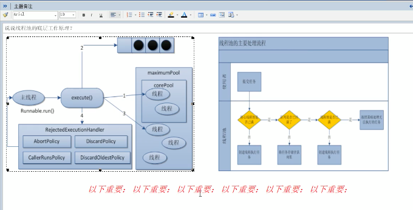

        1. 在创建了线程池后，等待提交过来的请求
        2. 当调用Execute()方法添加一个请求任务时，线程池会做如下判断：
           1. 如果正在运行的线程数量少于corePoolSize，那么马上创建线程运行这个任务
           2. 如果正在运行的线程数量大于或等于corePoolSize,那么将这个任务放入队列；
           3. 如果这时候队列满了且正在运行的线程数量小于maxinumPoolSize，那么还是要创建非核心线程立刻运行这个任务
           4. 如果队列满了且正在运行的线程数量大于或等于maxinumPoolSize,那么线程池会启动饱和拒绝策略来执行
        3. 当一个线程完成任务时，他会从队列中取下一个任务来执行
        4. 当一个线程无事可做超过一定的时间时，线程池会判断关闭超过corePoolSize的线程

    40. 线程池的拒绝策略

        1. AbortPolicy:直接抛出RejectExecutionException异常阻止系统正常运行。
        2. CallerRunsPolicy:将任务会退给调用者
        3. DiscardOldestPolicy:抛弃队列中等待最久的任务，然后把当前任务加入队列中尝试再次提交当前任务
        4. DiscardPolicy:直接丢弃任务，不予任何处理也不抛出异常。如果允许任务丢失，这是最好的一章方案
    
    41. 线程池中用哪个创建线程池？
    
        实际生产环境中不要使用默认提供的构造方法
    
        1. FixedThreadPool 和SingleThreadPool 允许的请求队列长度为Integer.Max可能会堆积大量的请求，从而导致oom
        2. CachedThreadPool和ScheduledThreadPood
           1. 允许创建的线程数量为Integer.MaxValue可能会创建大量的线程，从而导致OOM
        3. 如何配置线程池的最佳数量
           1. Runtime.getruntime().avaliableProcessors()获取核数
           2. cpu密集型
              1. cpu核数 + 1
           3. io密集型
              1. cpu核数 * 2
              2. cpu核数 /(1- 阻塞系数)  阻塞系数 一般是 0.8 - 0.9
    
    42. 线程池都有哪些状态？
        线程池有5种状态：Running、ShutDown、Stop、Tidying、Terminated。
    
        线程池各个状态切换框架图：
    
        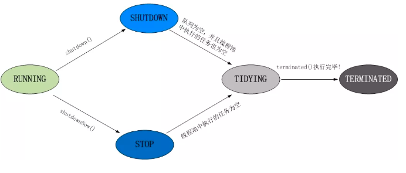
    
    43. Runtime类的作用
    
        1. Runtime.getRuntime().totalMemory();返回java虚拟机中的内存和总量
        2. Runtime.getRuntime().maxMemory()java虚拟机使用的最大内存量
    
    44. 死锁编码及定位分析
    
        1. jps 查看java进程
        2. jstack
    
    45. gc各版本日志分析
    
    46. java对象的生命周期，finilize方法什么原理
    
    47. 你见过的异常有哪些？
    
    48. linux句柄是什么？
    
    49. 假如生产环境出现cpu占用过高，请谈谈你的分析思路和定位
    
        1. top命令找出cpu最高的进程
        2. ps -ef 定位具体哪个进程
        3. 定位到具体的线程或者代码
           1. ps -mp 5501 -o THREAD,tid,time
              1. 显示所有的线程
              2. p 进程使用的cpu时间
              3. -o 用户自定义格式  线程，线程id， 使用的时间
        4. 将线程id转换为 16进制，查找目标线程
    
    50. jvm工具
    
        1. jps
        2. jinfo
        3. jmap
        4. jstat
        5. javap
        6. jconsole
    
    