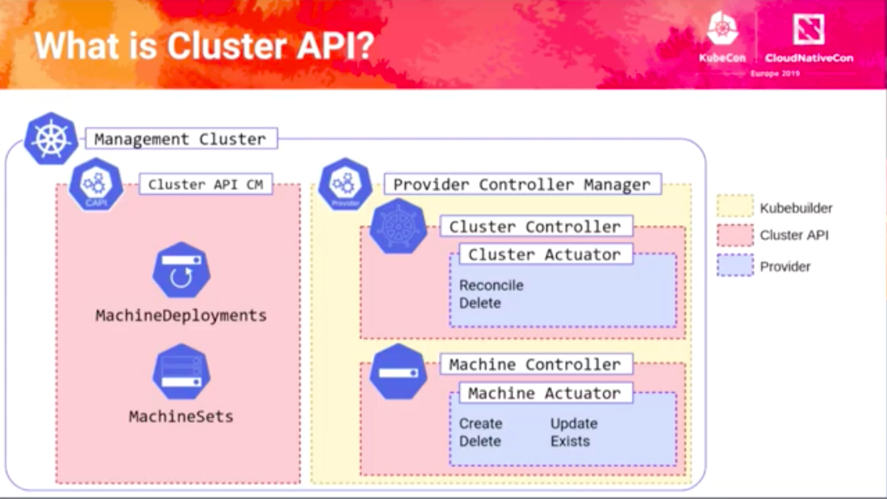

# kubernetes source code 

## 1. cluster APi

#### 1.1 cluster api的安装，运行，启动流程。

#### 

1. cluster api 安装部分代码实现
2. cluster api 控制器部分代码实现，以及Kubernetes整体控制器实现方法。
3. 实现一个kubernetes controller。
4. 实现一个 cluster api provider。
5. cluster api 与底层iaas交互部分实现
6. kubernetes 错误机制以及日志机制。 