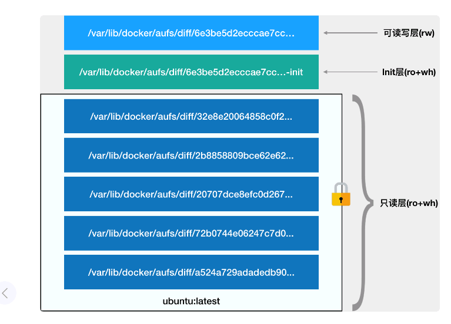

# 深入剖析kubernetes

### 开篇词


#### 问题

- 为什么容器里只能跑“一个进程”？

- 为什么我原先一直在用的某个 JVM 参数，在容器里就不好使了？

- 为什么 Kubernetes 就不能固定 IP 地址？容器网络连不通又该如何去debug？

- kubernetes中 StatefulSet 和Operator到底什么区别？PV和pvc这些概念又该怎么用？

我把专栏划分成了 4 大模块：

- 白话”容器技术基础

- Kubernetes 集群的搭建与实践

- 容器编排与 Kubernetes 核心特性剖析

- Kubernetes 开源社区与生态


### 1. 小鲸鱼大事记（一）：初出茅庐

- paas项目被大家接纳的一个主要原因，是它提供了一种名叫“用用托管”的能力，像Cloud Foundry 这样的paas项目，最核心的组件就是一套应用打包的分发机制。
- 由于虚机上启动很多不同用户的应用，Cloud Foundry会调用操作系统的Cgroups和Namespace机制为每一个应用单独创建一个称作“沙盒”的隔离环境，然后在“沙盒”中启动这些应用进程。这正是paas最核心的能力。
- docker项目在大部分功能和实现原理和Cloud Foundry都是一样的，唯一不同是Docker 镜像，docker镜像解决了打包问题，提供了本地环境和云端环境一致的能力。

总结：

docker项目提供了一种非常便利的打包机制，这种机制直接打包了应用运行所需要的整个操作系统，从而保证了本地环境和云端环境的高度一致，避免了用户通过“试错”来匹配不通运行环境之间差异的痛苦过程。

这种机制使得Docker公司脱颖而出。

### 2. 小鲸鱼大事记（二）：崭露头角

docker迅速崛起的三个重要原因：

1. Docker 镜像通过技术手段解决了PaaS的根本性问题
2. Docker容器通开发者之间有着与生俱来的密切关系；
3. PaaS概念已经深入人心的完美契机。

### 3.小鲸鱼大事记（三）：群雄并起

- 2014年底CoreOS推出了Rocket
- 2014年12月Dokcer为了扩展自己的平台能力，发布了Swarm

- Fig项目第一次提出了容器编排（Container Orchestration）的概念，docker收购fig
- mesos拼接超大集群管理经验提出Marathon
- 2014年6月Google提出了Kubernetes项目。

### 04 | 预习篇 · 小鲸鱼大事记（四）：尘埃落定

- 2015年6月22日，有Docker牵头，CoreOS，Google，RedHat公司共同宣布，Docker 公司将libcontainer捐出，并改名为RunC项目，交由中立基金会管理。并以Runc为依据，大家共同制定一套容器和镜像的标准和规范。
- OCI的提出，意在将容器运行时和镜像的实现从Docker项目中完全剥离出来。
- Google,RedHat共同牵头发起了一个名为CNCF(Cloud Native Computing Fundation)的基金会。它希望，已kubernetes项目为基础，建立一个有开源基础设施领域厂商主导的、按照独立基金会方式运营的平台及社区，来对抗以Docker为核心的容器商业生态。
- 要对抗docker，CNCF需要确保两件事情
  1. kubernetes项目必须能够在容器编排领域取得足够大的竞争优势；
  2. CNCF社区必须以kubernetes项目为核心，覆盖足够多的场景

我们先来看看 CNCF 社区如何解决 Kubernetes 项目在编排领域的竞争力问题：

- Kubernetes 项目早期的 GitHub Issue 和Feature大多来自Borg和Omega系统的内部特性，这些特性落到kubernetes项目上，就是Pod，Sidecar等功能。kubernetes项目的基础特性，并不是工程师拍脑袋想出来的，而是Google公司在容器化基础设施领域多年来实践经验的沉淀和升华。这是kubernetes避免通swarm和Mesos同质化的重要手段。
- RedHat凭借对开源设计运作和项目研发真谛的理解，使kubernetes在开源社区落地，并培育出认同这些理念的生态。

如何覆盖足够多的场景：

Kubernetes 的应对策略则是反其道而行之，开始在整个社区推进“民主化”架构，即：从API到容器运行时的每一层，kubernetes项目都为开发者暴露除了可以扩展的插件机制，鼓励用户通过代码的方式介入到kubernetes的每一个项目。

- 2017年开始，Docker公司将Docker项目的容器运行时部分Containerd捐赠给CNCF社区，标志着Docker项目全面升级成为一个PaaS平台；
- 紧接着，Docker公司宣布将Docker项目改名为Moby,然后交给社区维护。
- 2017年10月在docker企业版中内置kubernetes项目
- 2018年1月30 RedHat收购CoreOS。


### 05 | 白话容器基础（一）：从进程说开去

通过前四篇，能理解如下事实：

- 容器技术性起源于PaaS技术的普及；
- Docker公司发布的Docker项目具有里程碑式的意义；
- Docker项目通过“容器镜像”，解决了应用打包这个根本性难题。
- 容器本身没有价值看，有价值的是“容器编排”

容器，到底是怎么一回事儿？

- 容器技术的核心功能，就是通过约束和修改进程的动态表现，从而为其创造出一个“边界”。
- Cgroups技术用来制造约束的主要手段，而Namespace技术则是用来修改进程视图的主要方法。

容器实际上时在创建容器进程时，指定了这个进程所需要启用的一组Namespace参数。这样容器就只能看到当前Namespace所限定的资源、文件、设备、状态、或配置。所以说，容器，其实是一种特殊的进程而已。


### 06 | 白话容器基础（二）：隔离与限制

#### 06.1 隔离


在这个图里，我们应该把Docker画在跟应用同级别并且靠边的位置，用户运行在容器里的应用进程，跟宿主机操作系统的其他进程一样，都有宿主机操作系统统一管理，只不过这些被隔离的进程拥有额外设置的Namespace参数。而Docker项目在这里扮演的角色，更多的是旁路式的辅助和管理工作。

docker为什么比虚拟机更受欢迎？

1. 虚拟机技术做为应用沙盒，就必须由Hypervisor来负责创建虚拟机，这个虚拟机是真实存在的，并且它里面必须运行一个完整的Guest OS才能执行用户的应用进程。这就不可避免的带来了额外的资源消耗和占用。
2. 容器化后的用户应用，只是一个宿主机上的普通进程，因为虚拟化而带来的性能损耗是不存在的。同时，使用Namespace作为隔离手段的容器并不需要单独的Guest OS,这就使得容器额外的资源占用几乎可以忽略不计。

所以说，“敏捷”和“高性能”是容器相较于虚拟机最大的优势，也是它能够在PaaS这种更细粒度的资源管理平台上大行其道的重要原因。

容器的劣势：

- 隔离的不彻底
  1. 容器只是运行在宿主机上的一种特殊的进程，多个容器之间使用的是同一个宿主机的操作系统。在windows宿主机上运行linux容器和低版本的linux宿主机上运行高版本的容器，都是行不通的。
  2. 在linux内核中，有很多资源对象是不能被Namespace化的，最典型的例子就是：时间。
  3. 安全问题

#### 06.2 限制

Linux Cgroups就是Linux内核中用来为进程设置资源限制的一个重要功能。

Linux Cgroups的全称是Linux Control Group。它最主要的作用，就是限制一个进程组能够使用的资源上限，包括CPU、内存、磁盘、网络带宽等等。

Cgroup给用户暴露出来的操作接口是文件系统，即它以文件目录的方式组织在操作系统的/sys/fs/cgroup路径下。如果在自己机器上没有看到这些目录，就需要自己去挂载Cgroups。

配置文件又如何使用？

```shell
[root@paas-controller-192-169-13-23:/sys/fs/cgroup/cpu]$ mkdir container
[root@paas-controller-192-169-13-23:/sys/fs/cgroup/cpu]$ cd container/
[root@paas-controller-192-169-13-23:/sys/fs/cgroup/cpu/container]$ ls
cgroup.clone_children  cgroup.procs  cpuacct.usage         cpu.cfs_period_us  cpu.rt_period_us   cpu.shares  notify_on_release
cgroup.event_control   cpuacct.stat  cpuacct.usage_percpu  cpu.cfs_quota_us   cpu.rt_runtime_us  cpu.stat    tasks

[root@paas-controller-192-169-13-23:/sys/fs/cgroup/cpu/container]$ cat /sys/fs/cgroup/cpu/container/cpu.cfs_quota_us
-1
[root@paas-controller-192-169-13-23:/sys/fs/cgroup/cpu/container]$ cat /sys/fs/cgroup/cpu/container/cpu.cfs_period_us
100000


[root@paas-controller-192-169-13-23:/sys/fs/cgroup/cpu/container]$ echo 20000 > /sys/fs/cgroup/cpu/container/cpu.cfs_quota_us
[root@paas-controller-192-169-13-23:/sys/fs/cgroup/cpu/container]$ cat  /sys/fs/cgroup/cpu/container/cpu.cfs_quota_us
20000
echo 226 > /sys/fs/cgroup/cpu/container/tasks

```

1. 新创建的文件夹称为一个控制组
2. 写入cpu的限制
3. 写入进程号

除cpu外，Cgroup的每一项子虚铜都有其独有的资源限制能力，比如

- blkio 为块设备设定I/O限制，一般用于磁盘等设备
- cpuset,为进程分配单独的CPU核和对应的内存节点；
- memory，为进程设定内存使用的限制。

Cgroups对资源限制能力有很多不完善的地方，比如/proc,/proc并不了解Cgroups限制的存在。在容器top看到的是宿主机的信息。

**一个正在运行的容器，其实就是一个启用了多个linux Namespace的应用进程，而这个进程能够使用的资源量，则受Cgroups配置的限制。**

容器是一个“单进程”模型。容器本事的设计，希望容器和应用能够同生命周期。


### 07 | 白话容器基础（三）：深入理解容器镜像

容器的本质是一种特殊的进程，使用Namespace进行隔离，使用Cgroups进行限制。

docker的核心原理：

1. 启用Linux Namespace 配置
2. 设置指定的Cgroup参数
3. 切换进程的根目录(Change Root)

#### rootfs

我们一般会给容器的根目录写挂载一个完成操作系统的文件系统。这个挂载在容器根目录上，用来为容器进程提供隔离后执行环境的文件系统，就是所谓的“容器镜像”。他还有一个更为专业的名字，叫做：rootfs（根文件系统）。

rootfs知识一个操作系统所包含的文件，配置，和目录，并不包括操作系统内核。在linux系统中，这两部分是分开存放的，操作系统只有开机启动时才会加载指定版本的内核镜像。

同一台机器上的所有容器，都共享操作系统的内核。

#### aufs



1. 只读层。

   

2. 可读写层
   1. 为了实现删除操作，Aufs会在可读写层创建一个whiteout文件，把只读层里的文件“遮挡”起来。

3.  init层
   1. 以-init结尾的层，加载只读层和读写层之间。init层是Docker项目单独生成的一个内部层，专门用来存放/etc/hosts、/etc/resolv.conf等信息

总结：

通过使用Mount Namespacehe 和rootfs，容器就能够为进程构建出一个完善的文件系统隔离。

通过使用多个增量rootfs联合挂载一个完整的rootfs的方案，比每次完整的使用一个操作系统要小得多。


### 08 | 白话容器基础（四）：重新认识Docker容器


### 

- rootfs的最下层，是来自Docker镜像的只读层
- 在只读层之上是docker自己添加的Init层，用来存放被临时修改过的/etc/hosts等文件
- rootfs的最上层是一个可读写层，它以Copy-on-write的方式存放任何对只读层的修改，容器声明的Volume的挂载点，也出现在这一层。

### 09 | 从容器到容器云：谈谈Kubernetes的本质

一个容器，实际上是有Linux Namespace、Linux Cgroups和rootfs三种技术构建出来的进程的隔离环境。

1. 一组联合挂载在/var/lib/docker/aufs/mnt上的rootfs,这一部分称为“容器镜像”，是容器的静态视图；
2. 一个由Namespace+Cgroup构成的隔离环境，这一部分我们称为“容器运行时”， 是容器的动态视图。

docker出现以后迅速走向容器编排的原因：

云服务上或者基础服务上能够将用户提交的docker镜像运行起来，就能成为整个容器生态系统的一个承载点，从而将整个容器技术栈上的价值，沉淀在这个点上。更重要的是，从这个承载点，向docker镜像制作者和使用者方向回溯，整条路径上的各个服务节点，都有发挥和盈利的空间。

Kubernetes 项目要着重解决的问题：

- 运行在大规模集群中的各种任务之间，实际上存在着各种各样的关系。这些关系的处理，才是作业编排和管理系统最困难的地方。

Kubernetes项目最主要的设计思想是：从更宏观的角度，以统一的方式来定义任务之间的各种关系，并且为将来支持更多种类的关系留有余地。

- 首先总结了一类非常常见的紧密交互的关系，即：这些应用之间需要非常频繁的交互和访问；又或者，他们会直接通过本地进行交换。（pod）

- web应用于数据库之间的访问关系，kubernetes项目则提供了一种叫做“service”的服务。这样的应用往往故意不部署在同一台机器上。而且ip地址等信息不固定。

  


除了应用于应用之间的关系外，应用运行的形态是影响“如何容器化这个应用”的第二个重要因素。

- 为此，kubernetes定义了新的，基于pod改进后的对象。比如job，用来描述一次性运行的Pod
- 比如DaemonSet，用来描述宿主机上必须且只能运行一个副本的守护进程服务。
- 又比如CronJob，则用来描述定时任务。

在kubernetes项目中，推崇的使用方法是：

1. 通过一个“编排对象”， 比如 Pod，Job，CronJob等，来描述你视图管理的应用
2. 在为它定义一些“服务对象”， 比如Service, Secret,Horizontal Pod AutoScaler等，这些对象，会负责具体的平台级功能。

这种使用方法，就是所谓的“声明式API”。这种Api对应的“编排对象”和“服务对象”， 都是Kubernetes项目中的API对象（API Object）


### 10 | Kubernetes一键部署利器：kubeadm

kubelet为什么不容器化？

如果kubelet运行在容器里，那么直接操作宿主机就变得很麻烦。

kubeadm init 的工作流程

1. kubeadm首先要做的，是一系列的检查工作，以确定这台机器可以用来部署Kubernetes
2. 在通过了Preflight Checks之后，kubeadm要为你做的，是生成Kubernetes对外提供服务所需的各种证书和对应的目录
   1. kubeadm为kubernetes生成的证书文件都放在Master节点的/etc/kubernetes/pki目录下。这个目录下，最重要的证书文件时ca.crt和对应的私钥ca.key。
   2. 此外，用户使用kubectl获取容器日志等Streamming操作时，需要通过kube-apiserver向kubelete发起请求，这个连接必须是安全的。kubeadm为这一步生成的是api-kubelet-client.crt文件，对应的私钥是api-kubelet-client.key。
3. 证书生成后，kubeadm接下来会为其他组件生成访问kube-apiserver所需的配置，这些文件的路径是：/etc/kubernetes/xxx.conf，这些文件记录的是，当前这个master节点的服务地址，监听端口，证书目录等信息。对应的客户端（比如scheduler,kubelete等）， 可以直接加载响应的文件，使用里面的信息与kube-apiserver建立安全连接。
4. kubeadm会为Master组件生成Pod配置文件
   1. master组件的yaml文件会生成在/etc/kubernetes/manifests路径下，以static Pod的形式启动。
5. 然后 kubeadm就会为集群生成一个bootstrap token。只要持有这个token，任何一个安装了kubelet和kubadm的节点，都可以通过kubeadm join加入到这个集群中。
6. 在token之后，kubeadm会将ca.crt等Master几点的重要信息，通过ConfigMap的方式保存到ETCD当中，供后续部署Node节点使用。
7. 安装默认插件，kube-proxy和DNS。

kubeadm join 的工作流程

1. 使用bootstrap token 在任意节点上执行kubeadm join

### 11 | 从0到1：搭建一个完整的Kubernetes集群

```
$ curl -s https://packages.cloud.google.com/apt/doc/apt-key.gpg | apt-key add -
$ cat <<EOF > /etc/apt/sources.list.d/kubernetes.list
deb http://apt.kubernetes.io/ kubernetes-xenial main
EOF
$ apt-get update
$ apt-get install -y docker.io kubeadm

```


