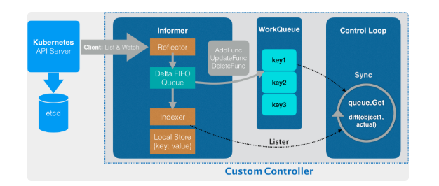
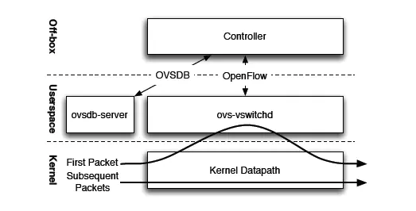

##### kubernetes 基础

1. 什么是kubernetes，有什么功能？

   k8s是一个自动化的容器部署，弹缩，管理平台。

   1. 根据资源自动化调度
   2. 自愈
   3. 水平弹缩
   4. 服务发现和负载均衡
   5. 滚动升级/撤回
   6. 配置管理
   7. 存储编排
   8. 批量执行

2. k8s的架构

   1. master	
      1. api-server
         1. 发起创建CronJob的post请求之后，编写的YAML的信息就被提交给了APIServer
         2. api-server找到对应的CronJob类型定义
         3. 根据类型定义，创建一个CronJob对象
            1. 进行一个Convert工作，把用户提交的yal文件，转换成一个superVersion对象，它是该对象的所有版本的字段全集。
         4. 鉴权和验证(验证各个字段是否合法)
         5. 序列化存入etcd
      2. controller-manager
         1. reconcile方法达到最终的一致性
         2. 
      3. scheduler
      4. etcd
   2. node 
      1. kubeproxy
      2. kubelete
      3. container Runtime 

3. 用户实现自定义资源的实现？

   1. 定义用户自定义资源

4. k8s对象

   1. pod
      1. 最简单并且是最小的k8s调度对象，共享相同的网络命名空间，挂在相同的外部存储
      2. pod是一个短暂的概念，它本身没有自愈能力，它的容灾，自愈，水平扩容都需要他的控制器实现
   2. labels
      1. 用来组织和选择对象的子集合
      2. 包括集合选择器和相等选择器
   3. ReplicationControllers,Replicasets,Deployment
      1. rc和rs的区别是 rc不支持集合选择器
      2. depolyment用来进行滚动升级和回退，滚动升级过程中会创建新的rs，升级完成后使用新的rs，然后删除老的rs
   4. NameSpace
   5. jobs
      1. job
         1. jobcontroller控制的对象是pod
         2. reconcile的过程是调节running状态pod的数目，completed状态的署名。
      2. cronjob
   6. DaemonSets
      1. 每个节点上只有一个这样的pod
      2. 实现：
         1. 使用nodeAffinity实现
         2. Toleration
         3. 步骤
            1. 遍历所有节点
            2. 判断节点上是否有被管理pod的
            3. 增加nodeaffinity和toleration属性
      
      
   
5. etcdraft实现

   

   1. raft
      1. 集群中的节点分为可以为三种状态 leader follower candidate
      2. 集群初始化：所有节点都为follower，当follower无法接收到 leader的heartbeat并超过随机的time out时，则发起选举，得到半数以上票，则变为leader，定时向follower发起heatbeat，每选出一次leader，则当前leader比前一个leader步进数加1
      3. 当leader不可用时，则发起选举，旧的leader重新加入集群时会比较步进数，如果小于当前leader，则把自己变为follower
      4. 当初始时出现多个candidate，两个几点同时成为candidate， 如果 两个candidate都没有获取半数以上票，投票不成功，则间隔随机时间后重新发起candiate。
   2. 日志记录
      1. 一条uncommited 的日志条目提交至leader节点
      2. 在下一个 heartbeat，leader将此条目复制给所有follower
      3. 当大多数节点记录此条目之后，节点认为此条目有效，将此条目设定为已提交并存储于本地磁盘
      4. 在下一个heartbeat， leader通知多有follower提交这一日志并存储于各自的磁盘
   3. 数据存储
      1. 内存中的存储除了顺序化的记录下所有用户对节点数据变更的记录外，还会对用户数据进行索引、建堆等方便查询的操作。
      2. 持久化则使用预写式日志（WAL：Write Ahead Log）进行记录存储。
         1. 一个是WAL，存储着所有事务的变化记录；
         2. 另一个则是snapshot，用于存储某一个时刻etcd所有目录的数据。
         3. 通过WAL和snapshot相结合的方式，etcd可以有效的进行数据存储和节点故障恢复等操作。
      3. 有了WAL实时存储了所有的变更，为什么还需要snapshot呢
         1. 随着使用量的增加，WAL存储的数据会暴增，为了防止磁盘很快就爆满，etcd默认每10000条记录做一次snapshot，经过snapshot以后的WAL文件就可以删除。

6. 容器技术是如何实现的

   1. 使用linux cgroup限制资源
      1. Linux Cgroups 的全称是 Linux Control Group。它最主要的作用，就是限制一个进程组能够使用的资源上限，包括 CPU、内存、磁盘、网络带宽等等
      2. Cgroups 给用户暴露出来的操作接口是文件系统，即它以文件和目录的方式组织在操作系统的 /sys/fs/cgroup 路径下，以一个子系统目录加上一组资源限制文件的组合实现
   2. 使用mount Namespace 挂在 rootfs  ，rootfs将应用和它运行所有依赖，都被封装在了一起。
   3. 步骤
      1. 启用 linux namespace 配置
      2. 设置指定的Cgroups参数
      3. 切换进程的根目录
   4. 文件系统
      1. 文件系统使用了联合文件系统：本质是把多个目录联合挂在到同一个目录下
      2. 运行时的rootfs一般分为 只读层， init层， 可读写层
         1. 只读层对应镜像中的各层，一般是 readonly 和 whiteout，whiteout的意思就是删除未见为覆盖文件，在试图上看不见
         2. 可读写层是最上面一层，它的挂在方式是rw，在没有写入文件之前，这个目录是空的，一旦做了些操作，修改产生的内容就会以增量的方式出现在这个层中
         3. init加在只读层和读写层之间，用于存放/etc/host  /etc/resolv.conf等用户需要修改缺不想保存在镜像中的内容。在commit使不会被提交

7. statefulSet 如何实现的，以及其如何表示有状态的

   1. StatefulSet 的核心功能，就是通过某种方式记录这些状态，然后在 Pod 被重新创建时，能够为新 Pod 恢复这些状态。
   2. statefulset将真实世界的应用状态抽象为了两种情况
      1. 拓扑状态：意味着，这些应用实例，必须按照某些顺序启动，并且网络标识相同
         1. 使用statefulset pod 启动会按照顺序启动 在+ headless service 保证pod有唯一的网络标识
      2. 存储状态：对于这些应用实例来说，pod a第一次读取到的数据，和隔了十分钟之后再次读取到的数据，应该是同一份。
         1. 为每一个statefulset 的pod绑定一个与名字相关的 pvc ，在pod被删除时，pvc不会被删除，等pod再启动时，继续可以通过名字找到这个pvc，然后挂载这个目录
      3. 本质都是使用名字作为唯一标志，然后再辅助以其它方式保证状态的稳定
   3. stataful set 如何更新
      1. 正常滚动更新会按照pod序号相反的方向，
      2. 也可以使用partition：2 更新序号大于 指定数字的pod

8. DaemonSet如何保证每个node上有且只有一个被管理的pod

   1. 从etcd中获取所有的node列表，然后遍历所有的node。 查看是否有指定标签的pod
      1. 没有，则创建
      2. 有pod，但数量大于1 则把多余的pod从这个节点删除
         1. 通过nodeaffinity 指定节点
         2. 然后 使用 toleration 忽略节点的unschedulable的五点
      3. 正好有一个这种pod，说明这个节点正常

9. controller 的实现原理

   1. 
   2. Reflector 使用的是一种叫作 ListAndWatch 的方法，来“获取”并“监听”这些 Network 对象实例的变化。
   3. 一旦 APIServer 端有新的 Network 实例被创建、删除或者更新，Reflector 都会收到“事件通知”。这时，该事件及它对应的 API 对象这个组合，就被称为增量（Delta），它会被放进一个 Delta FIFO Queue（即：增量先进先出队列）中
   4. Informe 会不断地从这个 Delta FIFO Queue 里读取（Pop）增量。每拿到一个增量，Informer 就会判断这个增量里的事件类型，然后创建或者更新本地对象的缓存。这个缓存，在 Kubernetes 里一般被叫作 Store。
   5. Informer 的第二个职责，则是根据这些事件的类型，触发事先注册好的 ResourceEventHandler。然后放入workqueue 中

10. k8s的service是如何访问的
   1. service的vip
   2. service的dns方式：dns方式有两种
      1. normal service：将dns解析为service vip
      2. headless service： 不用解析为service的ip， 而是直接解析为pod的ip

11. 持久化存储

    1. PV 描述的，是持久化存储数据卷。这个 API 对象主要定义的是一个持久化存储在宿主机上的目录，比如一个 NFS 的挂载目录
    2. PVC 描述的，则是 Pod 所希望使用的持久化存储的属性
    3. 而 StorageClass 的作用，则是充当 PV 的模板。并且，只有同属于一个 StorageClass 的 PV 和 PVC，才可以绑定在一起。
    4. 而用户创建的 PVC 要真正被容器使用起来，就必须先和某个符合条件的 PV 进行绑定。这里要检查的条件，包括两部分：
       1. 第一个条件，当然是 PV 和 PVC 的 spec 字段。比如，PV 的存储（storage）大小，就必须满足 PVC 的要求
       2. 而第二个条件，则是 PV 和 PVC 的 storageClassName 字段必须一样。这个机制我会在本篇文章的最后一部分专门介绍。
    5. PersistentVolumeController 会不断地循环将空闲的pv和pvc绑定起来

12. 这个 PV 对象，又是如何变成容器里的一个持久化存储的呢

     	1. 通常情况下当一个 Pod 调度到一个节点上之后，kubelet 就要负责为这个 Pod 创建它的 Volume 目录。默认情况下，kubelet 为 Volume 创建的目录是如下所示的一个宿主机上的路径
     	2. 持久化存储情况下
          	1. 为虚拟机挂载远程磁盘的操作 ，由 Volume Controller 负责维护的而它的作用，就是不断地检查每一个 Pod 对应的 PV，和这个 Pod 所在宿主机之间挂载情况。从而决定，是否需要对这个 PV 进行 Attach（或者 Dettach）操作。
          	2. 格式化这个磁盘设备，然后将它挂载到宿主机指定的挂载点上， 它是 kubelet 组件的一部分。这个控制循环的名字，叫作：VolumeManagerReconciler，
          	3. 给容器做目录映射

 13. StorageClass 对象的作用

     1. storage的作用是创建pv的模板
     2. storageClass 会定义两个部分 
        1. pv的属性，创建这种pv需要用到的存储插件

14. docker 容器网络

    1. 
    2. 同节点 容器之间 通过docker0网桥
    3. 节点访问容器，通过路由规则进入docker0网卡
    4. 容器访问其他节点，先到达docker0 网桥，在通过主机路由到其它节点

15. 常用的虚拟化设备

    1. veth pair
    2. tun/tap
       1. 一端是网卡设备，一端是字符设备，字符设备那端应用程序可以通过文件直接读取
       2. tun 设备处理tun层数据包
       3. tap设备处理 mac层数据包

16. flannel网络的三种模式

    1. 在k8s中知识把docker0网桥换为cni桥

    2. 在flannel管理的容器网络中，以太宿主机上的所有容器，都属于该宿主机被分配的一个组网。而这些子网与宿主机的 对应关系，保存在Etcd中。

    3. vxlan

       底层建立vxlan隧道，同时flannel增加路由保证发往其它几点的数据包都在vtep设备

       

    4. hostgw

       1. host-gw 模式的工作原理，其实就是将每个 Flannel 子网（Flannel Subnet，比如：10.244.1.0/24）的“下一跳”，设置成了该子网对应的宿主机的 IP 地址。
       2. Flannel host-gw 模式必须要求集群宿主机之间是二层连通的。

    5. udp

       1. 容器通过docker0 将数据包发送到主机
       2. 主机走路有规则通过tun设备将容器内数据包先发送到flannel进程
       3. flanel进程 将数据包封装在udp中发送给指定节点的flannel进程
       4. 解除udp中的内容在发送给他 tun设备
       5. 
       6. 此方案又多次的用户态和内核态的切换，所以性能差

17. vxlan是什么

    1. 采用L2 over L4（MAC-in-UDP）的报文封装模式，将二层报文用三层协议进行封装，可实现二层网络在三层范围内进行扩展，实现大的vxlan网络
    2. 作用
       1. 虚拟机过多后，报文通过二层转发时，mac转发表过大
       2. vlan隔离能力弱
       3. 对于虚机迁移一般要保证ip mac不变在此种情况下，只能在同一个二层网络内迁移，一般二层网络受物理的限制。vxlan个突破物理地域的限制
    3. vxlan的网络模型
       1. vtep：vxlan的边缘设备，是vxlan起点和终点，vxlan报文的相关处理均在这上面进行
       2. vni：进行二层通信的隔离
       3. vxlan隧道：建立在两个vtep之间的隧道

18. kubernetes网络隔离是如何做的

    1. 使用networkpolicy隔离的，在network policy中加入规则并选中pod即可
    2. 在使用插件根据network policy生成iptables规则

19. service 实现原理

    1. kube-proxy通过service 的informer感知到service对象的添加，就会创建iptables规则，将其转到对应的pod上
    2. 另一种方式是使用ipvs，通过ipvs负载均衡到对应的pod上
    3. service有cluster-ip和node port方式。nodeport方式可以把在任意节点上的访问转到service的vip上
    4. service和pod都会被分配 dns记录

20. 如何从外界访问service

    1. nodeport，在转发时要做snat，以保证数据包原路返回

21. k8s的资源模型

    1. k8s有两种资源模型，
       1. 一种是可压缩资源，当资源不足时 pod只会饥饿，不会退出。如cpu
       2. 一种是不可压缩资源，当不可压缩资源不足时，pod会因为OOM被内核杀掉

22. scheduler详解

    1. 启动一系列的informer 用来watch etcd中pod，node，service等与调度相关的api对象的变化。然后将pod放入待调度队列。
    2. 不断从调度队列中拿出pod，用算法过滤node，找到合适的node，将pod里的nodename字段改为node，然后向api-server发起pod更新
    3. pod在节点上以后，kubelete会再次验证pod是否能够在节点上运行

23. iptables

    1. iptables和netfilter共同组成了linux下的包过滤防火墙。netfilter位于内核空间，iptables相当于netfilter的用户控件的一个客户端。
    2. iptables有五个链  prerouting链，input链，forward output链 postrouting链
    3. 
    4. iptables的四个表：
       1. filter表：负责过滤功能 input output forward
       2. nat表：负责实现nat  : prerouting output postrouting
       3. mangle表：负责拆解报文，并重新封装 ： 所有
       4. raw表：关闭nat表上启用的连接追踪机制 ： prerouting链， output
       5. 顺序：raw —》mangle—>nat —>filter表

24. ovs简介

    1. 主要模块
       1. ovs-vswitchd ：`s-vswitchd`守护进程是OVS的核心部件，它和`datapath`内核模块一起实现OVS基于流的数据交换。作为核心组件，它使用openflow协议与上层OpenFlow控制器通信
       2. `ovsdb-server`是OVS轻量级的数据库服务，用于整个OVS的配置信息，
       3. 四个工具 ：ovs-dpctl  ovs-ofctl ovsdb-tool ovs-vsctl： 查询和更新ovs-vswitchd的配置；

    