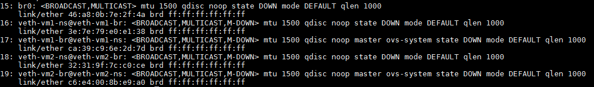
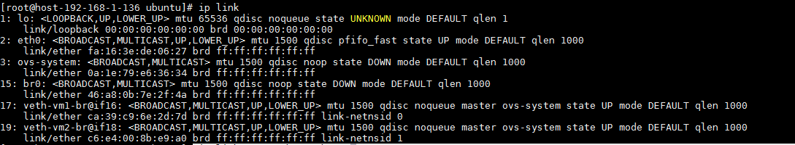
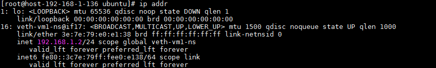

### 网络实验

#### 1.使用ovs连接两个网络命名空间并能互相ping通。

1. 创建网络设备

```shell
ovs-vsctl add-br br0
ip link add veth-vm1-br type veth peer name veth-vm1-ns
ip link add veth-vm2-br type veth peer name veth-vm2-ns
```



2. 创建命名空间vm1和vm2。

```
ip netns add vm1
ip netns add vm2
```


3. 将网络veth设备的两端一端放到命名空间内，一端插到桥上。并up桥上的网口

```
ovs-vsctl add-port  br0 veth-vm1-br
ip link set veth-vm1-ns netns vm1
ovs-vsctl add-port br0 veth-vm2-br
ip link set veth-vm2-ns netns vm2

ip link set veth-vm1-br up
ip link set veth-vm2-br up

```



4. 进入 vm1命名空间并设置 ip

```
ip netns exec vm1 bash 
ip addr add 192.168.1.2/24 dev veth-vm1-ns
ip link set veth-vm1-ns up
exit
```



5. 进入VM2命名空间并设置ip，测试联通性。

```
ip netns exec vm2 bash 
ip addr add 192.168.1.3/24 dev veth-vm2-ns
ip link set veth-vm2-ns up

```


6. 实验脚本

[实验脚本](.\vm2_ping_vm1.sh)

   

   