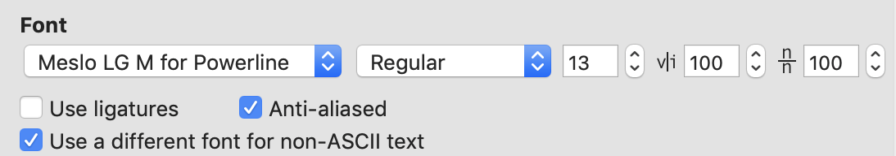

```
# ls ~/.oh-my-zsh/themes
```

参考：https://zhuanlan.zhihu.com/p/37195261

https://segmentfault.com/a/1190000013612471

1. 切换shell

```
chsh -s /bin/zsh
```

2. 安装oh my zsh

   ```
   # curl 安装方式
   sh -c "$(curl -fsSL https://raw.githubusercontent.com/robbyrussell/oh-my-zsh/master/tools/install.sh)"
   或者
   
   # wget 安装方式
   sh -c "$(wget https://raw.githubusercontent.com/robbyrussell/oh-my-zsh/master/
   ```

3. 安装powerline

   ```
   sudo easy_install pip
   pip install powerline-status --user
   ```

   

4. 下载字体

   ```
   # git clone
   git clone https://github.com/powerline/fonts.git --depth=1
   # cd to folder
   cd fonts
   # run install shell
   ./install.sh
   
   
   ```

   安装好字体库之后，我们来设置iTerm2的字体，具体的操作是iTerm2 -> Preferences -> Profiles -> Text，在Font区域选中Change Font，然后找到Meslo LG字体。有L、M、S可选

5. 安装配色方案

   ```
   https://iterm2colorschemes.com/ 下载
   Dracula
   https://raw.githubusercontent.com/mbadolato/iTerm2-Color-Schemes/master/schemes/Dracula.itermcolors
   Monokai Remastered
   https://raw.githubusercontent.com/mbadolato/iTerm2-Color-Schemes/master/schemes/Monokai%20Remastered.itermcolors
   ```

6. 安装agnoster主题

   ```
   cd ~/Desktop/OpenSource
   git clone https://github.com/fcamblor/oh-my-zsh-agnoster-fcamblor.git
   cd oh-my-zsh-agnoster-fcamblor/
   ./install
   ```

7. 安装高亮插件

   ```
   cd ~/.oh-my-zsh/custom/plugins/
   git clone https://github.com/zsh-users/zsh-syntax-highlighting.git
   vi ~/.zshrc
   ```

   这时我们再次打开zshrc文件进行编辑。找到plugins，此时plugins中应该已经有了git，我们需要把高亮插件也加上。

   然后在文件的最后一行添加：

   ```
   source ~/.oh-my-zsh/custom/plugins/zsh-syntax-highlighting/zsh-syntax-highlighting.zsh
   ```

8. 安装命令补全插件

   ```
   cd ~/.oh-my-zsh/custom/plugins/
   git clone https://github.com/zsh-users/zsh-autosuggestions
   vi ~/.zshrc
   ```

9. 安装jump

   ```
   brew install autojump # Mac
   ```

   `CentOS`安装好之后，需要在`~/.zshrc`中配置一下，除了在`plugins`中增加`autojump`之外，还需要添加一行：

   ```
   [[ -s ~/.autojump/etc/profile.d/autojump.sh ]] && . ~/.autojump/etc/profile.d/autojump.sh
   ```

10. 字体大小



