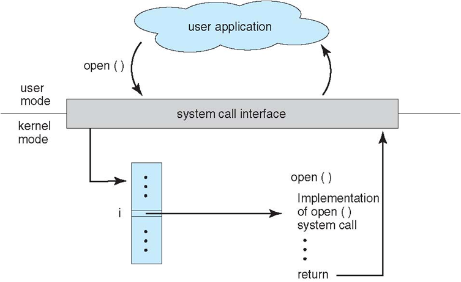

1. 操作系统的基本特征

   1. 并发

      并发是指宏观上在一段时间内能同时运行多个程序，操作系统通过引入进程和线程，使得程序能够并发运行

   2. 共享

      1. 共享是指系统中的资源可以被多个并发进程共同使用
      2. 有两种共享方式：互斥共享和同时共享。

   3. 虚拟

      1. 虚拟技术把一个物理实体转换为多个逻辑实体
      2. 虚机技术有两种：时分复用技术和空分复用技术，
         1. 时分复用：多个金宠能在同一个处理器上并发执行使用了时分复用技术。
         2. 虚拟内存使用了空分复用技术，他将物理内存抽象为地址空间，每个进程都有各自的地址空间。地址空间的页被映射到物理内存，地址空间的页并不需要全部在内存中，当使用到一个没有物理内存的页时，执行页面置换算法，将该页置换到内存中。

   4. 异步。

2. 操作系统基本功能

   1. 进程管理
      1. 进程控制、进程同步、进程通信、死锁处理、处理机调度
   2. 内存管理
      1. 内存分配，地址映射，内存保护与共享、虚拟内存等。
   3. 文件管理
      1. 文件存储空间管理、目录管理、文件读写管理和保护
   4. 设备管理
      1. 完成用户的I/O请求，方便用户使用各种设备，并提高设备的利用率
      2. 主要包括缓冲管理。设备分配、设备处理、虚拟设备等。

3. 什么是系统调用?

   1. 如果一个进程在用户态需要使用内核态的功能，就进行系统调用宠儿陷入内核，有操作系统代为完成

      

4. Linux的系统调用主要有哪些？

| Task     | Commands                    |
| -------- | --------------------------- |
| 进程控制 | fork(); exit(); wait();     |
| 进程通信 | pipe(); shmget(); mmap();   |
| 文件操作 | open(); read(); write();    |
| 设备操作 | ioctl(); read(); write();   |
| 信息维护 | getpid(); alarm(); sleep(); |
| 安全     | chmod(); umask(); chown();  |

5. 大内核和微内核的区别

   1. 大内核

      1. 大内核是将操作系统功能作为一个紧密结合的整体放到内核。

         由于各模块共享信息，因此有很高的性能。

   2. 微内核

      1. 在微内核结构下，操作系统被划分成小的、定义良好的模块，只有微内核这一个模块运行在内核态，其余模块运行在用户态。
      2. 因为需要频繁地在用户态和核心态之间进行切换，所以会有一定的性能损失。

6. 什么是内核态，用户态，为什么要有内核态和用户态。
   1. 在CPU的所有指令中，有一些指令是非常危险的，如果错用，将导致整个系统崩溃，所以CPU将指令分为特权指令和非特权指令，对于那些危险的指令，只允许操作系统及其相关模块使用，普通的应用程序只能使用那些不会造成灾难的指令
   2. 一个任务（进程）执行系统调用而陷入内核代码中执行时，我们就称进程处于内核运行态（或简称为内核态）。此时处理器处于特权级最高的（0级）内核代码中执行
   3. 当进程在执行用户自己的代码时，则称其处于用户运行态（用户态）。即此时处理器在特权级最低的（3级）用户代码中运行。

6. 什么是中断，什么时候会使用中断，中断你的分类？

   1. 计算机处于执行期间
   2. 系统内发生了非寻常或非预期的急需处理事件
   3. CPU暂时中断当前正在执行的程序而转去执行相应的事件处理程序
   4. 处理完毕后返回原来被中断处继续执行

7. 中断的作用

   早期的CPU处理外设的事件(比如接收键盘输入)，往往采用“轮询”的方式。这种方式使CPU的执行效率很低，且CPU与外设不能同时工作（因为要等待CPU来“巡查”）。

    中断模式时就是说CPU不主动访问这些设备，只管处理自己的任务。如果有设备要与CPU联系，或要CPU处理一些事情，它会给CPU发一个中断请求信号。这时CPU就会放下正在进行的工作而去处理这个外设的请求。处理完中断后，CPU返回去继续执行中断以前的工作。

8. 中断的分类

   1. 外中断
      1. 由 CPU 执行指令以外的事件引起，如 I/O 完成中断，表示设备输入/输出处理已经完成，处理器能够发送下一个输入/输出请求。此外还有时钟中断、控制台中断等。
   2. 异常
      1. 由 CPU 执行指令的内部事件引起，如非法操作码、地址越界、算术溢出等。

9. 进程和线程的区别

   1.  拥有资源

      进程是资源分配的基本单位，但是线程不拥有资源，线程可以访问隶属进程的资源。

   2. 调度

      线程是独立调度的基本单位，在同一进程中，线程的切换不会引起进程切换，从一个进程中的线程切换到另一个进程中的线程时，会引起进程切换。

   3. 系统开销

      由于创建或撤销进程时，系统都要为之分配或回收资源，如内存空间、I/O 设备等，所付出的开销远大于创建或撤销线程时的开销。类似地，在进行进程切换时，涉及当前执行进程 CPU 环境的保存及新调度进程 CPU 环境的设置，而线程切换时只需保存和设置少量寄存器内容，开销很小。

   4. 通信方面

   ​	线程间可以通过直接读写同一进程中的数据进行通信，但是进程通信需要借助 IPC。

10. 进程调度算法

    1. 批处理系统

       1. 先来先服务
       2. 短作业优先
       3. 最短剩余时间

    2. 交互式系统

       交互式系统有大量的用户交互操作，在该系统中调度算法的目标是快速地进行响应。

       1. 时间片轮转

          将所有就绪进程按 FCFS 的原则排成一个队列，每次调度时，把 CPU 时间分配给队首进程，该进程可以执行一个时间片。当时间片用完时，由计时器发出时钟中断，调度程序便停止该进程的执行，并将它送往就绪队列的末尾，同时继续把 CPU 时间分配给队首的进程。

       2. 优先级调度

          1. 为每个进程分配一个优先级，按优先级进行调度。

             为了防止低优先级的进程永远等不到调度，可以随着时间的推移增加等待进程的优先级。