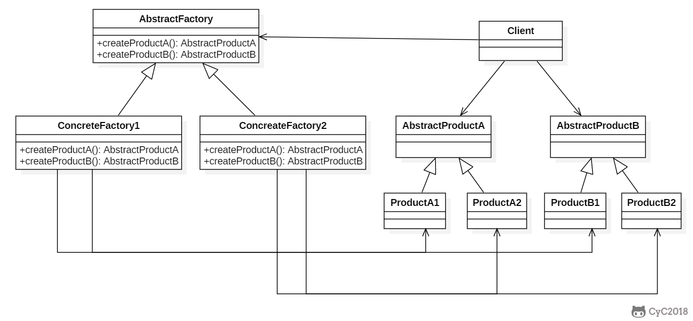
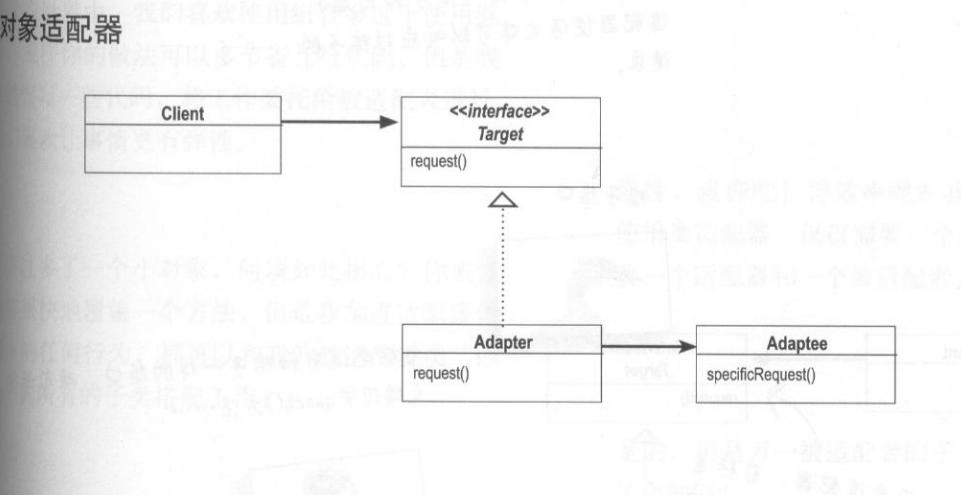

1. uml类图中类常用的关系有哪些

   1. 继承

   2. 实现

   3. 依赖

      一个类A使用到了另一个类B，而这种使用关系是具有偶然性的、临时性的、非常弱的，表现在代码层面，为类B作为参数被类A在某个method中使用

      

   4. 关联

      强依赖关系，表现在代码层面，为被关联类B以类属性的形式出现在关联类A中。

      ​	

   5. 聚合

      关联关系的一种特例，他体现的是整体与部分、拥有的关系，即has-a的关系，此时整体与部分之间是可分离的，他们可以具有各自的生命周期。

      ​	

   6. 组合

      关联关系的一种特例，他体现的是一种contains-a的关系，这种关系比聚合更强，也称为强聚合；他同样体现整体与部分间的关系，但此时整体与部分是不可分的，整体的生命周期结束也就意味着部分的生命周期结束。

      

2. solid设计原则有哪些

   1. 单一职责原则：修改一个类的原因应该只有一个。
   2. 开放封闭原则：类应该对扩展开放，对修改关闭。
   3. 里氏替换原则：子类对象必须能够替换掉所有父类对象。
   4. 接口分离原则：不应该强迫客户依赖于它们不用的方法。
   5. 依赖倒置原则：高层模块不应该依赖于低层模块，二者都应该依赖于抽象；抽象不应该依赖于细节，细节应该依赖于抽象。

3. 创建者类型的设计模式有哪些

   1. 工厂方法
   2. 抽象工厂
   3. 原型模式
   4. 单例模式
   5. 建造者模式

4. 单例模式的几种实现方式

   1. 直接初始化
   2. 双锁检查，双锁检查为什么要使用volatile关键字
      1. uniqueInstance = new Singleton() 分为三个步骤
         1. 为 uniqueInstance 分配内存空间
         2. 初始化 uniqueInstance
         3. 将 uniqueInstance 指向分配的内存地址
      2. 由于 JVM 具有指令重排的特性，执行顺序有可能变成 1>3>2。指令重排在单线程环境下不会出现问题，但是在多线程环境下会导致一个线程获得还没有初始化的实例。例如，线程 T1 执行了 1 和 3，此时 T2 调用 getUniqueInstance() 后发现 uniqueInstance 不为空，因此返回 uniqueInstance，但此时 uniqueInstance 还未被初始化
   3. 枚举实现的好处
      1. 简单
      2. jvm保证序列化和反序列化都是一个
      3. 简单
   4. 单例各个方式使用场景
      1. 不需要延迟初始化，并且线程安全： 直接初始化方式
      2. 需要序列化后保证单例，并且线程安全： 枚举
      3. 需要延迟初始化： 双检查锁

5. 什么是工厂方法模式？

   1. 定义一个用于创建对象的接口， 让子类决定实例化哪一个类。 工厂方法使一个类的实例化延迟到其子类。
   2.  

6. 什么是抽象工厂模式

   1. 提供一个接口，用于创建 **相关的对象家族** 。
   2. 

7. 工厂方法模式和抽象工厂是什么以及关系

   1. 工厂方法模式：定义一个用于创建对象的接口， 让子类决定实例化哪一个类。 工厂方法使一个类的实例化延迟到其子类
   2. 抽象工厂模式：提供一个接口，用于创建 **相关的对象家族** 。

8. 原型模式是什么

   1. 原型模式：用原型实例指定创建对象的种类， 并且通过拷贝这些原型创建新的对象。
   2. java.lang.Object为原型模式

9. 常见的行为型模式有哪些

   1. 观察者
   2. 策略
   3. 状态
   4. 模板方法

10. 常见的结构性模式有哪些

    1. 适配器
    2. 组合
    3. 装饰
    4. 代理

11. 观察者模式是什么

    1. 定义对象之间的一对多依赖，当一个对象状态改变时，它的所有依赖都会收到通知并且自动更新状态。
    2. 

12. 策略模式是什么

    1. 定义算法族，分别封装起来，让他们之间可以互相替换，此模式让算法的变化独立于使用算法的客户

       

13. 状态模式是什么

    1. 允许对象在内部状态改变时改变它的行为，对象看起来好像修改了它所属的类。

       

14. 状态模式和策略模式的区别

    1. 状态模式是通过状态转移来改变 Context 所组合的 State 对象，而策略模式是通过 Context 本身的决策来改变组合的 Strategy 对象
    2. 状态模式主要是用来解决状态转移的问题，当状态发生转移了，那么 Context 对象就会改变它的行为；而策略模式主要是用来封装一组可以互相替代的算法族，并且可以根据需要动态地去替换 Context 使用的算法。

15. 什么是模板方法模式

    1. 定义算法框架，并将一些步骤的实现延迟到子类。
    2. 

16. 什么是适配器模式

    1. 将一个类的接口变换成客户端所期待的另一种接口， 从而使原本因接口不匹配而无法在一起工作的两个类能够在一起工作。

       

17. 组合模式

    1. 允许你将对象组合成树形结构，来表现"整体/部分"层次结构。组合能让客户以一致的方式处理个别对象以及对象组合

    

18. 什么是装饰模式

    1. 动态地给一个对象添加一些额外的职责。就增加功能来说， 装饰模式相比生成子类更为灵活。

    

19. 什么是代理模式

    1. 控制对其它对象的访问。
    2. 