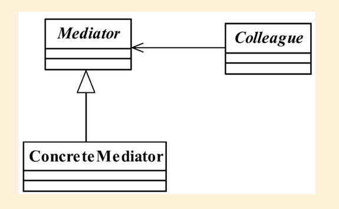

## 中介者模式

## 1定义

中介者模式的定义为： Define an object that encapsulates how a set of objectsinteract.Mediator promotes loose coupling by keeping objects from referring to each other explicitly,and it lets you vary their interaction independently.（用一个中介对象封装一系列的对象交互， 中介者使各对象不需要显示地相互作用， 从而使其耦合松散， 而且可以独立地改变它们之间的交互。 ）

#### 1.1通用类图



#### 1.2通用代码

```java
public abstract class Mediator {
//定义同事类
protected ConcreteColleague1 c1;
protected ConcreteColleague2 c2;
//通过getter/setter方法把同事类注入进来
public ConcreteColleague1 getC1() {
return c1;
}
public void setC1(ConcreteColleague1 c1) {
this.c1 = c1;
}
public ConcreteColleague2 getC2() {
return c2;
}
public void setC2(ConcreteColleague2 c2) {
this.c2 = c2;
}/
/中介者模式的业务逻辑
public abstract void doSomething1();
public abstract void doSomething2();
}
```

```java
public class ConcreteMediator extends Mediator {
@Override
public void doSomething1() {
//调用同事类的方法， 只要是public方法都可以调用
super.c1.selfMethod1();
super.c2.selfMethod2();
}p
ublic void doSomething2() {
super.c1.selfMethod1();
super.c2.selfMethod2();
}
}
```

```java
public abstract class Colleague {
protected Mediator mediator;
public Colleague(Mediator _mediator){
this.mediator = _mediator;
}
}
```

```java
public class ConcreteColleague1 extends Colleague {
//通过构造函数传递中介者
public ConcreteColleague1(Mediator _mediator){
super(_mediator);
}
//自有方法 self-method
public void selfMethod1(){
//处理自己的业务逻辑
}
 //依赖方法 dep-method
public void depMethod1(){
//处理自己的业务逻辑
//自己不能处理的业务逻辑， 委托给中介者处理
super.mediator.doSomething1();
}
}
public class ConcreteColleague2 extends Colleague {
//通过构造函数传递中介者
public ConcreteColleague2(Mediator _mediator){
super(_mediator);
}
//自有方法 self-method
public void selfMethod2(){
//处理自己的业务逻辑
}
//依赖方法 dep-method
public void depMethod2(){
//处理自己的业务逻辑
//自己不能处理的业务逻辑， 委托给中介者处理
super.mediator.doSomething2();
}
}
```

```java

```

```java

```

```java

```

```java

```

## 2.优缺点

#### 2.1优点

中介者模式的优点就是减少类间的依赖， 把原有的一对多的依赖变成了一对一的依赖，同事类只依赖中介者， 减少了依赖， 当然同时也降低了类间的耦合

#### 2.2缺点

中介者模式的缺点就是中介者会膨胀得很大， 而且逻辑复杂， 原本N个对象直接的相互依赖关系转换为中介者和同事类的依赖关系， 同事类越多， 中介者的逻辑就越复杂

## 3.使用场景

1.  N个对象之间产生了相互的依赖关系（N＞2）
2. 多个对象有依赖关系， 但是依赖的行为尚不确定或者有发生改变的可能， 在这种情况下一般建议采用中介者模式， 降低变更引起的风险扩散。
3. 产品开发。 一个明显的例子就是MVC框架， 把中介者模式应用到产品中， 可以提升产品的性能和扩展性， 但是对于项目开发就未必， 因为项目是以交付投产为目标， 而产品则是以稳定、 高效、 扩展为宗旨。

 