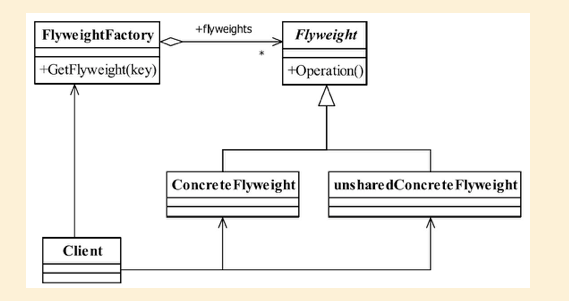

## 享元模式

## 1定义

享元模式（Flyweight Pattern） 是池技术的重要实现方式， 其定义如下： Use sharing to support large numbers of fine-grained objects efficiently.（使用共享对象可有效地支持大量的细粒度的对象。 ）

#### 1.1通用类图



#### 1.2通用代码

```java
public abstract class Flyweight {
//内部状态
private String intrinsic;
//外部状态
protected final String Extrinsic;
//要求享元角色必须接受外部状态
public Flyweight(String _Extrinsic){
this.Extrinsic = _Extrinsic;
}/
/定义业务操作
public abstract void operate();
//内部状态的getter/setter
public String getIntrinsic() {
return intrinsic;
}p
ublic void setIntrinsic(String intrinsic) {
this.intrinsic = intrinsic;
}
}
```

```java
public class ConcreteFlyweight1 extends Flyweight{
//接受外部状态
public ConcreteFlyweight1(String _Extrinsic){super(_Extrinsic);
} /
/根据外部状态进行逻辑处理
public void operate(){
//业务逻辑
}
} p
ublic class ConcreteFlyweight2 extends Flyweight{
//接受外部状态
public ConcreteFlyweight2(String _Extrinsic){
super(_Extrinsic);
} /
/根据外部状态进行逻辑处理
public void operate(){
//业务逻辑
}
}
```

```java
public class FlyweightFactory {
//定义一个池容器
private static HashMap<String,Flyweight> pool= new HashMap<String,Flyweight
//享元工厂
public static Flyweight getFlyweight(String Extrinsic){
//需要返回的对象
Flyweight flyweight = null;
//在池中没有该对象
if(pool.containsKey(Extrinsic)){
flyweight = pool.get(Extrinsic);
}else{
//根据外部状态创建享元对象
flyweight = new ConcreteFlyweight1(Extrinsic);
//放置到池中
pool.put(Extrinsic, flyweight);
} r
eturn flyweight;}
}
```

```java

```

```java

```

```java

```

```java

```

```java

```

## 2.优缺点

#### 2.1优点

##### 2.1.1算法可以自由切换


##### 2.1.2避免使用多重条件判断


##### 2.1.3扩展性良好

#### 2.2缺点

##### 2.2.1策略类数量增多

##### 2.2.2所有的策略类都需要对外暴露

## 3.使用场景

1. 系统中存在大量的相似对象。
2. 细粒度的对象都具备较接近的外部状态， 而且内部状态与环境无关， 也就是说对象没
   有特定身份。
3. 需要缓冲池的场景。

 