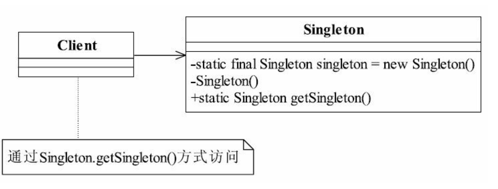

## 单例模式模式

## 1定义

Ensure a class has only one instance, and provide a global point of access to it.（确保某一个类
只有一个实例， 并提供一个全局的访问点 ）

#### 1.1通用类图



#### 1.2通用代码

```java
public class EagerSingleton {
    private static final EagerSingleton singleton = new EagerSingleton();

    private EagerSingleton() {
    }

    public static EagerSingleton getSingleton(){
        return singleton;
    }
}

```

```java
public class LazySingleton {
    private static  LazySingleton singleton;

    private LazySingleton() {
    }

    public static LazySingleton getSingleton(){
        if (singleton == null){
            singleton = new LazySingleton();
            return singleton;
        }
        return singleton;
    }
}
```

```java
public class TreadSafeSingleton {
    private static TreadSafeSingleton singleton;

    private TreadSafeSingleton() {
    }

    public synchronized TreadSafeSingleton getSingleton() {
        if (singleton == null) {
            singleton = new TreadSafeSingleton();
        }
        return singleton;
    }
}
```

```java
public class DoubleLockSingleton {
    private static DoubleLockSingleton singleton;

    private DoubleLockSingleton(){}

    public DoubleLockSingleton getInstance(){
        if(singleton == null){
            synchronized(DoubleLockSingleton.class){
                if(singleton == null){
                    singleton = new DoubleLockSingleton();
                }
            }
        }
        return singleton;
    }
}
```

## 

#####  