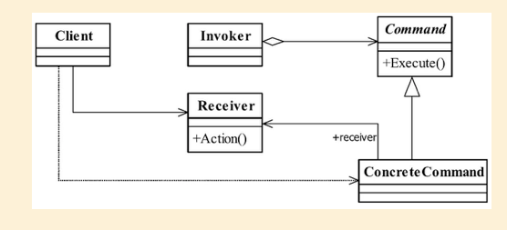

## 命令模式

## 1定义

命令模式是一个高内聚的模式， 其定义为： Encapsulate a request as an object,thereby letting you parameterize clients with different requests,queue or log requests,and support undoable operations.（将一个请求封装成一个对象， 从而让你使用不同的请求把客户端参数化， 对请求排队或者记录请求日志， 可以提供命令的撤销和恢复功能。 ）

#### 1.1通用类图



#### 1.2通用代码

```java
public abstract  class Command {
    abstract void execute();
}

```

```java
public class ConcreteCommand extends Command {
    private Reciver reciver;

    public ConcreteCommand(Reciver reciver) {
        this.reciver = reciver;
    }

    @Override
    void execute() {

    }
}
```

```java
public class Invoker {
    private Command command;

    public void setCommand(Command _command) {
        this.command = _command;
    }

    public void action() {
        this.command.execute();
    }
}
```

```java
public class Reciver {
    public void method1(){

    }

    public void method2() {

    }
}

```

## 2.优缺点

#### 2.1优点

##### 2.1.1类间解耦

调用者角色与接收者角色之间没有任何依赖关系， 调用者实现功能时只需调用Command抽象类的execute方法就可以， 不需要了解到底是哪个接收者执行。

##### 2.1.2可扩展性

Command的子类可以非常容易地扩展， 而调用者Invoker和高层次的模块Client不产生严
重的代码耦合。

##### 2.1.3命令模式结合其他模式会更优秀

命令模式可以结合责任链模式， 实现命令族解析任务； 结合模板方法模式， 则可以减少 Command子类的膨胀问题。

#### 2.2缺点

命令模式也是有缺点的， 请看Command的子类： 如果有N个命令， 问题就出来了， Command的子类就可不是几个， 而是N个， 这个类膨胀得非常大， 这个就需要读者在项
目中慎重考虑使用。

## 3.使用场景

##### 队列请求

1. 命令可以将运算块打包，然后传来传去，即使在命令对象呗创建很久以后，依然可以调用

2. 可以继续用于队列请求。比如：一个工作队列，你在某一段添加命令，然后另一端是线程，消费这些命令。

##### 日志请求

1. 在命令中实现load和restore方法，
2. 在执行时，将历史记录持久化，在重启后重新执行。

## 4.注意事项

## 5.设计原则

## 6.  扩展

1. reciever 和 command合为一体，不能动态调整 reciever。 
2. invoker仅需要负责调用
3. 可以使用macromand封装多个命令实现命令的再次封装。