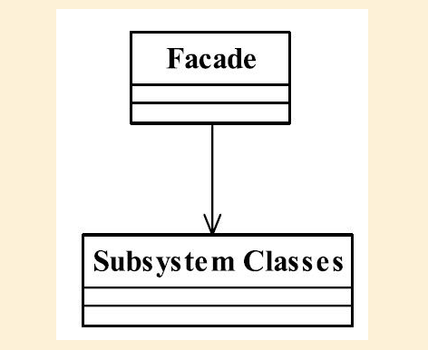

## 外观模式

## 1定义

Provide a unified interface to a set of interfaces in a subsystem.Facade defines a higher-level interface that makes the subsystem easier to use.（提供一个统一的接口，用来访问自徐彤的一群结构。 外观定义了一个高层接口，让子系统更容易使用。

#### 1.1通用类图

## 2.优缺点

#### 2.1优点

1. 减少系统的相互依赖

## 3.使用场景

1. 为一个复杂的模块或子系统提供一个供外界访问的接口

   

## 4.注意事项

1. 一个子系统可以有多个门面
2. 外观不参与子系统内的业务逻辑

## 5.设计原则

最小知识原则

## 6.  扩展

#####  