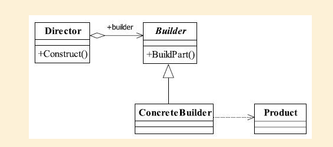

## 建造者模式

## 1定义

Separate the construction of a complex object from its representation so that the same
construction process can create different representations.（将一个复杂对象的构建与它的表示分离， 使得同样的构建过程可以创建不同的表示。 ）

#### 1.1通用类图



#### 1.2通用代码

```java
public class Product {
public void doSomething(){
//独立业务处理
}
}
```

```java
public abstract class Builder {
//设置产品的不同部分， 以获得不同的产品
public abstract void setPart();
//建造产品
public abstract Product buildProduct();
}
```

```java
public class ConcreteProduct extends Builder {
private Product product = new Product();
//设置产品零件
  public void setPart(){
/*
* 产品类内的逻辑处理
*/
}
//组建一个产品
public Product buildProduct() {
return product;
}
}
```

```java
public class Director {
private Builder builder = new ConcreteProduct();
//构建不同的产品
public Product getAProduct(){
builder.setPart();
/*
* 设置不同的零件， 产生不同的产品
*/
return builder.buildProduct();
}
}
```

## 2.优缺点

1. 封装性
2. 建造者独立， 容易扩展
3. 便于控制细节风险

## 3.使用场景

1.  相同的方法， 不同的执行顺序， 产生不同的事件结果时， 可以采用建造者模式。
2. 多个部件或零件， 都可以装配到一个对象中， 但是产生的运行结果又不相同时， 则可
   以使用该模式。
3. 产品类非常复杂， 或者产品类中的调用顺序不同产生了不同的效能， 这个时候使用建造者模式非常合适。

## 4.注意事项

## 5.设计原则

## 6.  扩展

#####  