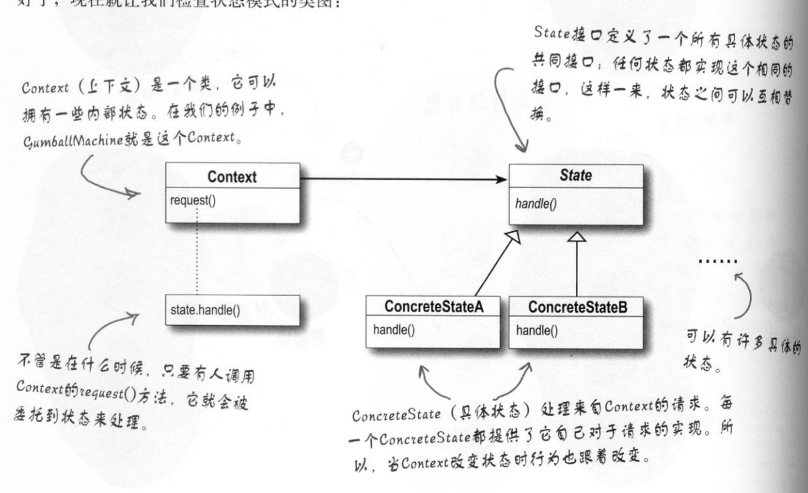

## 状态模式

## 1定义

Allow an object to alter its behavior when its internal state changes.The object will appear to change its class.（当一个对象内在状态改变时允许其改变行为， 这个对象看起来像改变了其类。 ）

#### 1.1通用类图



#### 1.2通用代码

```java
public class Context {
    private State curState;
    private State state1 = new ConcreteState1(this);
    private State state2 = new ConcreteState2(this);

    public void setCurState(State curState) {
        this.curState = curState;
    }

    public State getCurState() {
        return curState;
    }

    public State getState1() {
        return state1;
    }

    public State getState2() {
        return state2;
    }
}
```

```java
public abstract class State {
    private Context context;

    public State(Context context) {
        this.context = context;
    }

    public abstract void handle();
    public abstract void handle1();

    public Context getContext() {
        return context;
    }
}

```

```java
public class ConcreteState1 extends State {
    public ConcreteState1(Context context) {
        super(context);
    }

    @Override
    public void handle() {
        System.out.println("nothing");
    }

    @Override
    public void handle1() {
        System.out.println("something");
        super.getContext().setCurState(getContext().getState2());
    }
}

```

```java
public class ConcreteState2 extends State {

    public ConcreteState2(Context context) {
        super(context);
    }

    @Override
    public void handle() {
        System.out.println("something");
        this.getContext().setCurState(getContext().getState1());
    }

    @Override
    public void handle1() {
        System.out.println("");
    }
}
```

## 2.优缺点

#### 2.1优点

##### 2.1.1结构清晰

避免了过多的switch...case或者if...else语句的使用， 避免了程序的复杂性,提高系统的可维护性。


##### 2.1.2遵循设计原则

很好地体现了开闭原则和单一职责原则， 每个状态都是一个子类， 你要增加状态就要增加子类， 你要修改状态， 你只修改一个子类就可以了

##### 2.1.3封装性非常好

这也是状态模式的基本要求， 状态变换放置到类的内部来实现， 外部的调用不用知道类内部如何实现状态和行为的变换。

#### 2.2缺点

子类会太多， 也就是类膨胀

## 3.使用场景

1. 行为随状态改变而改变的场景
2. 条件、 分支判断语句的替代者

## 4.注意事项

使用时对象的状态最好不要超过5个

#####  