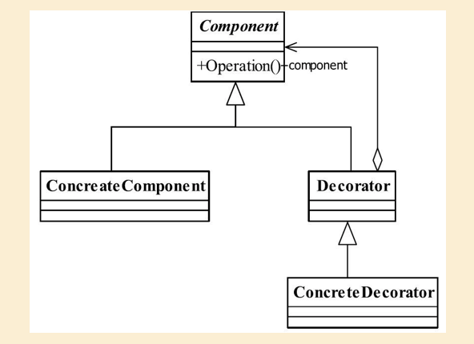

## 策略模式

## 1定义

Attach additional responsibilities to an object dynamically keeping the same interface.Decorators provide a flexible alternative to subclassing for extending functionality.（动态地给一个对象添加一些额外的职责。
就增加功能来说， 装饰模式相比生成子类更为灵活。 ）

#### 1.1通用类图

#### 

#### 1.2通用代码

```java
public interface Component {
    void operate();
}

```

```java
public class ConcreteComponent implements Component {
    @Override
    public void operate() {
        System.out.println("do something");
    }
}

```

```java
public abstract  class Decorator implements  Component {
    private Component component;

    public Decorator(Component component) {
        this.component = component;
    }

    @Override
    public void operate() {
        this.component.operate();
    }
}

```

```java
public class ConcreteDecorator extends Decorator {

    public ConcreteDecorator(Component component) {
        super(component);
    }

    @Override
    public void operate() {
        System.out.println("do something");
        super.operate();
    }
}

```

## 2.优缺点

#### 2.1装饰器模式的优点

1. 装饰类和被装饰类可以独立发展， 而不会相互耦合，
2. 扩展性好：扩展时无需改变原有类(开闭原则)
3. 降低复杂度：装饰器模式比继承更灵活，可以减少子类的数量

#### 2.2装饰模式的缺点

多层装饰比较复杂，需要剥开多层才能看到最里面

## 3.使用场景

-  需要为一批的兄弟类进行改装或加装多种功能， 当然是首选装饰模式。

## 4.注意事项

## 5.设计原则

对扩展开放，对修改关闭

## 6.  扩展

java IO模型使用装饰器模式

##### 