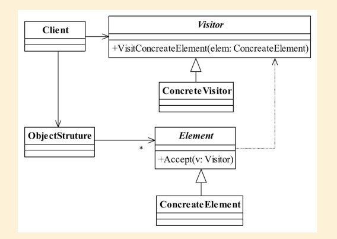

## 访问者模式

## 1定义

Represent an operation to be performed on the elements of an object structure. Visitor lets you define a new operation without changing the classes of the elements on which it operates. （封装一些作用于某种
数据结构中的各元素的操作， 它可以在不改变数据结构的前提下定义作用于这些元素的新的
操作。 ）

#### 1.1通用类图



#### 1.2通用代码

```java
public abstract class Element {
//定义业务逻辑
public abstract void doSomething();
//允许谁来访问
public abstract void accept(IVisitor visitor);
}
```

```java
public class ConcreteElement1 extends Element{
//完善业务逻辑
public void doSomething(){
//业务处理
}
//允许那个访问者访问
public void accept(IVisitor visitor){
visitor.visit(this);
}
}
public class ConcreteElement2 extends Element{
//完善业务逻辑
public void doSomething(){
//业务处理
}
//允许那个访问者访问
public void accept(IVisitor visitor){
visitor.visit(this);
}
}
```

```java
public interface IVisitor {
//可以访问哪些对象
public void visit(ConcreteElement1 el1);
public void visit(ConcreteElement2 el2);
}
```

```java
public class Visitor implements IVisitor {
//访问el1元素
public void visit(ConcreteElement1 el1) {
el1.doSomething();
}
//访问el2元素
public void visit(ConcreteElement2 el2) {
el2.doSomething();
}
}
```

```java
public class ObjectStruture {
//对象生成器， 这里通过一个工厂方法模式模拟
public static Element createElement(){
Random rand = new Random();
if(rand.nextInt(100) > 50){
return new ConcreteElement1();
}else{
return new ConcreteElement2();
}
}
}
```

```java
public class Client {
public static void main(String[] args) {
for(int i=0;i<10;i++){
//获得元素对象
  Element el = ObjectStruture.createElement();
//接受访问者访问
el.accept(new Visitor());
}
}
}
```

```java

```

```java

```

## 2.优缺点

#### 2.1优点

#### 2.2缺点

## 3.使用场景

## 4.注意事项

## 5.设计原则

## 6.  扩展

#####  