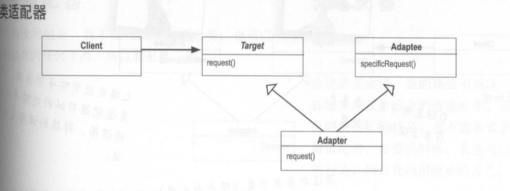

## 适配器模式

## 1定义

Convert the interface of a class into another interface clients expect.Adapter lets classes work together that couldn't otherwise because of incompatible interfaces.（将一个类的接口变换成客户端所期待的另一种接口， 从而使原本因接口不匹配而无法在一起工作的两个类能够在一起工作。 ）

#### 1.1通用类图




#### 1.2通用代码

```java
public interface Target {
    void request();
}

```

```java
public class Adapter extends Adaptee implements Target {
    @Override
    public void request() {
        this.SpecificRequest();
    }
}

```

```java
public class Adaptee {
    public void SpecificRequest(){

    }
}

```

## 2.优缺点

#### 2.1优点

1. 适配器模式可以让两个没有任何关系的类在一起运行， 只要适配器这个角色能够搞定
   他们就成
2. 提高了类的复用度
3. 灵活性非常好


## 3.使用场景

你有动机修改一个已经投产中的接口时， 适配器模式可能是最适合你的模式


## 4.  扩展

#####  

